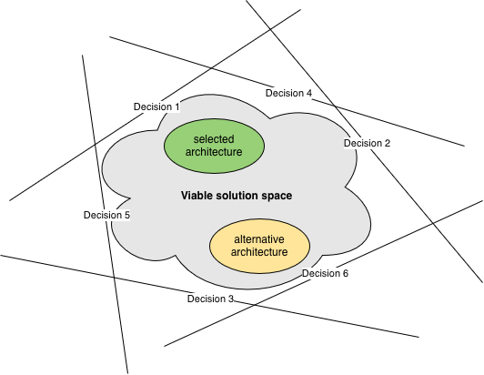
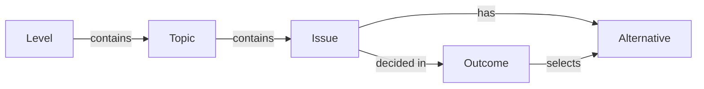
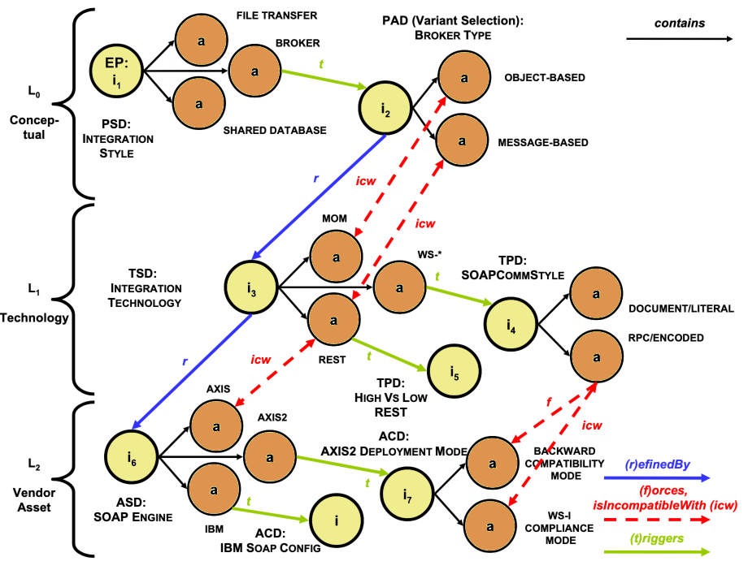

# Analysis

## Decisions

Architectures are usually documented (if at all) as a series of views @@Clements2010.
Those views are _representations_ of the architecture, however, not the architecture itself.
**The architecture is the set of principal design decisions @@Taylor2009.**

```admonish tldr title="Definition"
A **principal design decision** is the description of the set of architectural additions, subtractions, and modifications
to the software architecture, the rationale, and the design rules, design constraints, and additional requirements that
(partially) realize one or more requirements on a given architecture.

--- @@JansenBosch2005
```

Each principal design decision constrains the solution space of the system in its own way.
As the number of decisions grows, the resulting viable part of the solution space shrinks.
The selected architecture is a single point in this viable part of the solution space.
Note that there may be other points that are viable as well; these are alternative architectures.

Let's pretend for a moment that the multidimensional solution space has only two dimensions.
Then we can visualize the relationship between architecture and principal design decisions:



If architecture is the set of principal design decisions, then it makes sense to look more deeply into decision-making.

We already encountered the decision-making framework
[Cynefin](../introduction/software-engineering.md#the-cynefin-framework) @@Snowden2007.
The unwritten assumption in the industry is that software architecture lies within the _Complicated_ domain.
The appropriate approach for that domain is Sense → Analyze → Respond, and that's what architects do:

- **Sense** the functional requirements and quality attributes
- **Analyze** how they interact and compare them to other systems the architect has worked on or is otherwise familiar
  with
- **Respond** by making principal design decisions

Software architects seldom have formal training in decision-making and rarely use anything other than their experience
(or fashion) to make decisions.
Most are unaware of formal decision-making approaches, like Decision Intelligence @@Pratt2023, and decision-making
tools, like decision matrices @@WikipediaDM.

Some decisions are impossible or very hard to reverse @@Bezos2015.
We must then be very careful not to make the wrong choice, so using more formal approaches makes sense.
Most decisions aren't like that, however.
It would be wasteful to spend a lot of time on them if we can change direction at low cost.
Just because architectural decisions are _principal_ design decisions, doesn't automatically make them irreversible.

Architects rarely document their decisions.
It then falls to others to reverse-engineer the decisions from the architectural views or from the code.
The downside of this approach is that it's impossible to retrieve the reasoning behind the decision.
This leaves several questions unanswered, like

- What prompted the decision? What problem was the architect trying to solve?
- What was the situation at the time?
- What alternatives did the architect consider?
- What were the main decision drivers?

It makes sense to capture all that information in **Architecture Decision Records** (ADRs) @@Nygard2011.
This is true even for decisions that are easy to reverse.

Up to this point, we've talked about decisions as if they're a single thing.
If we take the time aspect into account, however, we can make a distinction between "decisions we need to make" and
"decisions that we made."
Where this distinction is important, we call the former **issues** and the latter **outcomes**.


## Related decisions

Making one principal design decision is hard enough, but those decisions rarely come in isolation.
Decisions have relationships with each other.

**Some decisions constrain other decisions.**
For instance, the choice of a programming language reduces the choices for what tools and frameworks to use.
The Go `build` command can't compile Ruby code.
PyTest can't test Rust code.
Using the Spring framework only makes sense with JVM languages like Java and Kotlin.

**Some decisions replace earlier decisions.**
Things change, so what was once a prudent decision may now have serious negative consequences that require a different
choice.
For example, if maintainers of an open source library abandon it, you'll no longer receive security fixes.
Or if your company decides to standardize on AWS, your service running on GCP needs migrating.

Combining the above two relationships, it becomes clear that there is value in keeping options open @@MaassenMatts2007.
For instance, tools like Bazel and Gradle can each compile several languages.
Or organizing code in a Hexagonal Architecture @@Cockburn2025 makes it easier to switch from Kafka to GCP Pub/Sub or
AWS SNS & SQS.

**Some decisions lead to further decisions.**
The definition of principal design decision mentions "additional requirements" that the architecture must meet.
Follow-up design decisions must address these new requirements.

For example, suppose your application is running in a private datacenter, and you make the high-level decision to move
it to AWS.
Then there must be follow-up decisions about using EC2 vs ECS vs EKS, whether to use RDS or DynamoDB, etc.
Or if you decide on a microservices architecture, then you also have to decide between storing code in a monorepo or in
multiple repositories.

When looking at collections of decisions, it helps to organize them a bit.
We can group functionally related decisions into **topics**.
Another grouping is at which **level** we make a decision, for instance `Executive`, `Conceptional`, `Technology`, and
`Vendor asset`.
Adding those groupings gives us the following basic model:



Now let's look at expanding this model to define the above relationships between issues and alternatives more formally.
@@Zimmerman_et_al2009 define the following relations between issues:

- **decomposesInto**: We can use divide-and-conquer to split a decision into a set of smaller ones.
- **refinedBy**: We can make a decision at one level, which then requires another decision at a lower level.
- **influences**: This is a symmetric relationship that's deliberately less well-defined.

They also define relations between alternatives:

- **forces**: If we select an alternative for one issue, that implies we must select a certain alternative for another
issue.
- **isIncompatibleWith**: If we select an alternative for one issue, that implies we must **not** select certain
alternatives for another issue.
- **isCompatibleWith**: Certain alternatives for one issue work well with certain alternatives for another issue.

The above are all structural relations.
Zimmerman et al define a temporal relation as well:

- **triggers**: Choosing an alternative for one issue (which creates an outcome) makes another issue ready to resolve.

Given the right integrity constraints on these relations, we can capture a set of issues as a directed acyclic graph
called a **decision model** @@Zimmerman_et_al2009.
Here's an example:



_EP = Entry Point.
PSD = Pattern Selection Decision.
PAD = Pattern Adoption Decision.
TSD = Technology Selection Decision.
TPD = Technology Profiling Decision.
ASD = Asset Selection Decision.
ACD = Asset Configuration Decision._

A decision model has entry points, which are issues that are open for resolution.
Once we make a decision for an entry point, other issues become open for resolution because of the triggers and other
relations.
In that way, the decision model guides the decision maker through a web of related decisions.

@@Zimmerman_et_al2009 describe a _Reusable Decision Model for SOA_ with 4 levels, 86 topic groups, and 389 issues.
Architects can apply this decision model to any SOA project.


## Architecture decisions

Now that we've looked at general decision-making, let's turn back to architecture.
If architecture is the set of principal design decisions, then it follows that architects must make decisions about
important design alternatives.

@@Kruchten2004 classify principal design decisions based on their impact:

- **Existence decisions** state that some element/artifact must exist in the systems’ design or implementation.
  Structural decisions relate to components, whereas behavioral decisions relate to their interactions.
- **Non-existence decisions** state that some element must _not_ exist in the system's design or implementation.
- **Property decisions** state an enduring, overarching trait or quality of the system.
  Property decisions can be design rules or guidelines (when expressed positively) or design constraints (when expressed
  negatively).
- **Executive decisions** don't relate directly to the design elements or their qualities, but derive more from
  the business environment (financial), and affect the development process (methodological), the people
  (education and training), the organization, and technologies and tools.


Another grouping takes into account how unique decisions are, ie, how often they occur for different projects:

- **Common decisions** are those that architects need to make for (virtually) all software systems.
  For instance, every system benefits from a decision about its architectural style (layered, pipe-and-filter,
  event-based, etc) @@Taylor2009.
  Likewise, every system needs a programming language for implementation, along with build tool, testing framework, etc.
- **Category-specific decisions** are those that come up for certain categories of software systems.
  For example, every microservices architecture requires making a decision about how to deal with distributed
  transactions (choreography, orchestration) @@Richardson2019.
  Likewise, every event-based system needs decisions about what type each event is (notification, event-carried state
  transfer) @@Fowler2017.
- **Context-specific decisions** are those that are unique for a given software system or small set of systems.

Architects must be well-versed in making common decisions.
It may make sense for them to specialize in a certain category of architecture, to become proficient at
category-specific decision-making as well.
Finally, they must understand decision-making tools and techniques well enough to handle the inevitable
context-specific decisions.

In theory, we should be able to create reusable decision models for common and category-specific decisions.
