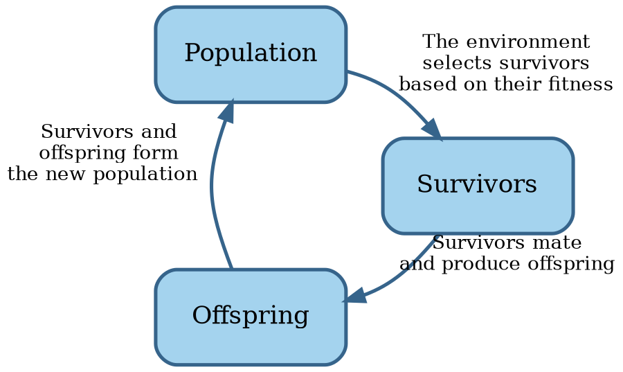

# Book organization

The rest of this book attempts to answer the question of how to make software development a real engineering discipline.

First we'll look into each of the SWEBOK knowledge areas and see how much they conform to the engineering approach.
Then we'll see if we can synthesize an actual engineering process out of their combination.

Before we get into all that, a quick note on the book's title.


## Evolution

Biology is the scientific study of life.
While it has a broad scope, there is a unifying theory:

```admonish info "Quote"
Nothing in biology makes sense except in the light of evolution.

--- @@Dobzhansky1973
```

The scientific theory of evolution rests on two pillars:

1. **Natural selection** is the differential survival and reproduction of individuals due to differences in traits
  @@Darwin1859.
2. **Heredity of traits** is the passing on of traits from parents to their offspring with some changes @@Mendel1866,
  @@Fisher1930.

On a high level, evolution works as follows:



What's this loop doesn't show, is the massive parallel exploration of genetics space that happens.
Survivors that mate produce offspring that aren't exact copies of their parents.
Instead, **mutations**, or small alterations in the genetic material, occur spontaneously.
In species with sexual reproduction, **crossovers** swap part of the genetic material of the parents in the child.
In this way, nature tries out many different variations and keeps the best, or fittest, of each generation.
In other words, nature forms and evaluates many hypotheses simultaneously in each generation.

Nature is doing science.

The two pillars of evolution were fist brought together in the seminal book _Evolution: The Modern Synthesis_
@@Huxley1948.

This book similarly aspires to bring together the various pillars of software engineering.
Let's get to it.
