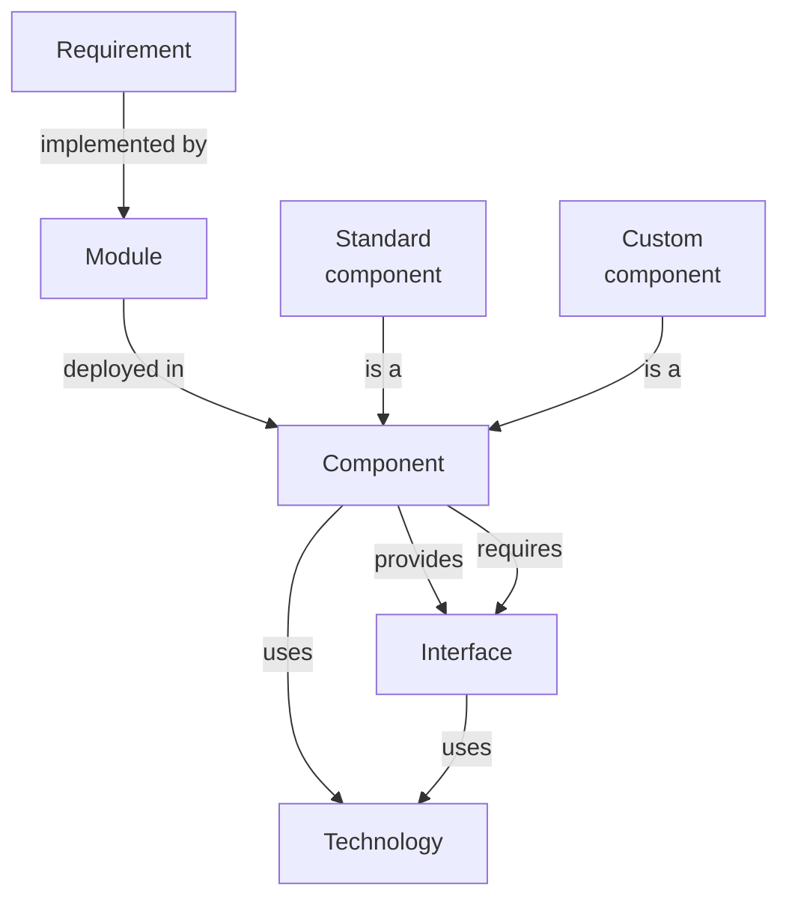
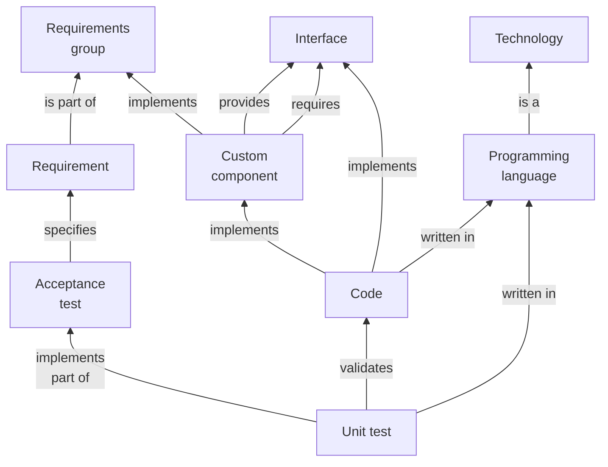

# Preliminary analysis


## Design method

1. Put the requirements in Rigorous Event Storming Icon Notation (RESIN) and resolve hotspots.
    See the [examples](../examples/index.md).
1. If there are any humans issuing commands, or looking at read models, then design guidelines for the user experience.
1. If there are any external systems issuing commands or consuming events, then design guidelines for the developer
    experience.
1. For all **events**:
   - Determine whether to use a notification event or event-carried state transfer @@Fowler2017.
     If the latter, determine what data the event carries.
   - If an external system consumes the event, design the API.
   - Determine whether the event requires an explicit queue with durability guarantees.
1. For all **commands**:
   - If a human issues the command, design the user interaction that allows the user to do that.
   - If an external system issues the command, design the API that allows the system to do that.
   - Determine if the command requires synchronous processing. If not, prefer asynchronous processing.
   - For asynchronous commands, determine whether the command requires an explicit queue with durability guarantees.
1. For all **read models**:
   - Design the data model using ERDs or similar notation.
   - If the read model serves a human, design the user interaction that gives the user access to the data.
   - If the read model updates from events, determine whether each event requires an explicit queue with durability
    guarantees.
1. For all **aggregates**:
   - Design the data model using ERDs or similar notation.
1. Create a directed graph capturing dependencies:
   - Add a node for every aggregate, read model, and automatic policy.
   - Add an edge from an aggregate to a policy if the policy issues a command processed by the aggregate.
   - Add an edge from a policy to a read model if the policy uses the read model to make a decision.
   - Add an edge from a read model to an aggregate if the read model updates from an event emitted by the aggregate
       and their data models have entities in common.
1. Assign aggregates, automatic policies, and read models to subdomains based on the above dependency graph:
    - For every aggregate:
      - Create a domain containing the aggregate.
    - For every read model:
      - If all outgoing edges of the read model are to aggregates in the same domain, assign the read model to
          that domain.
      - Otherwise, create a domain containing the read model.
    - For every policy:
      - If the policy has no outgoing edges, and all commands issued by the policy go to aggregates in a
          single domain, assign the policy to that domain.
      - If a policy has outgoing edges, and they're all to read models in the same domain, assign the policy to that
          domain.
      - Otherwise, create a domain containing the policy.
1. Assign commands and events to the discovered subdomains as follows:
   - Assign each command to the subdomain that contains the aggregate that accepts the command.
   - Assign each event to the subdomain that contains the aggregate that emits the event.
   - Assign each unassigned event to the subdomain that contains the policy that handles the event.
1. Dependencies between modules follow from dependencies between the RESIN elements, in particular events and commands,
    since those are the modules' APIs.
1. If there are cycles between modules, then merge all the modules on each cycle into a single module.


### Architecture

```admonish tldr title="Definitions"
A **module** is a compiled and packaged subdomain, like a jar file.
A **component** is an executable and deployable collection of modules, like a war file or executable fat jar.

--- @@Richardson2023
```

Architecting consists of the following activities:

1. Combine modules into components based on organizational structure and Quality Attribute Requirements @@Richardson2023.
1. Divide components into standard components to acquire (like databases and queues) and custom components to build.
1. Select existing implementations for standard components.
1. Decide how components interact.
1. Select technologies to implement custom components and their interfaces.



Inputs to the architecting process:

- Requirements and the modules discovered from them
- Architectural styles and patterns
- Sanctioned technologies and vendors
- Teams and their skill levels

Outputs of the architecting process:

- Assignments of modules to components.
- [Container diagram](https://c4model.com/#ContainerDiagram).
    Note that the C4 model uses different terminology: their _container_ corresponds to our _component_ and their
    _component_ corresponds to our _module_.
- Architecture Decision Records (ADRs).

The starting point is an application consisting of a single system.
Then analyze the quality attributes one by one to see if systems need splitting.
Only make the architecture as complicated as it needs to be to meet the requirements.

Performance / scalability:

- Each aggregate and policy has implied queues for accepting commands and handling events.
  In theory, we can use queueing theory to analyze such systems.
  In practice, this approach runs into some issues, like unknown arrival and service time distributions.
  The theoretical models usually assume that work for server processes is independent and can therefore occur in
  parallel.
  In practice, this is seldom the case, and Amdahl's law comes into play @@Amdahl1967.
  These problems mean that mathematical analysis is usually computationally intractable or at least impractical.
  It's best to measure arrival and service times, store these as metrics, and then scale dynamically based on the
  collected metrics.
- Some commands require synchronous processing, because the caller needs a result right away.
  The latency for processing such commands is the latency of the entire process.
  For asynchronous commands, the latency is just the work for validating the input.
  Use asynchronous commands where possible, to give faster feedback.
- Split off command/event handlers that have significantly different scaling requirements into their own components, so
  they can scale independently.

Resilience:

- Make some queues explicit as components so that retries can handle issues during processing of commands/events.
  This requires that the handling code is idempotent.
- Split off command/event handlers that have a big risk of causing issues, like OOM, to reduce impact on other parts.
- Define what liveness means for each process.
  Consider using an orchestration tool (another component) to automatically restart processes that fail the liveness
  test.
- Consider load shedding when performance requirements aren't met to preserve uptime.
  Detect this using the metrics defined in these requirements.

Security / compatibility:

- Commands arrive over a wire protocol.
  Apply input validation while mapping their data to domain objects.
- Apply output encoding when mapping domain objects to outputs.

Maintainability / portability:

- The domain model is more stable than technical parts, like what storage solution to use.
  Apply hexagonal architecture to isolate changes in those parts from the domain model.

Once done with non-functional requirements, you should have identified all components.
Perform make or buy decisions on all components.
For each custom component, implement all functional requirements in the requirements group implemented by the component.
Again, do one requirement at a time.
Non-functional requirements apply to all components.


### Design

Design happens for each custom component:

1. Collect all requirements in the requirements group that the custom component must implement.
2. Implement requirements one at a time.
3. For a given requirement, translate its acceptance tests into a list of detailed tests.
4. Write code based on those tests using TDD.




Canon TDD:

1. Write a list of the test scenarios you want to cover.
2. Turn one item of the list into an actual, concrete, runnable test.
3. Change the code to make the test (& all previous tests) pass (adding items to the list as you discover them).
4. Optionally refactor to improve the implementation design.
5. If the test list isn't empty, go back to #2.

Issues:

- How to order the initial list of tests? Select one which requires the code transformation with the highest priority.
- How to design the code-level API when writing a test? How to test non-functional requirements?
- Are the transformations in the TPP complete?
- How to perform the vague ones, like `statement->statements`?
- How to deal with big jumps?
- Is there an order to code smells as well?
- When should we fix a smell and when should we wait a bit?
