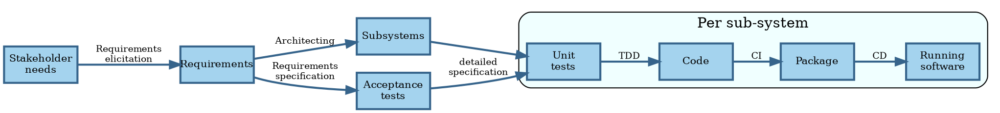
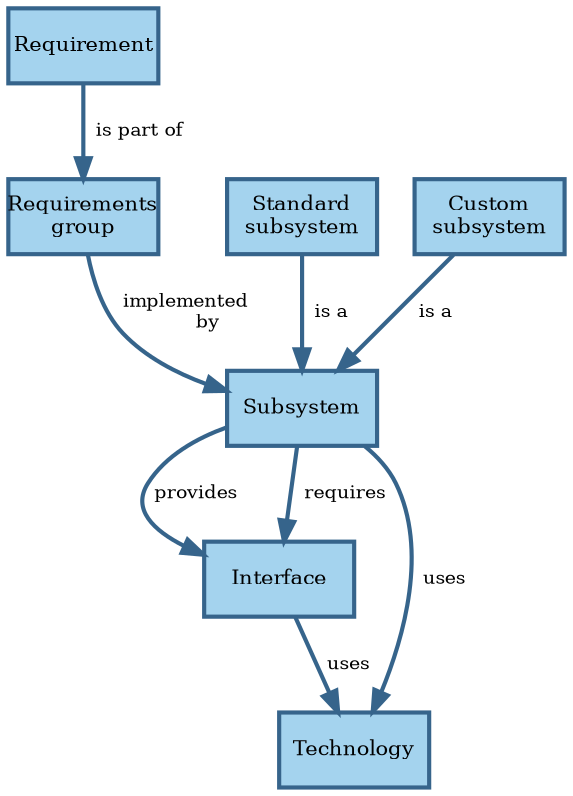
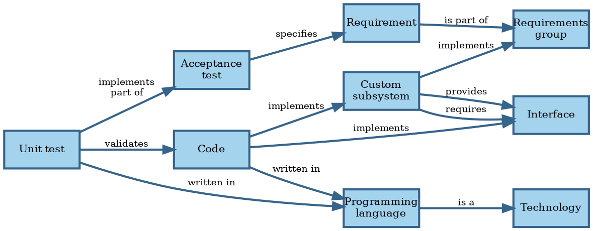

# Preliminary analysis

## Ideas

Software development is a process that starts with stakeholder needs and ends with running software that meets those
needs:

This process consists of multiple steps.
Since different actors (people or software processes) may execute different steps, there are hand-offs of work items.
Hand-offs imply queues and their associated waiting time.
Queuing theory suggests that we can reduce the total time by limiting the number of items in process @@Kleinrock1974.

You can't look at the requirements and come up with a design that satisfies them all in one go anyway.
By necessity, you start with a subset and expand from there.
Therefore, you may as well take them one by one or in small batches.

### Architecture

Architecting consists of the following activities:

1. Divide the system into subsystems based on requirements.
2. Group functional requirements and assign the groups to subsystems.
3. Divide subsystems into standard subsystems to acquire (like databases) and custom subsystems to build.
4. Select existing implementations for standard subsystems.
5. Decide how subsystems interact.
6. Select technologies to implement custom subsystems and their interfaces.

Inputs to the architecting process:

- Requirements
- Architectural styles and patterns
- Sanctioned technologies and vendors

Outputs of the architecting process:

- Requirements grouping.
- Container diagram.
- Architecture Decision Records (ADRs).

The starting point is an application consisting of a single system.
Then analyze the quality attributes one by one to see if systems need splitting.
Only make the architecture as complicated as it needs to be to meet the requirements.

Performance / scalability:

- Each aggregate and policy has implied queues for accepting commands and handling events.
  In theory, we can use queueing theory to analyze such systems.
  In practice, this approach runs into some issues, like unknown arrival and service time distributions.
  The theoretical models usually assume that work for server processes is independent and can therefore occur in
  parallel.
  In practice, this is seldom the case, and Amdahl's law comes into play @@Amdahl1967.
  These problems mean that mathematical analysis is usually computationally intractable or at least impractical.
  It's best to measure arrival and service times, store these as metrics, and then scale dynamically based on the
  collected metrics.
- Some commands require synchronous processing, because the caller needs a result right away.
  The latency for processing such commands is the latency of the entire process.
  For asynchronous commands, the latency is just the work for validating the input.
  Use asynchronous commands where possible, to give faster feedback.
- Split off command/event handlers that have significantly different scaling requirements into their own subsystems, so
  they can scale independently.

Resilience:

- Make some queues explicit as subsystems so that retries can handle issues during processing of commands/events.
  This requires that the handling code is idempotent.
- Split off command/event handlers that have a big risk of causing issues, like OOM, to reduce impact on other parts.
- Define what liveness means for each process.
  Consider using an orchestration tool (another subsystem) to automatically restart processes that fail the liveness
  test.
- Consider load shedding when performance requirements aren't met to preserve uptime.
  Detect this using the metrics defined in these requirements.

Security / compatibility:

- Commands arrive over a wire protocol.
  Apply input validation while mapping their data to domain objects.
- Apply output encoding when mapping domain objects to outputs.

Maintainability / portability:

- The domain model is more stable than technical parts, like what storage solution to use.
  Apply hexagonal architecture to isolate changes in those parts from the domain model.

Once done with non-functional requirements, you should have identified all subsystems.
Perform make or buy decisions on all subsystems.
For each custom subsystem, implement all functional requirements in the requirements group implemented by the subsystem.
Again, do one requirement at a time.
Non-functional requirements apply to all subsystems.

### Design

Design happens for each custom subsystem:

1. Collect all requirements in the requirements group that the custom subsystem must implement.
2. Implement requirements one at a time.
3. For a given requirement, translate its acceptance tests into a list of detailed tests.
4. Write code based on those tests using TDD.

Canon TDD:

1. Write a list of the test scenarios you want to cover.
2. Turn one item of the list into an actual, concrete, runnable test.
3. Change the code to make the test (& all previous tests) pass (adding items to the list as you discover them).
4. Optionally refactor to improve the implementation design.
5. If the test list isn't empty, go back to #2.

Issues:

- How to order the initial list of tests? Select one which requires the code transformation with the highest priority.
- How to design the code-level API when writing a test? How to test non-functional requirements?
- Are the transformations in the TPP complete?
- How to perform the vague ones, like `statement->statements`?
- How to deal with big jumps?
- Is there an order to code smells as well?
- When should we fix a smell and when should we wait a bit?
