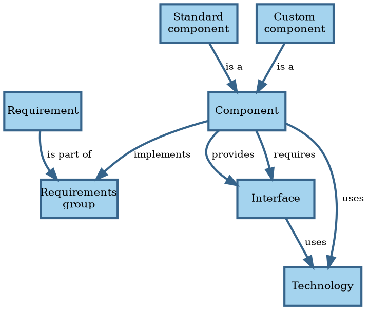

# Preliminary analysis

The books referenced by SWEBOK present generally accepted knowledge in the software design field.

## Ideas

You can't just look at all the requirements and come up with a design that satisfies them all.
By necessity, you start with a subset and expand from there.
Therefore, you may as well take them one by one.

There isn't a good theory to go from requirements to design.
Part of the problem comes from there being different kinds of design: interaction design, user interface
design, architecture, low-level design, database design, and code.
Code is low-level design; construction is just compilation.

### Architecture

Architecting consists of the following activities:

1. Group requirements and assign the groups to components.
2. Decide how components interact.
3. Divide components into standard components to acquire (like databases and container orchestration systems)
   and custom components to build.
4. Select existing implementations of standard components.
5. Select technologies to implement custom components and their interfaces.

Inputs to the architecting process:

- Requirements
- Architectural styles and patterns
- Sanctioned technologies and vendors

Start with a single component deployed as a single instance.
Then analyze the quality attributes one by one to make the architecture as complicated as it needs to be.

Performance / scalability:

- Each aggregate and policy has implied queues for accepting commands and handling events.
  In theory, we can use queueing theory to analyze such systems.
  In practice, this approach runs into some issues, like unknown arrival and service time distributions.
  The theoretical models usually assume that work for server processes is independent and can therefore occur in
  parallel.
  In practice, this is seldom the case, and Amdahl's law comes into play @@Amdahl1967.
  These problems mean that mathematical analysis is usually computationally intractable or at least impractical.
  It's best to measure arrival and service times, store these as metrics, and then scale dynamically based on the
  collected metrics.
- Some commands require synchronous processing, because the caller needs a result right away.
  The latency for processing such commands is the latency of the entire process.
  For asynchronous commands, the latency is just the work for validating the input.
  Use asynchronous commands where possible, to give faster feedback.
- Split off command/event handlers that have significantly different scaling requirements into their own components, so
  they can scale independently.

Resilience:

- Make some queues explicit as components to handle issues during processing of commands/events by retries.
  This requires that the handling code is idempotent.
- Split off command/event handlers that have a big risk of causing issues, like OOM, to reduce impact on other parts.
- Define what liveness means for each process.
 Use an orchestration tool (another component) to automatically restart processes that fail the liveness test.
- Use load shedding when performance requirements aren't met to preserve uptime.
  Detect this using the metrics defined in these requirements.

Security / compatibility:

- Commands arrives over a wire protocol.
  Apply input validation while mapping their data to domain objects.
- Apply output encoding when mapping domain objects to outputs.

Maintainability / portability:

- The domain model is more stable than technical parts, like what storage solution to use.
  Apply hexagonal architecture to isolate changes in those parts from the domain model.

Once done with non-functional requirements, you should have identified all components.
Perform make or buy decisions on all components.
For each custom component, implement all functional requirements in all groups implemented by the component.
Again, do one requirement at a time.

### Design

Design happens for each custom component:

1. Collect all requirements in the requirements group that the custom component must implement.
2. Implement requirements one at a time.
3. For a given requirement, translate its acceptance tests in a list of detailed tests.
4. Write code based on those tests using TDD.

Canon TDD:

1. Write a list of the test scenarios you want to cover
2. Turn one item on the list into an actual, concrete, runnable test
3. Change the code to make the test (& all previous tests) pass (adding items to the list as you discover them)
4. Optionally refactor to improve the implementation design
5. Until the list is empty, go back to #2

Issues:

1. How to compile the initial list: embed TDD inside BDD; BDD scenarios follow directly from acceptance criteria for
  requirements.
2. How to order the tests? Select one which requires code transformation with the highest priority.
  How to design the code-level API when writing a test? How to test non-functional requirements?
3. Are the transformations in the TPP complete? How to perform the vague ones, like `statement->statements`? How to deal
  with big jumps?
4. Is there an order to code smells? When to fix a smell and when to wait a bit?
