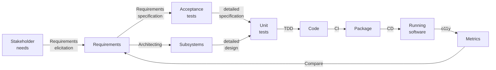

# Analysis

Software development is a process that starts with stakeholder needs and ends with running software that meets those
needs:

This process consists of multiple steps.
Since different actors (people or software processes) may execute different steps, there are hand-offs of work items.
Hand-offs imply queues and their associated waiting time.
Queuing theory proves that we can reduce the total time by limiting the number of items in process @@Kleinrock1974.

Good software development processes are:

- **Iterative**: The system starts small and grows over time by adding parts.
- **Incremental**: Each part goes through the process one or more times. Each stage of the process refines work from
  earlier stages and/or adds information.

[Use case scenarios](../requirements/digest/elicitation.md#techniques) make good candidates for these parts.

Artifacts from one stage should link to the artifacts from earlier stages that they refine or add information to.
This provides [traceability](../requirements/digest/management.md#requirements-management), which helps with impact
analysis of proposed changes.

In an ideal world, we'd store artifacts in files that are both human and machine-readable.
Stage-specific compilers verify the links between artifacts to ensure the system is complete and correct.
Making the file formats machine-readable may mean humans needs specific editors to work with the files.
