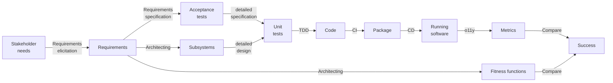

# Analysis

Software development is a process that starts with stakeholder needs and ends with running software that meets those
needs:

Ideally, this process is:

- **Iterative** -- The system starts small and grows over time by adding or changing parts.
  Each part goes through the process one or more times.
  [Use case scenarios](../requirements/digest/elicitation.md#techniques) make good candidates for parts.
- **Incremental** -- Each stage of the process refines work from earlier stages and/or adds information.

Artifacts from one stage should link to the artifacts from earlier stages that they refine or add information to.
This provides [traceability](../requirements/digest/management.md#requirements-management), which helps with impact
analysis of proposed changes.

In an ideal world, we'd store artifacts in files that are both human and machine-readable.
Stage-specific compilers verify the links between artifacts to ensure the system is complete and correct.
Making the file formats machine-readable may mean humans need dedicated editors to work with the files.
