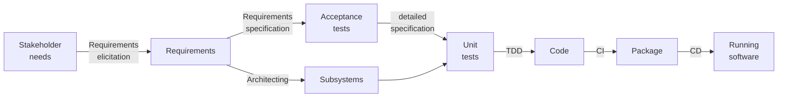

# Analysis

## Ideas

Software development is process that results in software, which is a prescription for a process.
The concept of a process is therefore fundamental to software development.
As we saw in [requirements](../requirements/analysis.md#learning-the-domain), event storming uncovers processes.
TODO: Apply event storming to software development.

Software development is a process that starts with stakeholder needs and ends with running software that meets those
needs:

This process consists of multiple steps.
Since different actors (people or software processes) may execute different steps, there are hand-offs of work items.
Hand-offs imply queues and their associated waiting time.
Queuing theory proves that we can reduce the total time by limiting the number of items in process @@Kleinrock1974.

Perform process analysis @@Dumas2018.
