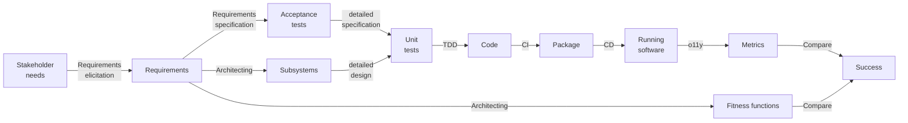
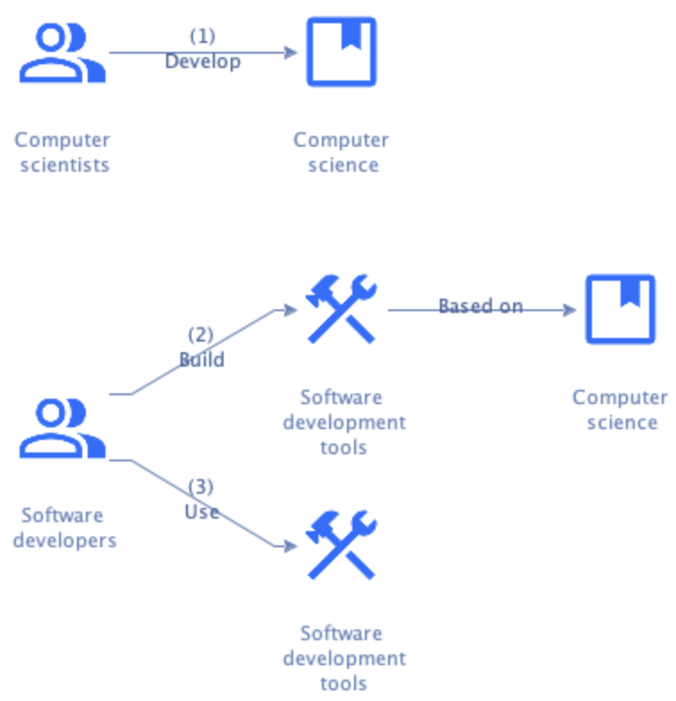

# Analysis

## The software development process

Software development is a process that starts with stakeholder needs and ends with running software that meets those
needs:



Ideally, this process is:

- **Iterative** -- The system starts small and grows over time by adding or changing parts.
  Each part goes through the process one or more times.
  This follows Gall's Law:

  > A complex system that works is invariably found to have evolved from a simple system that worked. @@Gall1977

  [Use case scenarios](../requirements/digest/elicitation.md#techniques) make good candidates for parts.
- **Incremental** -- Each stage of the process refines work from earlier stages and/or adds information.
  This acknowledges that software development is collaborative knowledge work.


## Knowledge management

Knowledge work is different from other forms of work because of its emphasis on "non-routine" problem-solving.
This requires a combination of convergent and divergent thinking @@WikipediaKM.
Various definitions of knowledge work exist, with the most narrow being:

```admonish tldr title="Definition"
**Knowledge work** is the direct manipulation of symbols to create an original knowledge product, or to add obvious
value to an existing one.

--- @@WikipediaKM
```


The knowledge product may be in the knowledge worker's head, stored in an artifact, or a combination of the two.
As the number of knowledge workers that collaborate to solve a problem grows, it becomes more important to capture
knowledge in artifacts.

Software development in professional settings is highly collaborative.
Many specialized people contribute their deep knowledge to specific parts of the process.
The software development team therefore needs to capture their knowledge in artifacts, like requirements documents,
design diagrams, source code, and tests.

Typical knowledge workers must have some system at their disposal to create, process, and enhance their own knowledge
@@WikipediaKM.
The practice of knowledge management (KM) evolved to support knowledge workers with standard tools and processes.
KM tools used in software development range from generic, like word processors, to specialized, like Integrated
Development Environments (IDEs).


## Knowledge management tools for software development

More specialized tools bring higher value by automating parts of the process.
This is especially important since software development has high accidental complexity @@Brooks1986.
The software development team has to consider many things that have nothing to do with the problem to solve, but
by how it's solved.

Since software is eating the world @@Andreessen2011, it's become imperative that we improve the effectiveness and
efficiency of the software development process.
We therefore need more specialized tools that automate more parts of the process and reduce accidental complexity as
much as possible.

Such tools need a good "understanding" of what's going on.
The tools' "understanding" depends on capturing as much of the knowledge worker's knowledge as possible in _structured_
artifacts.
Where generic tools like word processors can work with unstructured content, specialized tools need detailed structure
that provides context.

Consider the case of renaming something.
A word processor offers the tool of `Search & Replace`, where the tool either replaces everything or the human has to
decide _for each_ occurrence whether to replace.
An IDE, however, offers the `Rename` tool that makes this decision automatically for the human, based on its
understanding of the context.
In that sense, the `Rename` tool reduces accidental complexity compared to the `Search & Replace` tool.

To support specialized tools, we should store artifacts in files that are both human and machine-readable.
Artifacts from one stage should link to the artifacts from earlier stages that they refine or add information to.
This provides [traceability](../requirements/digest/management.md#requirements-management), which helps with impact
analysis of proposed changes.
Stage-specific tools verify the links between artifacts to ensure the system is complete and correct.
Making the file formats machine-readable may mean humans need dedicated editors to work with the files.


## Tools for software _engineering_

The discussion has so far been about a process and supporting tools for software _development_.
This leaves open whether software development is an engineering discipline or not.
If we wanted to go further and insist on engineering discipline, what would change?

Since engineering is the application of scientific principles to solve practical problems, we'd need a science of
software development.
And then build tools based on that science:



A set of such tools supporting the full software development lifecycle is a **Software Engineering Workbench** (SEW).
A SEW should support and guide the software development process, helping teams adopt the right practices at the right
time.


## Software engineering as a team sport

Since professional software development is highly collaborative, a SEW must aid collaboration.
The output of one member should flow effortlessly to the next, like a well-practiced sports team passing the ball
around.

In our current reality, handoffs are usually not this smooth.
A software development team is seldom a real team, but usually a collection of individuals each working in isolation
and throwing output over the wall.
Such handoffs imply queues with associated wait times, which can be significant.

A SEW should help the work flow faster through the team.
It should collect flow metrics @@Pereira2024 that identify and help the team improve the bottleneck @@Goldratt1984.
It should also promote practices that improve flow, like software teaming @@Pearl2018 @@Meadows2022.

Most importantly, a SEW should make it easy to collaborate.
It should make progress visible to all team members and make it clear where each can best contribute their special
skills at each moment.
