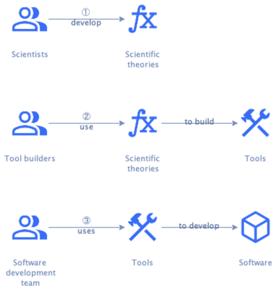

# Analysis

## The software development process

Software development is a multistep process that starts with stakeholder needs and ends with running software that meets
those needs:


Ideally, this process is:

- **Iterative** -- The system starts small and grows over time by adding or changing parts.
  Each part goes through the process one or more times.
  This follows Gall's Law:

  > A complex system that works is invariably found to have evolved from a simple system that worked. @@Gall1977

  Using [domain stories](../requirements/analysis.md#learning-the-domain) is a good way to start describing the parts.
- **Incremental** -- Each stage of the process refines work from earlier stages and/or adds information.
  This acknowledges that software development is collaborative knowledge work.

Let's look at knowledge and how knowledge workers collaborate in more detail and then apply that to software development.


## Knowledge

Knowledge work is work that requires extensive knowledge to perform.
Knowledge is often contrasted with information and data.

```admonish tldr title="Definition"
**Data** comprises facts, observations, or perceptions (which may or may not be correct).
Data represent raw numbers or assertions and may therefore be devoid of context, meaning, or intent.

--- @@Becerra2024
```

```admonish tldr title="Definition"
**Information** is a subset of data, only including those data that possess context, relevance, and purpose.
Information typically involves the manipulation of raw data to obtain more meaningful indication of trends or patterns
in the data.

--- @@Becerra2024
```

```admonish tldr title="Definition"
**Knowledge** in an area are justified beliefs about relationships among concepts relevant to that particular area.

--- @@Becerra2024
```

Knowledge helps produce information from data or more valuable information from less valuable information.
In this way, knowledge facilitates action, like making a decision.
Such decisions lead to events, which generate more data.

Knowledge can be generic or specific.
The latter, also known as idiosyncratic knowledge, is more interesting for the current discussion.
It can be technology-specific, context-specific, or both.

**Technology-specific knowledge** is deep knowledge about a specific area.
It includes knowledge about tools and techniques that are useful to solve problems in that area.
People often acquire this kind of knowledge as part of a formal training program and then augment it through
experience in the field.

**Context-specific knowledge** refers to the knowledge of particular circumstances of time and place in which people
perform work.
One can't acquire context-specific knowledge through formal training, but only via working in the context.

Software development relies on both context-specific and technology-specific knowledge.

For instance, consider the architectural decision about how to distribute code over deployable artifacts.
Three basic options exist: an unstructured monolith (big ball of mud), a modulith, or a set of microservices.
Technology-specific knowledge tells us that the big ball of mud approach has severe downsides for applications of
non-trivial size.
It can't tell us whether a modulith or a microservices approach is the right choice, however.
For that, we need context-specific knowledge about team sizes, skill levels of team members, etc.

Knowledge resides in several different locations: people, artifacts, and organizational entities.
As the number of knowledge workers that collaborate to solve a problem grows, it becomes more important to capture
knowledge in artifacts.

Software development in professional settings is highly collaborative.
Many specialized people contribute their deep knowledge to specific parts of the process.
The software development team therefore needs to capture their knowledge in artifacts, like requirements documents,
design diagrams, source code, and tests.


## Knowledge management tools for software development

Typically, knowledge workers have systems at their disposal to create, process, and enhance their own knowledge.
The practice of knowledge management (KM) evolved to support knowledge workers with standard tools and processes.
KM tools used in software development range from generic, like word processors, to specialized, like Integrated
Development Environments (IDEs) or deployment tools.

More specialized tools deliver higher value by automating parts of the process.
This is especially important since software development has high accidental complexity @@Brooks1986.
The software development team has to consider many things that have nothing to do with the problem to solve, but
by how it's solved.

Since software is eating the world @@Andreessen2011, it's become imperative that we improve the effectiveness and
efficiency of the software development process.
We therefore need more specialized tools that automate more parts of the process and reduce accidental complexity as
much as possible.

Such tools need a good understanding of what's going on.
In other words, we need to embed technology-specific knowledge in them.
This requires capturing as much of the knowledge worker's knowledge as possible in _structured_ artifacts.
Where generic tools like word processors can work with unstructured content, specialized tools need detailed structure
that provides context.

Consider the case of renaming something.
A word processor offers the tool of `Search & Replace`, where the tool either replaces everything or the human has to
decide _for each occurrence_ whether to replace it.
An IDE, however, offers the `Rename` tool that makes this decision automatically for the human, based on its
understanding of the context.
In that sense, the `Rename` tool reduces accidental complexity compared to the `Search & Replace` tool.

To support specialized tools, we should store artifacts in files that are both human and machine-readable.
Making the file formats machine-readable may mean humans need dedicated editors to work with the files efficiently.

Artifacts from one stage should link to the artifacts from earlier stages that they refine or add information to.
This provides [traceability](../requirements/digest/management.md#requirements-management), which helps with impact
analysis of proposed changes.
Stage-specific tools verify the links between artifacts to ensure the system is complete and correct.

One thing we can learn from Unix, is that it's better to have more fine-grained tools than fewer coarser-grained ones.
Having more tools means they each support a smaller part of the process.
This allows both the tools and the artifacts to be more focused.
This, in turn, makes it easier to implement tools and easier to review artifacts.
It also makes it easier to optimize tools for quality attributes like performance and cost.

Having many small, focused tools that each transforms a particular artifact type into another leads to an architectural
style called _pipes and filters_ @@Taylor2009.


## Tools for software _engineering_

The discussion has so far been about a process and supporting tools for software _development_.
This leaves open whether software development is an engineering discipline or not.
If we wanted to go further and insist on engineering discipline, what would change?

Since engineering is the application of scientific principles to solve practical problems, we'd need a science of
software development.
This science formalizes technology-specific knowledge about how best to develop software and organizes it in a coherent
scientific theory.

And then we need to build tools based on that scientific theory:



A set of such tools supporting the full software development lifecycle is a **Software Engineering Workbench** (SEW).
A SEW should support and guide the software development process, helping teams adopt the right practices at the right
time.

We can expect a science of software development to consist of several specific theories, each relevant to one or more
stages.
These theories define the rules for a given stage in the form of a coherent model and/or ontology.
The science of software development needs to ensure these models map well onto each other, both forward and
backward.
Without such mappings, it would be impossible to support traceability and incremental development.


## Software engineering as a team sport

Since professional software development is highly collaborative, a SEW must aid collaboration.
The output of one member should flow effortlessly to the next, like a well-practiced sports team passing the ball
around.

In our current reality, handoffs are usually not this smooth.
A software development team resembles a team in a relay race more than, say, a rugby team (which is ironic when that
team uses Scrum).
The average software development team is more a collection of individuals who work in isolation and throw output
over the wall than an actual team.
Such handoffs imply queues with associated wait times, which can be significant.

A SEW should help the work flow faster through the team.
It should collect flow metrics @@Pereira2024 that identify and help the team improve the bottleneck @@Goldratt1984.
It should also promote practices that improve flow, like software teaming @@Pearl2018 @@Meadows2022.

Most importantly, a SEW should make it easy to collaborate.
It should make progress visible to all team members and make it clear where each can best contribute.
In a way, this means that software engineering is a team sport where the players are both humans and tools.
The tools ideally provide all technology-specific knowledge, while humans add context-specific knowledge.

A SEW thus consists of an **orchestrator** that maintains **tasks** for team members to complete, and **tools** that
create or update **artifacts**.
It supports team members by providing them tasks to perform, which also consist of creating and updating artifacts.
Note that the creation of an artifact is usually the result of the transformation of one or more other artifacts by
adding information.
Updating an artifact is usually also a matter of adding information.
