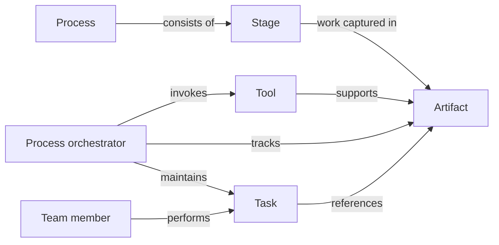

# Engineering process concepts

The software engineering process is a specialized version of the knowledge management process:

```mermaid
flowchart LR
  P[Process]
  S[Stage]
  A[Artifact]
  T[Tool]
  O[Process orchestrator]
  H[Team member]

  P--consists of-->S
  S--work captured in-->A
  T--supports-->A
  O--tracks-->A
  O--invokes-->T
  O--maintains-->Task
  H--performs-->Task
  Task--references-->A
```
