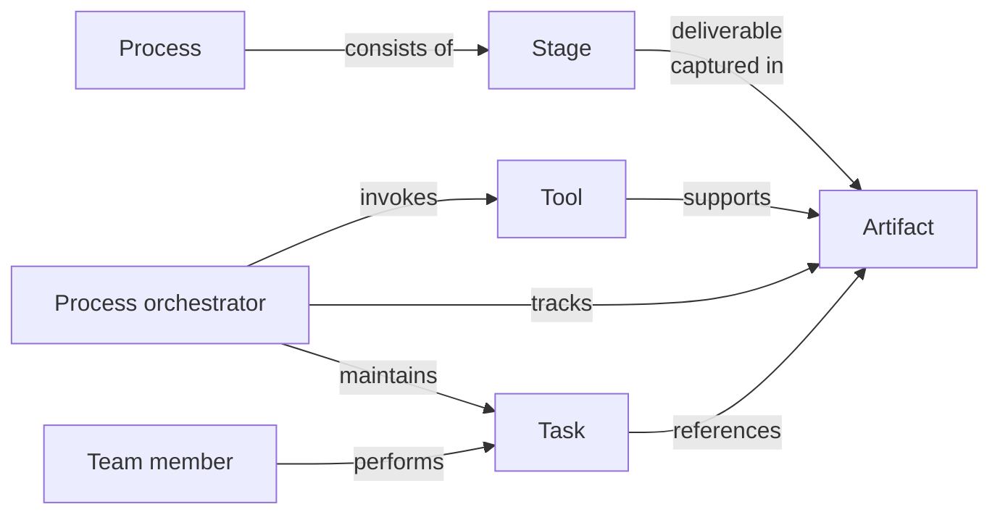

# Engineering process concepts

The software engineering process is a specialized version of the knowledge management process:

The specialization lies in the tools and artifacts used.
The chapters about the various stages of software development shed more light on the specifics.
For instance, for the requirements stage, the artifact would be a
[domain story](../requirements/analysis.md#learning-the-domain).
