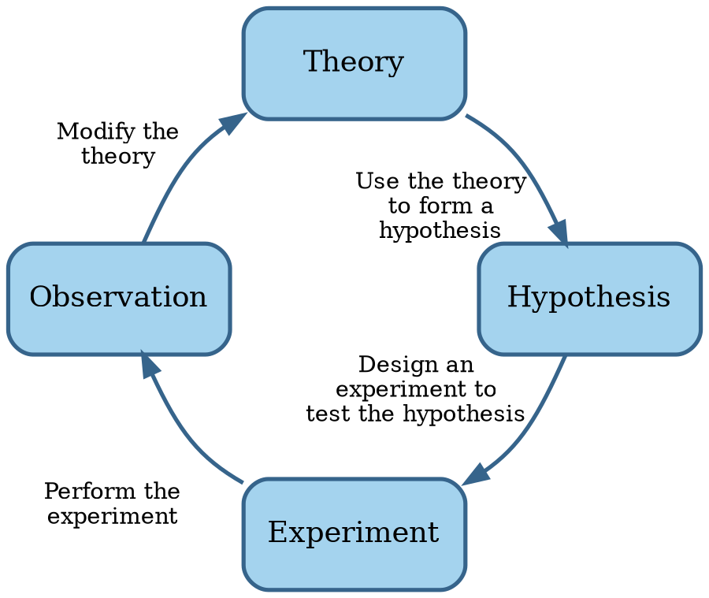
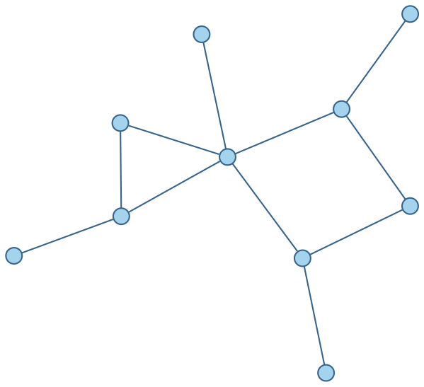

# Engineering

If the goal is for software development to be an engineering discipline, then we should understand what
engineering means.

```admonish tldr title="Definition"
**Engineering** is the creation of cost-effective solutions to practical problems by applying scientific knowledge
building things in the service of mankind.

--- @@Shaw1990
```

One of the essential parts in this definition is that engineering is about building things.
Where science is about discovering how things _are_, engineering is about discovering a _form_ for an artifact that
ensures it serves its purpose @@Brockman2009.

Another essential part is about applying science.
If the required science isn't available yet, we can settle for codified knowledge instead.
If there are no generally accepted principles and procedures at all, however, then it's craft rather than engineering.


## Science

```admonish tldr title="Definition"
**Science** is a system of knowledge covering general truths or the operation of general laws, especially as
obtained and tested through the scientific method.

--- @@MerriamWebsterScience
```

```admonish tldr title="Definition"
The **scientific method** are principles and procedures for the systematic pursuit of knowledge involving the
recognition and formulation of a problem, the collection of data through observation and experiment, and the
formulation and testing of hypotheses.

--- @@MerriamWebsterScientificMethod
```

The scientific method involves making observations, formulating hypotheses based on those observations,
running experiments to falsify the hypotheses, and generalizing hypotheses into a cohesive theory.
These activities form a loop:



Scientific knowledge grows over time.
Little discoveries here and there build on each other to reach truly impressive gains in understanding.
Most of this progress is gradual.
Every once in a while, however, a breakthrough leads to rapid progress.
Some of these breakthroughs are the result of a different way of looking at things @@Kuhn1970.


## Applied science

Application of the scientific method leads to scientific theories that engineering then applies to solve practical
problems.
For instance, electrical engineering applies the theory of electromagnetism @@Jackson1999.

Engineers apply scientific theories by constructing models of their designs @@Brockman2009.
A _model_ is an approximation of a real system that responds in a similar way.

Since everything connects to everything, networks are important models.
A _graph_ is a model of a network, where the _nodes_ are things and the _edges_ are relationships between the things.
Edges are either directed (with arrows) or undirected.

Here's an example of an undirected graph:



A _concept map_ is a graph where the nodes represent concepts and the edges their relationships.

A _system_ is part of a network inside a boundary @@Brockman2009.
Everything outside the boundary is the _environment_.
Systems can consist of subsystems, which are also systems.
Systems are often more than the sum of their parts.

Systems are important for engineering because:

- They're more robust: fewer dependencies means fewer things that can go wrong.
- They're easier to reason about: instead of having to understand everything inside a subsystem, we can temporarily
  forget about irrelevant details.
- Engineers can re-use existing designs when building subsystems.

Many systems are hierarchical in nature.
A graph of such a system is a _tree_, which is usually drawn upside-down, with the root at the top.
A _parts hierarchy_ or _structural hierarchy_ is a tree where all the relationships are `has-part`.
A _class hierarchy_ or _taxonomy_ is a tree where all the relationships are `is-a`.


## Design process

Artifacts have form and purpose, and the form must be appropriate for the purpose @@Brockman2009.
A producer produces an artifact in the _engineering environment_, while an operator uses the artifact in the
_operating environment_.

Operators have _performance goals_, or _specifications_.
Producers have _cost goals_, or _requirements_.
An engineers expresses goals quantitatively as constraints or objectives.
A _constraint_ is a hard limit, for instance water-resistant up to 20m.
An _objective_ is a desire for minimizing or maximizing a value, for example as thin as possible.

The engineering design process is basically to refine the form until it's acceptable in both the operating and
engineering environments.
However, the problem itself, or at least the understanding of it, also evolves in this process.
A _decision tree_, a hierarchy where the nodes are alternative options that meet a goal, may help building up that
understanding.

The design process to solve an engineering problem consists of the following steps:

1. **Define**.
  Identify the knowns and unknowns. Restate the problem in your own words. Visualize it.
2. **Explore**.
  Does the problem make sense? What are the assumptions? Approaches? Can we re-use (partial) existing solutions?
3. **Plan**.
4. **Implement**.
5. **Check**.
6. **Generalize**.
7. **Present results**.

While the above list suggests a linear approach, this is seldom the case.
At each step, the engineer may learn something that affects a "prior" step.
It's therefore best to think of this sequence as a circle rather than a straight line.


## Evolution of an engineering discipline

Engineering applies science and uses a design process.
Both of these take time to develop, so a new field of engineering necessarily grows from humble beginnings.
@@Shaw1990 provides the following model of such evolution:


@@Brockman2009 lists over 15 different engineering disciplines, like aerospace, chemical, civil, electrical, mechanical,
and nuclear engineering.
Before we judge whether software engineering deserves to be on that list, let's look at software in more detail.
