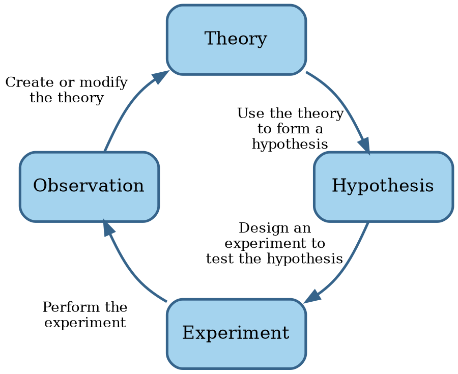
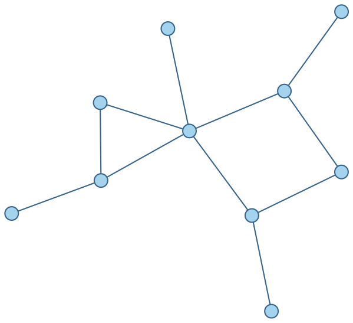

# Engineering

If the goal is for software development to be an engineering discipline, then we should understand what
engineering means.

```admonish tldr title="Definition"
**Engineering** is the creation of cost-effective solutions to practical problems by applying scientific knowledge
to build things in the service of mankind.

--- @@Shaw1990
```

One of the essential parts in this definition is that engineering is about building things.
Where science is about discovering how things _are_, engineering is about discovering a _form_ for an artifact that
ensures it serves its purpose @@Brockman2009.

Another essential part is applying science.
If the required science isn't available yet, we can settle for codified knowledge instead.
If there are no generally accepted principles and procedures at all, however, then it's craft rather than engineering
@@Shaw1990.


## Science

```admonish tldr title="Definition"
**Science** is a system of knowledge covering general truths or the operation of general laws, especially as
obtained and tested through the scientific method.

--- @@MerriamWebsterScience
```

```admonish tldr title="Definition"
The **scientific method** are principles and procedures for the systematic pursuit of knowledge involving the
recognition and formulation of a problem, the collection of data through observation and experiment, and the
formulation and testing of hypotheses.

--- @@MerriamWebsterScientificMethod
```

The scientific method involves making observations, formulating hypotheses based on those observations,
running experiments to falsify the hypotheses, and generalizing hypotheses into a cohesive theory.
These activities form a loop:



Scientific knowledge grows over time.
Little discoveries here and there build on each other to reach truly impressive gains in understanding.
Most of this progress is gradual.
Every once in a while, however, a breakthrough leads to rapid progress.
Some of these breakthroughs are the result of a different way of looking at things @@Kuhn1970.


## Applying science

Application of the scientific method leads to scientific theories that engineering then applies to solve practical
problems.
For instance, electrical engineering applies the theory of electromagnetism @@Jackson1999.

Engineers apply scientific theories by constructing models of their designs @@Brockman2009.
A **model** is an approximation of a real system that responds in a similar way.

Since everything connects to everything, networks are important models.
A **graph** is a model of a network, where the **nodes** are things and the **edges** are relationships between the
things.
Edges are either **directed** (with arrows) or **undirected** (without).

Here's an example of an undirected graph:



A **concept map** is a graph where the nodes represent concepts and the edges the relationships between them.

A **system** is part of a network inside a boundary @@Brockman2009.
Everything outside the boundary is the **environment**.
Systems can consist of **subsystems**, which are also systems.
Systems are often more than the sum of their parts.

Systems are important for engineering because:

- They're more robust: fewer dependencies means fewer things that can go wrong.
- They're easier to reason about: instead of having to understand everything inside a subsystem, we can temporarily
  forget about irrelevant details.
- Engineers can re-use existing designs when incorporating subsystems into the systems they're designing.

Many systems are hierarchical in nature.
A graph of such a system is a **tree**, which is usually drawn upside-down, with the **root** at the top.
A node directly above another node is a **parent node** and the node below it its **child**.
A node without children is a **leaf**.

A **parts hierarchy** or **structural hierarchy** is a tree where all relationships are `has-part`.
A **class hierarchy** or **taxonomy** is a tree where all relationships are `is-a`.


## Design process

Artifacts have form and purpose, and the form must be appropriate for the purpose @@Brockman2009.
A producer produces an artifact in the **engineering environment**, while an operator uses the artifact in the
**operating environment**.

Operators have performance goals, or **specifications**.
Producers have cost goals, or **requirements**.
An engineer expresses goals quantitatively as constraints or objectives.
A **constraint** is a hard limit, for instance water-resistant up to 20m.
An **objective** is a desire for minimizing or maximizing a value, for example as thin as possible.

The engineering design process basically refines the form until it's acceptable in both the operating and
engineering environments.
However, the problem itself, or at least the engineer's understanding of it, also evolves in this process.
It may help to grow this understanding by building up a decision tree.
A **decision tree** is a hierarchy where child nodes are alternative options to meet the goal of their parent node.

The design process to solve an engineering problem consists of the following steps:

1. **Define**.
  Identify the knowns and unknowns. Restate the problem in your own words. Visualize it.
2. **Explore**.
  Does the problem make sense? What are the assumptions? Possible approaches? Can we re-use (partial) existing solutions?
3. **Plan**.
  Determine the sequence of steps.
  Create a tree where the root represents the main goal, intermediate nodes represent subgoals, and leafs the givens
  and assumptions.
4. **Implement**.
  Solve equations, assemble the structure, write a program, etc.
  Take small steps and document them.
  Expect to iterate between this step and the plan step.
5. **Check**.
  Do a sanity check.
  Run through **test cases**, known solutions to an instance of a general problem.
  You may need to iterate again.
6. **Generalize**.
  Reflect on learnings.
  Would this approach also work for other problems?
  Did you encounter problems to watch out for in future endeavors?
7. **Present results**.
  Prepare to present to both experts and lay people.

While the above list may suggest a linear approach, this is seldom the case.
At most steps, the engineer may learn something that affects a "prior" step.


## Evolution of an engineering discipline

Engineering applies science, which takes time to develop.
A new field of engineering necessarily grows from humble beginnings.
@@Shaw1990 provides the following model of such evolution:


@@Brockman2009 lists over 15 different engineering disciplines, like aerospace, chemical, civil, electrical, mechanical,
and nuclear engineering.
Before we judge whether software engineering deserves to be on that list, let's look at software in more detail.
