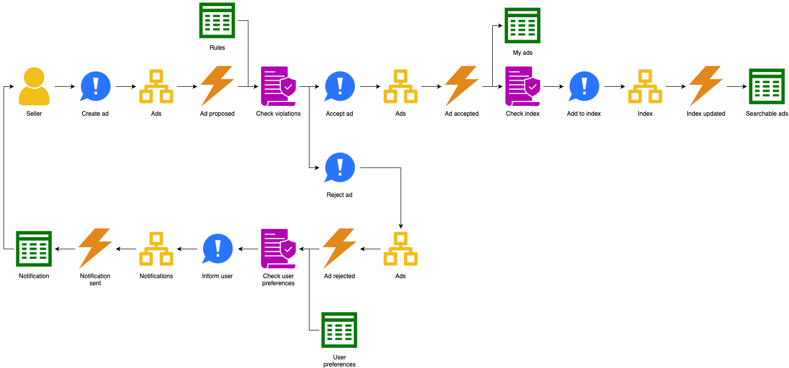
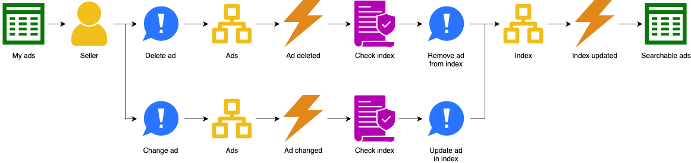
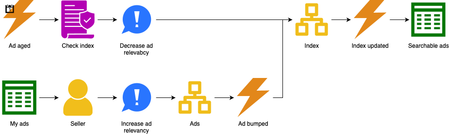
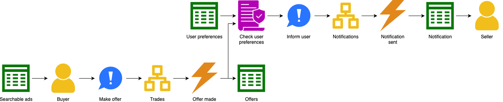
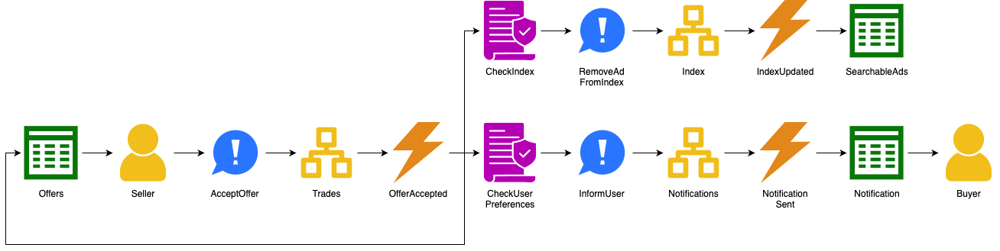
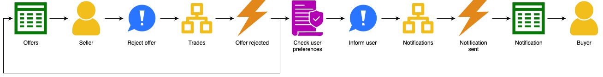
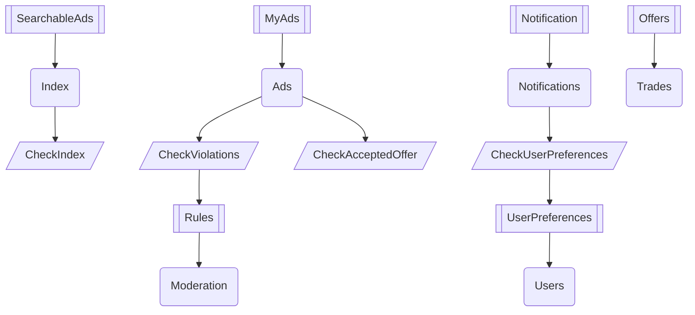
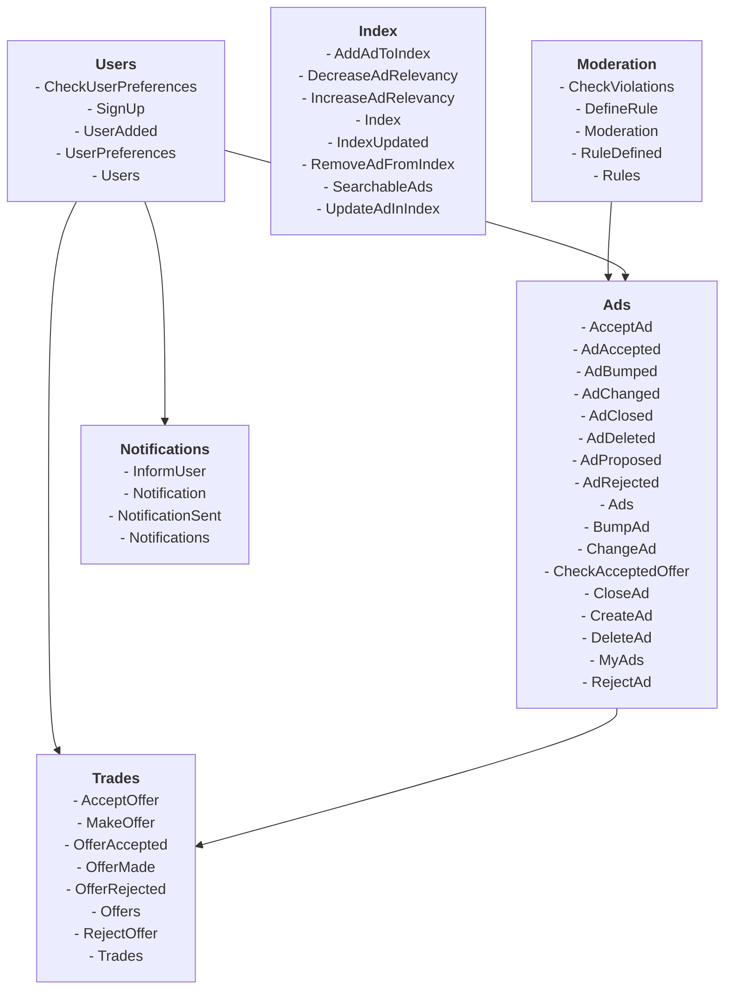

# Online classifieds

An online classifieds business is a two-sided marketplace, bringing together sellers and buyers.

# Requirements

Users (buyers and sellers) need to register with the marketplace:

Sellers can then place classifieds ads on the marketplace:

The marketplace maintains rules around what kind of ads sellers can place, and can reject ads that violate those rules.
In this example, we assume such moderation happens automatically, but in practice this would be a combination of
automated and manual processing.

The marketplace's Trust & Safety (TnS) Manager defines the moderation rules:

The marketplace maintains a database of ads and also an index of searchable ads.
The searchable ads contains a subset of all ads, optimized for searching by buyers.
The seller can delete or change their ads:

One of the ways the marketplace makes money is via paid features.
For instance, ads age, which reduces their relevancy in the search index.
Sellers can pay to bump their ads to increase this relevancy again:

Buyers browse ads and make offers to sellers:

The seller can accept the offer:

Or they can reject the offer:

The above is a bare-bones classifieds experience.
Competitive offerings include features not covered here, like messaging, payment, and shipping.

# Design

The dependency graph for aggregates, automated policies, and read models looks like this:

The corresponding modules are:

