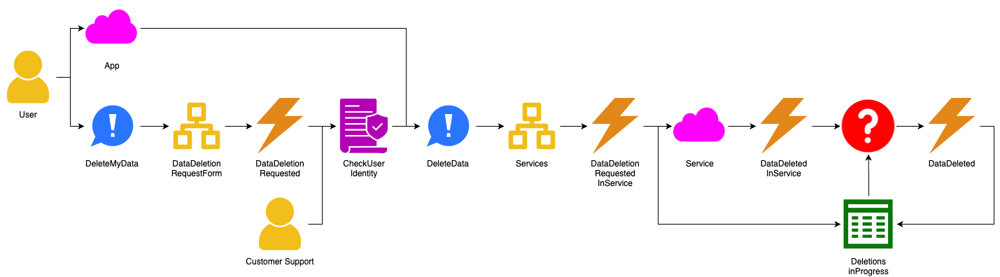
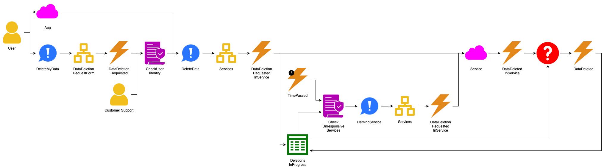
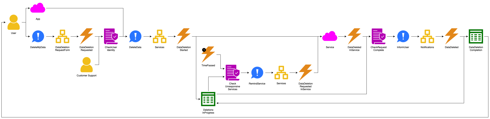
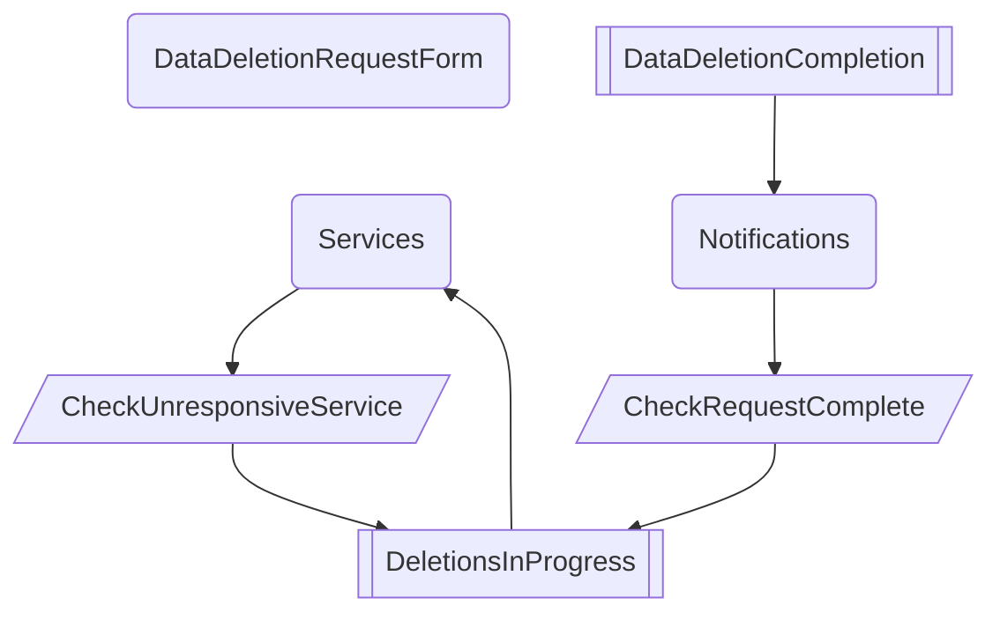
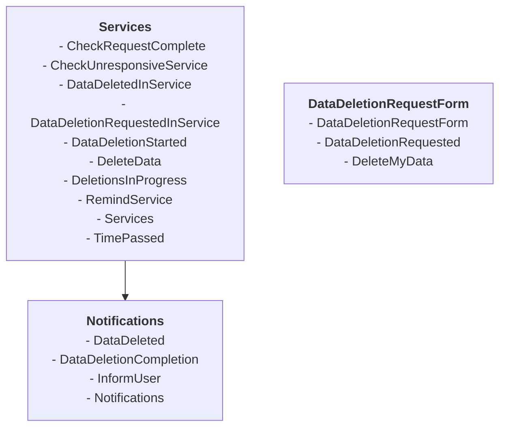

# Example: supporting GDPR

Here we show an example of the method in detail.

In this example, a company owns several apps that consumers use.
Since the company operates in the European Union, it must follow the GDPR regulation.
Among other things, this regulation grants EU citizens the right to have companies delete their data.

The company's apps store data about their users.
On top of that, the apps use shared services that also store data about those users.

## Requirements

We start by discovering the requirements.
For demonstration purposes, we'll show this process in a simplified, structured form.
The analyst asks a question, the stakeholder gives an answer, and the analyst shows the resulting model.

<!-- vale Google.FirstPerson = NO -->

**Q**: What can I do for you?

**A**: I want a system to support GDPR.

**Q**: What interesting things happen in this system?

**A**: Users delete their data with it.

**Q**: How does the system know who the user is?
Otherwise, it won't know what data to delete.

**A**: The user logs in to one of our apps and issues the command from there.
Or the user fills out an online form and our customer support agents validate their identity against the app's user
database.

**Q**: What happens when the user's request is invalid?
For instance, when I use the form to request deletion of your data?

**A**: Customer support contacts the user via email.
If that user doesn't respond, we cancel the request, and there's nothing else to do.
If the user responds they didn't send the request, we also cancel the request.
If the user doesn't have an account with any of our apps, same thing.

<!-- markdownlint-disable MD036 -->
_(The model doesn't change.)_
<!-- markdownlint-enable MD036 -->

**Q**: How does the system delete the user's data?

**A**: It has to tell all our services to delete the data.
They'll do the actual deletion and report back when they're done.

**Q**: What happens when a service doesn't respond?

**A**: After some time, we'll call them again.

**Q**: What happens when all services have responded back?

**A**: Then the request is complete, and we inform the user.

<!-- vale Google.FirstPerson = YES -->

At this point, the process model is complete, since there are no more hotspots.

Note that the analyst did some initial design during the requirements elicitation process.
Two situations makes this is possible:

1. The model contains a sequence of **command → hotspot → event** where it's clear what needs to happen in the hotspot
    and what information that requires.
    In that case, the analyst can replace the hotspot with an **aggregate** named after the required information.
2. Similar considerations apply to a sequence of **event → hotspot → command**.
    Here, the analyst replaces the hotspot with a **policy** that takes input from a **read model**.

Just because the process model is complete, doesn't mean we're done with requirements gathering.
We should define acceptance tests for automated policies, aggregates, and read models.

## Design

The dependency graph for the above process looks like this:

1. The graph has one cycle, so we create a module containing `Services`, `CheckUnresponsiveSerivces`, and
    `DeletionsInProgress`.
    Let's call this module `Services`, after its only aggregate.
2. We create two new modules for the unassigned aggregates `DataDeletionRequestForm` and `Notifications`.
3. The read model `DataDeletionCompletion` only has one outgoing edge, so we assign it to the `Notifications` module.
4. We assign the automatic policy `CheckRequestComplete` to the module that contains its read model, `Services`.

This gives us three loosely coupled modules:

