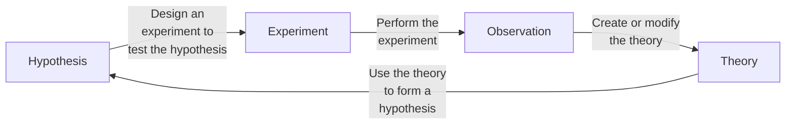
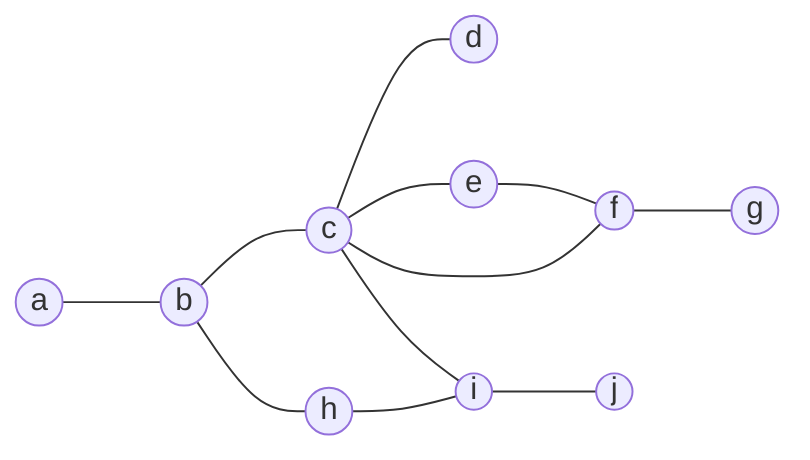
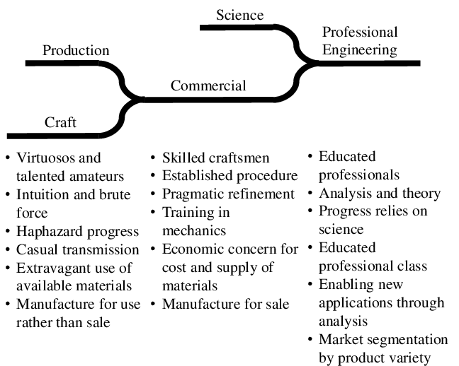

# Engineering

If the goal is for software development to be an engineering discipline, then we should understand what
engineering means.

```admonish tldr title="Definition"
**Engineering** is the creation of cost-effective solutions to practical problems by applying scientific knowledge
to build things in the service of mankind.

--- @@Shaw1990
```

One of the essential parts in this definition is that engineering is about building things.
Where science is about discovering how things _are_, engineering is about discovering a _form_ for an artifact that
ensures it serves its purpose @@Brockman2009.

Another essential part is applying science.
If the required science isn't available yet, we can settle for codified knowledge instead.
If there are no generally accepted principles and procedures at all, however, then it's craft rather than engineering
@@Shaw1990.


## Science

```admonish tldr title="Definition"
**Science** is a system of knowledge covering general truths or the operation of general laws, especially as
obtained and tested through the scientific method.

--- @@MerriamWebsterScience
```

```admonish tldr title="Definition"
The **scientific method** are principles and procedures for the systematic pursuit of knowledge involving the
recognition and formulation of a problem, the collection of data through observation and experiment, and the
formulation and testing of hypotheses.

--- @@MerriamWebsterScientificMethod
```

The scientific method involves making observations, formulating hypotheses based on those observations,
running experiments to falsify the hypotheses, and generalizing hypotheses into a cohesive theory.
These activities form a loop:



Scientific knowledge grows over time.
Little discoveries here and there build on each other to reach truly impressive gains in understanding.
Most of this progress is gradual.
Every once in a while, however, a breakthrough leads to rapid progress.
Some of these breakthroughs are the result of a different way of looking at things @@Kuhn1970.


## Applying science

Application of the scientific method leads to scientific theories that engineering then applies to solve practical
problems.
For instance, electrical engineering applies the theory of electromagnetism @@Jackson1999.

The methodical and iterative transition between scientific theory and its practical application successively develops
and refines both the theory itself and its application.
This forms the essence of good engineering practice @@Voland2004.

Engineers must acquire broad and deep technical knowledge, which begins with an understanding of scientific principles.
State-of-the-art designs require a deep understanding of one or more specialized engineering domains.
A broad view of how such an area of expertise relates to other domains provides opportunities to apply knowledge in
novel ways.
Engineers must also be familiar with historical design failures to avoid repeating the mistakes of the past.

Engineers apply scientific theories by constructing models of their designs @@Brockman2009.
A **model** is an approximation of a real system that responds in a similar way.

Since everything connects to everything, networks are important models.
A **graph** is a visualization of a network, where the **nodes** are things and the **edges** are relationships between
the things.
Edges are either **directed** (with arrows) or **undirected** (without).

Here's an example of an undirected graph:



A **concept map** is a graph where the nodes represent concepts and the edges the relationships between them.
Concepts maps are useful for organizing and structuring knowledge.

A **system** is part of a network inside a boundary @@Brockman2009.
Everything outside the boundary is the **environment**.
Systems can consist of **subsystems**, which are also systems.
Systems are often more than the sum of their parts.

Systems are important for engineering because:

- They're more robust: fewer dependencies means fewer things that can go wrong.
- They're easier to reason about: instead of having to understand everything inside a subsystem, we can temporarily
  forget about irrelevant details.
- Engineers can re-use existing designs when incorporating subsystems into the systems they're designing.

Many systems are hierarchical in nature.
A graph of such a system is a **tree**, which is usually drawn upside-down, with the **root** at the top.
A node directly above another node is a **parent node** and the node below it its **child**.
A node without children is a **leaf**.
A node that's neither the root nor a leaf is an **intermediate node**.

A **parts hierarchy** or **structural hierarchy** is a tree where all relationships are `has-part`.
A **class hierarchy** or **taxonomy** is a tree where all relationships are `is-a`.


## Design process

Engineers focus on problems for which there are many practical solutions.
They seek the best solution from among these alternatives.
To help with that, they follow a procedure known as the engineering design process @@Voland2004.

The artifacts to design have form and purpose, and the form must be appropriate for the purpose @@Brockman2009.
A _producer_ produces an artifact in the **engineering environment**, while an _operator_ uses the artifact in the
**operating environment**.

Operators have performance goals, or **specifications**.
Producers have cost goals, or **requirements**.
An engineer expresses goals quantitatively as constraints or objectives.
A **constraint** is a hard limit, for instance _water-resistant up to 20m_.
An **objective** is a desire for minimizing or maximizing a value, for example _as thin as possible_.

The engineering design process refines the form until it's acceptable in both the operating and
engineering environments.
The design process to solve an engineering problem consists of the following steps @@Voland2004 :

1. **Needs assessment**.
    Establish the need for a solution.
    This may be an unmet need or an improvement of an earlier solution with weaknesses or shortcomings.

    The output of this phase is a **design proposal**, which justifies the need for a solution and expresses this need
    in precise and accurate terms.
    The design proposal lists the objective (why), background (who, where), method (how, when), expected results
    (what), and costs (how much).

    The background describes the users to serve and the environment in which the solution must operate.
    It also evaluates existing solutions and prior work.
2. **Problem formulation**.
    Define the problem in the form of design goals that any viable solution must meet, using specifications and
    requirements.

    The "real" problem to solve is usually different from the initial statement.
    Several heuristics help with discovering the "real" problem:

    - The **statement-restatement technique** rewrites the initial statement in different ways to gain more insight
      into the real problem.
      You can use words, diagrams, or mathematical formulas.
    - A **why-why diagram** places the initial statement on the left and possible underlying sources on the right.
      One can identify the sources for those sources again, etc. to get more and more specific.
    - A **Duncker diagram** matches present and desired state.
      One keeps rewriting these until there is satisfactory correlation between them.
      Under each state one then lists solutions at three levels: general, functional, and specific.
      General solutions can either take an action to achieve the desired state, or transform the present state to make
      it acceptable.
    - **Kepner-Tregoe situation analysis**, see below.

    For most problems, the solution space is too large to search exhaustively.
    A more practical approach is to look at the problem state and desired solution state and develop a strategy for
    traversing the path between them.

    One such a strategy is to decompose the problem into a set of **design goals** that any viable solution must achieve.
    Design goals can be generic (like safety, reliability, performance, minimum costs, etc.) or problem-specific.
    Some design goals require complete achievement (MUSTs), whereas others (WANTs) have associated quantitative
    boundaries within which solutions must fit.

    Once you've settled on the design goals, you should prioritize them.
3. **Abstraction and synthesis**.

    In **abstraction**, the engineer breaks the problem down into as many different functional parts as possible, where
    the subproblems ideally are independent.

    Models help recognize what we know and what not about a problem and its solution.
    They can transform an unfamiliar problem into a set of recognizable subproblems that may be much easier to solve.
    Examples of models are miniatures, diagrams, sets of mathematical equations, and computer simulations.
    Models are approximations that leave out unnecessary detail.

    **Synthesis** uses the building blocks identified during analysis to generate solutions to the original problem.
    Synthesis is the creative phase, so use creativity-stimulating techniques like brainstorming to generate ideas.
    Try to avoid rejecting impractical ideas outright, but mold them into revised forms that are feasible.

    A morphological chart can help with synthesis.
    The rows correspond to design goals and the columns to different ways to achieve them.
    A solution is a combination of cells, one per column.
4. **Analysis**.
    Each design alternative has its own strengths and weaknesses.
    Establish objective evaluation criteria to evaluate them, including how easy the design is to implement and to
    misuse or abuse.
    Cost is almost always a criterion.
    You can use different measures for this, like Return on Investment (ROI) or Net Present Value (NPV).

    Rank-order the design goals.
    Assign weights to them, either directly or indirectly via categories, like critical/important/optional.

    Rate each design alternative on every evaluation criterion.
    If a natural way of scoring (like dollars for cost) is available, then use that.
    Otherwise, use a ranking scale, like excellent = 10, good = 8, etc.
    You may have to build prototypes to get the scores.

    Add the scores to a **decision matrix**, where the rows represent the alternatives and the columns the criteria.
    For each criterion, multiply the alternative's score by the weight.
    Then sum over all criteria to get a total score.
    Consider scores that differ less than 10% as ties.
    Select the best alternative.

    Kepner-Tregoe analysis (see below) builds upon this basic approach.
5. **Implementation**.
    Develop the final solution, converting the design and raw materials into the desired product or system.

    Materials have properties that we classify in categories, like mechanical, electrical, physical, chemical, thermal,
    and economic.
    The materials' properties must match both the performance and functional requirements of the product and the
    processing requirements for its manufacture.
    Engineers must be aware of the properties of the various materials when they design alternatives to prevent
    coming up with infeasible designs.

    During implementation, test whether the product does indeed meet its requirements before going into full-scale
    manufacturing.
    Distribute the finished product or system to the intended clients/customers/users.
    Activate any safety-critical subsystems first and start monitoring the system's performance.

    Receive feedback for the next-generation design.
    Since designing requires making trade-offs, there is seldom a perfect solution to the problem.
    Therefore, it's common to repeat the whole process multiple times, each time incorporating learnings from
    real-world usage.
6. **Reflection.**
    Contemplate the lessons learned and knowledge acquired and optionally write a report on the project.

The problem itself, or at least the engineer's understanding of it, evolves during this process.
The design process is therefore not a linear sequence of steps, but more of an iterative process.

The engineer can capture their growing understanding of the both the problem and the solution using a decision tree.
A **decision tree** is a hierarchy where child nodes are alternative options to meet the goal of their parent node.


### Kepner-Tregoe analysis

Kepner-Tregoe analysis consists of the following steps:

1. **Situation analysis**.
    Identify the most urgent or critical aspects of the situation based on the criteria of timing (relative urgency),
    trend (expected growth pattern of the subproblem), and impact (severity of negative consequences).
    Rank each aspect of the problem on each criterion using High, Medium, or Low.
2. **Problem analysis**.
    Now look at the problem in the dimensions of characteristics (what), timing (when), location (where), and
    magnitude (how much).
    For each dimension, look at the positive and negative, then at the difference.
    For instance, ask what the problem is and what it's not, how those answers differ, and what causes the distinction.
    Looking at all these different angles helps to determine the causes of the problem.
3. **Decision analysis**.
    Divide the design goals into MUSTs and WANTs.
    Reject alternatives that fail to meet all MUST goals.
    Rank the remaining alternatives based on their scores on the WANT goals, just like with a decision matrix.
4. **Potential problem analysis**.
    Consider any risks or hazards associated with the winning alternative.
    Calculate the threat associated with each risk as the product of its probability and severity, and sum the threats.
    If the total threat associated with the winning alternative is too high, repeat for the second-best alternative,
    etc. until you find an acceptable solution.


## Evolution of an engineering discipline

Engineering applies science, which takes time to develop.
A new field of engineering therefore necessarily grows from humble beginnings.
@@Shaw1990 provides the following model of such evolution:



@@Brockman2009 lists over 15 different engineering disciplines, like aerospace, chemical, civil, electrical, mechanical,
and nuclear engineering.
Before we judge whether software engineering deserves to be on that list, let's look at software in more detail.
