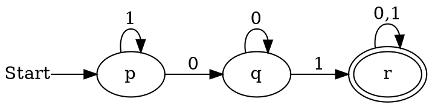
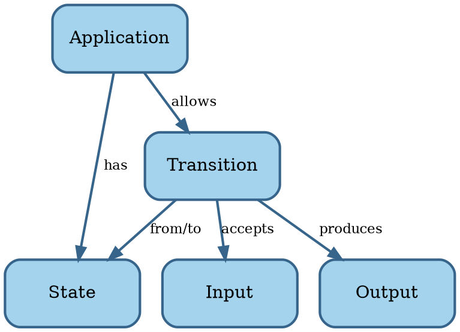

# Software

```admonish tldr title="Definition"
**Software** is a program for a computer.

--- @@MerriamWebsterSoftware
```

```admonish tldr title="Definition"
A **program** is a sequence of coded instructions that can be inserted into a computer.

--- @@MerriamWebsterProgram
```

We distinguish two types of software:

1. **System software**: operating systems, device drivers, and utilities.
2. **Application software**: productivity software, graphics software, databases, browsers, games, and the like.

System software is essential for the functioning of a general-purpose computer, managing hardware and providing a
platform on which application software runs.
System software provides value to the end user indirectly, through application software.

Most of what follows should be applicable to both categories.
In case of conflict, however, we'll focus on application software, because the majority of software falls into that
bucket.

In summary, software consists of instructions for a computer that tell it what to compute.
Let's look at the science of computing next.


## Computing

**Automata theory** is the study of abstract computing devices, named **machines** or **automata** @@Hopcroft2007.
The theory formally defines different types of automata and derives mathematical proofs about them.


### Finite automata

The simplest types of automata are finite automata.
A **Deterministic Finite Automaton** (DFA) is a tuple $A = \lang Q, \Sigma, \delta, q_0, F \rang$, where

- $Q$ is a finite set of **states** the automaton can be in.
- $\Sigma$ is a finite set of symbols, called the **input alphabet** of the automaton.
- $\delta$ is the **transition function** $\delta : Q \times \Sigma \to Q$ mapping states to
  successor states under input from $\Sigma$.
- $q_0 \in Q$ is the **start state**.
- $F \subseteq Q$ is the set of **accepting states**.

<!-- markdownlint-disable MD013 -->
<!-- vale Openly.SentenceLength = NO -->
We can visually present a DFA using a **transition diagram**.
For instance, the DFA $\lang \text{\textbraceleft} p, q, r\text{\textbraceright}, \text{\textbraceleft}0, 1\text{\textbraceright}, \delta, \text{\textbraceleft}p\text{\textbraceright}, \text{\textbraceleft}r\text{\textbraceright} \rang$
may look like this for a suitable $\delta$:
<!-- vale Openly.SentenceLength = YES -->
<!-- markdownlint-enable MD013 -->



<!-- vale Google.Ellipses = NO -->
Let $w$ be a word made up of symbols $a_i \in \Sigma$ such that $w = a_1a_2...a_n$.
If there are transitions in $\delta$ such that $q_1 = \delta(q_0, a_1)$, $q_2 = \delta(q_1, a_2)$, etc. and
$q_n \in F$, then $A$ **accepts** $w$.
The collection of all words that $A$ accepts is the **language** of $A$, $L(A)$.
<!-- vale Google.Ellipses = YES -->

For instance, the language of the automaton above is the set of strings composed of $0$s and $1$s that contains the
substring $01$.

Languages accepted by DFAs are **regular languages**.
Regular languages have many applications in software.
For instance, they describe keywords and valid identifiers in programming languages and parts of a URL.
They're also useful in searching documents and describing protocols.

A **Nondeterministic Finite Automaton** (NFA) is like a DFA, except $\delta$ returns a subset of $Q$ rather than
a single state.
In other words, an NFA can be in more than one state at the same time.
It's possible to convert an NFA to a DFA, so the languages accepted by NFAs are also regular languages.

An **$\epsilon$-NFA** is an NFA with the extra feature that it can transition on $\epsilon$, the empty string.
In other words, an $\epsilon$-NFA can make transitions without consuming input.
It's possible to convert an $\epsilon$-NFA to a DFA as well, so the languages accepted by $\epsilon$-NFAs are also
regular languages.

**Regular expressions** are an alternative way of describing regular languages.
They use the symbols of $\Sigma$ along with the operators $+$ (union) and $*$ (zero or more times) and parentheses.
For instance, the regular expression $(0+1)^*01(0+1)^*$ defines the same language as the PDA above.
We can convert regular expressions to DFAs and vice versa.


### Pushdown automata

TODO


### Turing machines

TODO


### Model of software

Here's a concept map of a software application based on automata theory:



This model is admittedly not super useful yet, but it'll serve as the basis for later enhancements.

Now that we understand the basics of both software and engineering, let's put these two together.
