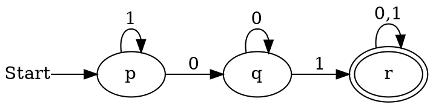
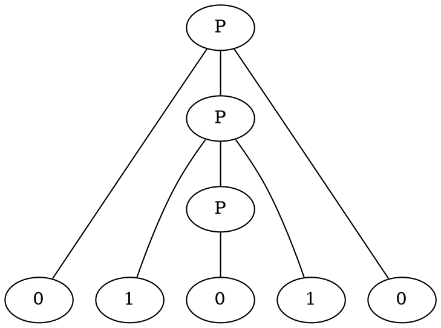
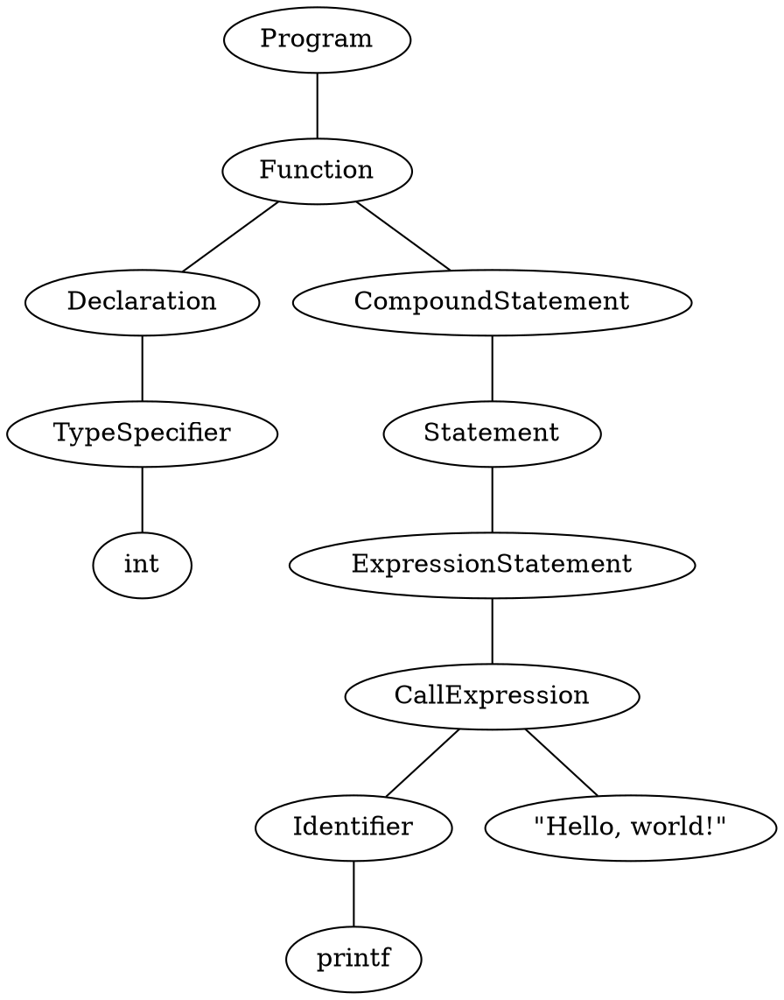
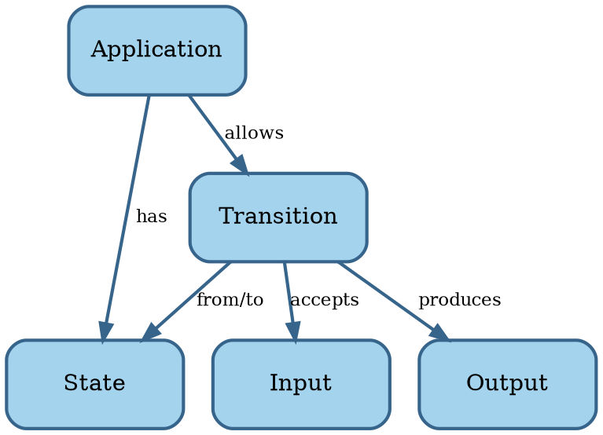

# Software

```admonish tldr title="Definition"
**Software** is a program for a computer.

--- @@MerriamWebsterSoftware
```

```admonish tldr title="Definition"
A **program** is a sequence of coded instructions that can be inserted into a computer.

--- @@MerriamWebsterProgram
```

We distinguish two types of software:

1. **System software**: operating systems, device drivers, and utilities.
2. **Application software**: productivity software, graphics software, databases, browsers, games, and the like.

System software is essential for the functioning of a general-purpose computer, managing hardware and providing a
platform on which application software runs.
System software provides value to the end user indirectly, through application software.

Most of what follows should be applicable to both categories.
In case of conflict, however, we'll focus on application software, because the majority of software falls into that
bucket.

In summary, software consists of instructions for a computer that tell it what to compute.
Let's look at the science of computing next.


## Computing

**Automata theory** is the study of abstract computing devices, named **machines** or **automata** @@Hopcroft2007.
The theory formally defines different types of automata and derives mathematical proofs about them.


### Finite automata

The simplest types of automata are finite automata.
A **Deterministic Finite Automaton** (DFA) is a tuple $A = \lang Q, \Sigma, \delta, q_0, F \rang$, where

- $Q$ is a finite set of **states** the automaton can be in.
- $\Sigma$ is a finite set of symbols, called the **input alphabet** of the automaton.
- $\delta$ is the **transition function** $\delta : Q \times \Sigma \to Q$ mapping states to
  successor states while consuming input.
- $q_0 \in Q$ is the **start state**.
- $F \subseteq Q$ is the set of **accepting states**.

<!-- markdownlint-disable MD013 -->
<!-- vale Openly.SentenceLength = NO -->
We can visually present a DFA using a **transition diagram**.
For instance, the DFA $\lang \text{\textbraceleft} p, q, r\text{\textbraceright}, \text{\textbraceleft}0, 1\text{\textbraceright}, \delta, \text{\textbraceleft}p\text{\textbraceright}, \text{\textbraceleft}r\text{\textbraceright} \rang$
may look like this for a suitable $\delta$:
<!-- vale Openly.SentenceLength = YES -->
<!-- markdownlint-enable MD013 -->



<!-- vale Google.Ellipses = NO -->
Let $w$ be a word made up of symbols $a_i \in \Sigma$ such that $w = a_1a_2...a_n$.
If there are transitions in $\delta$ such that $q_1 = \delta(q_0, a_1)$, $q_2 = \delta(q_1, a_2)$, etc. and
$q_n \in F$, then $A$ **accepts** $w$.
The set of all words that $A$ accepts is the **language** of $A$, $L(A)$.
<!-- vale Google.Ellipses = YES -->

For instance, the language of the automaton above is the set of strings composed of $0$s and $1$s that contain the
substring $01$.

Languages accepted by DFAs are **regular languages**.
Regular languages have many applications in software.
For instance, they describe keywords and valid identifiers in programming languages or the structure of a URL.
They're also useful in searching documents and describing protocols.

A **Nondeterministic Finite Automaton** (NFA) is like a DFA, except $\delta$ returns a subset of $Q$ rather than
a single state.
In other words, an NFA can be in more than one state at the same time.
It's possible to convert an NFA to a DFA, so the languages accepted by NFAs are also regular languages.

An **$\epsilon$-NFA** is an NFA with the extra feature that it can transition on $\epsilon$, the empty string.
In other words, an $\epsilon$-NFA can make transitions without consuming input.
It's possible to convert an $\epsilon$-NFA to a DFA as well, so the languages accepted by $\epsilon$-NFAs are also
regular languages.

**Regular expressions** are an alternative way of describing regular languages.
They use the symbols of $\Sigma$ along with the operators $+$ (union) and $*$ (zero or more times) and parentheses.
For instance, the regular expression $(0+1)^*01(0+1)^*$ defines the same language as the PDA above.
We can convert regular expressions to DFAs and vice versa.

Regular languages can describe parts of programs, but not entire programs.
The memory of a DFA is too limited.
Let's look at more powerful automata that define more useful languages.


### Pushdown automata

A **Pushdown Automaton** (PDA) is an $\epsilon$-NFA with a stack on which it can store information.
A PDA can access information on the stack only in a first-in-first-out way.
The stack allows the PDA to remember things, which makes it more powerful than a DFA.
For instance, no DFA can recognize palindromes, but a PDA can.

Formally, a PDA is a tuple $P = \lang Q, \Sigma, \Gamma, \delta, q_0, Z_0, F \rang$.
We've seen most of these symbols already in the definition of DFAs.
The new ones are:

- $\Gamma$ is the alphabet of stack symbols, the information that can go on the stack.
- $Z_0$ is the initial symbol on the stack when the PDA starts.

The transition function is slightly different.
It takes the current state, an input symbol, and the symbol from the top of the stack as input.
It outputs pairs consisting of a new state and a string of stack symbols that replace the top of the stack.

- This stack string can be $\epsilon$, the empty string, in which case $\delta$ pops an element off the stack.
- It can also be the same as the top of the stack, in which case the stack remains the same.
- Or it can be a different string, even consisting of multiple symbols.
  In that case, the PDA pops the top symbol off the stack and pushes the output string onto the stack,
  one symbol at a time.

We can visualize PDAs using transition diagrams, just like DFAs.
The edges show both the input symbol consumed and the old and new top of the stack.
For instance, an edge labeled $a, X / \gamma$ between nodes $p$ and $q$ means that $\delta(p,a, X)$ contains the pair
$(p, \gamma)$.
Here, $\gamma$ is a string made up of stack symbols $\gamma_i \in \Gamma$.

A PDA can accept a word in two ways:

- By final state, like for finite automatons.
- By empty stack, which is a new capability compared to finite automatons.
  In this definition, when the PDA pops the last symbol off its stack, the input it consumed up to then is a word that
  it accepts.

These two ways of accepting words and thus defining a language turn out to be the same.
Suppose a PDA $P_1$ accepts by final state the language $L$.
We can construct a different PDA $P_2$ that accepts by empty stack precisely $L$.
The converse is also true.

We call the languages accepted by PDAs the **context-free languages**.
Context-free languages, like regular languages, have important applications in software development.
Before we dive into those, let's look at an alternative way to specify the context-free languages: context-free grammars.

A **Context-Free Grammar** (CFG), or just grammar, is a tuple $G = \lang V, T, P, S \rang$, where

<!-- vale Google.Ellipses = NO -->
- $V$ is a set of variables.
  Each variable represents a language, or set of strings.
  **Variables** are building block for the bigger language that the grammar defines.
- $T$ is a set of terminals.
  A **terminal** is a symbol in the language the grammar defines.
- $P$ is a set of productions.
  A **production** is of the form $H \to B$, where $H \in V$ is the **head** and
  $B = \text{\textbraceleft} b_1b_2...b_n \mid b_i \in V \cup T \text{\textbraceright}$ is the **body**.
  A body consists of zero or more variables and terminals.
- $S \in V$ is the start symbol.
<!-- vale Google.Ellipses = YES -->

For instance, a grammar for the palindromes over $0$ and $1$ is:

$G_p = \lang \text{\textbraceleft}P\text{\textbraceright}, \text{\textbraceleft}0, 1\text{\textbraceright}, A, P \rang$

Where $A$ is the following set of productions:

1. $P \to \epsilon$
2. $P \to 0$
3. $P \to 1$
4. $P \to 0P0$
5. $P \to 1P1$

We can **derive** a word from a CFG $G$.
Start with its start symbol, and recursively replace variables using the productions until only terminal symbols remain.
The set of words we can derive from a grammar $G$ is its language, $L(G)$.

<!-- vale Google.Ellipses = NO -->
A **parse tree** is a tree representation of a derivation in a CFG $G$.
The root of this tree is the start symbol $S$ of $G$.
For every production $H \to b_1b2...b_n$, there is a child $b_i$ under parent $H$ and these children are in order.
<!-- vale Google.Ellipses = YES -->

Here's an example parse tree for $G_p$ that derives the palindrome $01010$:



The leaves from left to right spell the derived word.

Languages we can derive from CFGs are precisely the context-free languages.
For every CFG $G$ that defines a language $L(G)$, we can construct a PDA $P$ such that $L(G) = L(P)$.
The converse is also true.

Context-free languages can recognize programming languages.
A parse tree of a CFG for a programming language describes a single program in that language.
For instance, here's a fictitional parse tree for the infamous $Hello, world!$ program in C:



We now have the vocabulary to describe the _structure_ of a program and of programming languages.
However, PDAs aren't powerful enough to describe the runtime _behavior_ of all but the simplest programs.
Let's next look at automata that can.


### Turing machines

<!-- vale proselint.Typography = NO -->
A **Turing Machine** (TM) is a generalization of a PDA where an infinite tape replaces the stack.
This **tape** is a linear sequence of **cells**, one of which, the **head**, the TM points to.
Initially, the input is on the tape, one symbol per cell, and the head points to the first input symbol.
Left and right of the input, all cells are blank.
<!-- vale proselint.Typography = YES -->


Formally, a TM is a tuple $M = \lang Q, \Sigma, \Gamma, \delta, q_0, B, F \rang$.
We’ve seen most of these symbols already in the definition of previous automata.
The new and changed ones are:

- $\Gamma$ is a set of **tape symbols**.
  These are analogous to the stack symbols of a PDA.
  Note that $\Sigma \subset \Gamma$.
- $B$ is the **blank symbol**, where $B \in \Gamma - \Sigma$.
  It's analogous to $Z_0$ of a PDA.
- The transition function $\delta$ takes a state $q \in Q$ and tape symbol $X \in \Gamma$ as input.
  It produces a triple $(p, Y, D)$.
  Here $p \in Q$ is the next state.
  $Y \in \Gamma$ is the tape symbol written to the head.
  $D \in \text{\textbraceleft} L, R \text{\textbraceright}$ is the direction in which the head moves: $L$ = left and
  $R$ = right.

We can visualize TMs using transition diagrams, where edges are of the form $X / Y D$.
Here $X$ is the tape symbol at the head and $Y$ is the replacement tape symbol.
$D$ is the direction in which to move the head ($L$ or $R$).

The languages TMs accept are the **recursively enumerated** (RE) languages.
Several variations of TMs exist, such as those with multiple tapes and non-deterministic TMs.
These have the same power, in the sense that they also accept RE languages.
Simpler models exists as well, like a PDA with two stacks, that accept RE languages.

Real computers have the same power as TMs, in the sense that a TM can simulate a computer and vice versa.
Here we assume a computer has access to an infinite number of disks of external storage to simulate the infinite tape.
Programming a TM isn't practical for solving real-world problems, but a TM is a useful abstraction to reason about.


### Model of software

Here's a concept map of a software application based on automata theory:



This model is admittedly not super useful yet, but it'll serve as the basis for later enhancements.

Now that we understand the basics of both software and engineering, let's put these two together.
