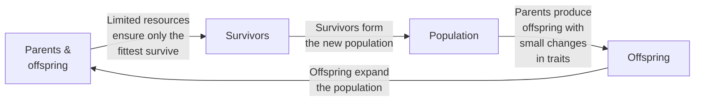

# Book organization

Before we look at the book's organization, a quick word on its title.


## Evolution

Biology is the scientific study of life.
While it has a broad scope, there is a unifying theory:

```admonish info "Quote"
Nothing in biology makes sense except in the light of evolution.

--- @@Dobzhansky1973
```

The scientific theory of evolution rests on two pillars:

1. **Natural selection** is the differential survival and reproduction of individuals due to differences in traits
  @@Darwin1859.
2. **Heredity of traits** is the passing on of traits from parents to their offspring with some changes @@Mendel1866,
  @@Fisher1930.

On a high level, evolution works as follows:



Note how this process resembles the [scientific method](engineering.md#science):

- The population is nature's current theory on how to best adapt to their environment.
- Offspring inherit traits from their parents, but with small changes via _mutation_ and, for species with
  sexual reproduction, _crossover_.
  In other words, each new generation contains several hypotheses on how to better adapt to the environment.
- Since resources are usually limited, only the fittest survive.
  Nature implicitly conducts experiments to falsify its hypotheses.
- The fittest organisms make up the new population, or current theory of how best to adapt to the environment.

The two pillars of evolution were fist brought together in the seminal book _Evolution: The Modern Synthesis_
@@Huxley1948.

The current book similarly aspires to bring together the various pillars of software engineering.

The only constant in life is change and this is especially true in software development.
Requirements change, technology changes, markets change, organizations change, and the development team changes.
All these changes have an impact on how to develop software.
As we'll see, the best way to deal with all these changes is to be agile and evolve the software.

The rest of this book attempts to answer the question of how to make software development a real engineering discipline.

First we'll look into each of the SWEBOK knowledge areas and see how much they conform to the engineering approach.
Then we'll see if we can synthesize an actual engineering process out of their combination.

Let's get started.
