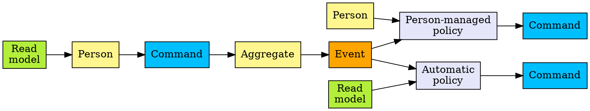
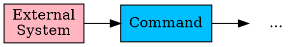
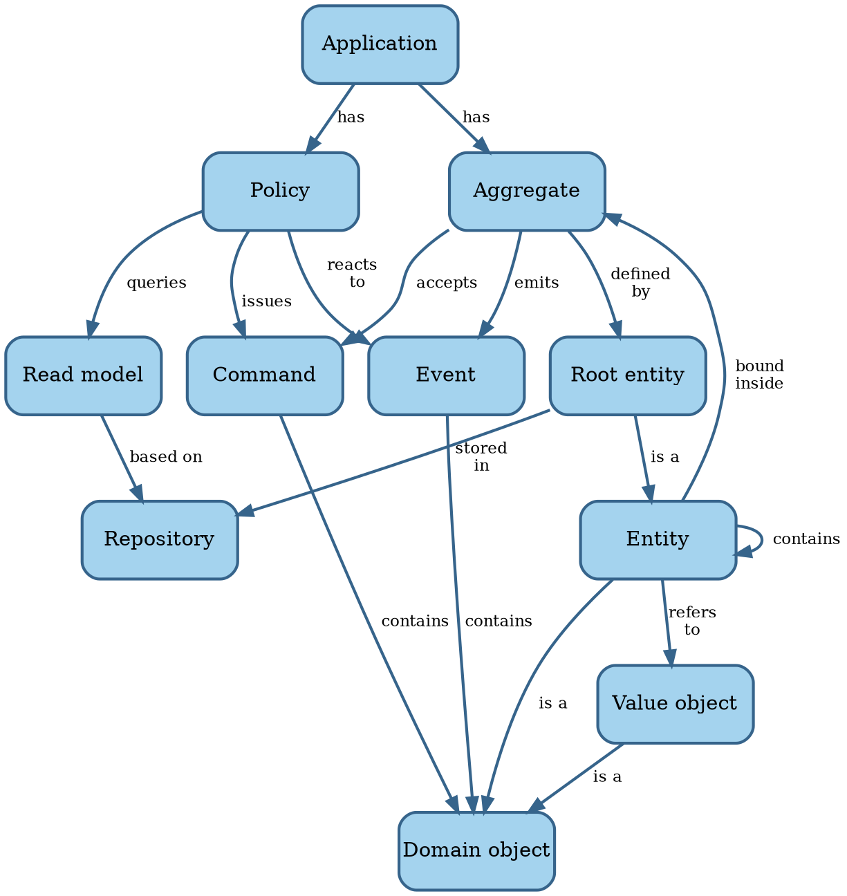

# Preliminary analysis

The books referenced by SWEBOK present generally accepted knowledge in the requirements engineering field.
However, we feel that some issues remain:

- There isn't always someone who can give us the requirements.
- Requirements elicitation takes a long time because the development team needs to learn the domain.
- Software has a certain shape that should affect how we express requirements.

Let's explore these issues in more detail.


## Unknowable requirements

The literature assumes that it's clear what the system we're about to build should do.
This isn't true until we achieve product/market fit, which means startups need a different process.

The _Lean Startup_ movement assumes that until we achieve product/market fit, we can only find out what works by trying
things out @@Ries2011.
This would put requirements development in the _Complex_
[Cynefin domain](../introduction/software-engineering.md#the-cynefin-framework), rather than in the _Complicated_
realm of engineering.

The Build-Measure-Learn cycle in Lean Startup corresponds to the probe-sense-response approach suited for the
_Complicated_ domain.
This process moves the undertaking from _Complex_ to _Complicated_.
Once the company establishes product/market fit, its requirements process normalizes.

<!-- vale Google.FirstPerson = NO -->
The issue of unknown requirements raises its head outside the startup scene as well.
We can ask stakeholders what they need, but they're always constrained by their current situation and thinking.

There may be requirements out there that, when realized, would significantly enhance the value the product delivers,
but which nobody involved can conceive of.
Remember the quote attributed to Henry Ford:
"If I had asked people what they wanted, they would have said faster horses."
<!-- vale Google.FirstPerson = YES -->

In this book, we're trying to establish an _engineering_ discipline for software development, so we'll focus on the
_Complicated_ domain.
We therefore won't pursue the issue of unknowable requirements any further, trusting that Lean Startup solves that
problem.


## Learning the domain

Most engineering disciplines specialize around a domain.
Engineers trained in that field speak the same language as the people requesting them to build a system.
In contrast, software developers need to learn the language of the domain.

The requirements elicitation practices assume an analyst interviews various subject-matter experts (SMEs)
and then writes down requirements.
Different representations of the requirements help SMEs to validate them.

In this approach, it's the business analyst who integrates the perspectives from various stakeholders.
Once a sufficiently clear picture is emerging from those conversations, maybe a workshop brings all the stakeholders
together to validate there is a shared understanding.

This approach has some issues.

Subject-matter experts, by definition, are experts.
They've accumulated a lot of knowledge over a long period of time.
It's hard for them to think back to when they didn't have all that knowledge.
This makes it hard for them to know what to explain or not, and even what to mention at all.
And since the business analyst is new to the domain, they don't know what questions to ask.
The result is an iterative process that takes a lot of time.

Worse, it's uncommon for SMEs to be experts in the entire domain.
More often, multiple SMEs each have a clear picture of one part of the process and nobody of the whole.
This results in conflicting points of view, which need resolution before building software.
However, it takes a while before the analyst knows enough to ask the hard questions and bring conflicts into the open.

_Event storming_ is a technique that solves these issues @@Brandolini2013 @@Webber2017.
It's a workshop where the key stakeholders work together to build up a consistent picture of the entire process.
It uses a simple notation that, unlike _Business Process Model and Notation_ @@BPMN2013, is easy for
non-technical people to understand.
It lets the stakeholders and development team build up a _domain model_ in hours or days rather than weeks or months.

In event storming, the SMEs perform the integration of various perspectives rather than the analyst.
By giving them a standard notation, non-experts can follow what they're doing and force them to be precise.
It allows them to ask the hard questions and bring conflicts out for resolution.
Everybody's learning compresses while the domain model emerges as a natural byproduct.

The event storming notation consists of the following:

- A **domain event** is anything that happens that's of interest to an SME.
- A **command** triggers an event.
- An **aggregate** accepts commands and emits events.
- A **policy** contains the decision how to react to an event.
- A **read model** holds the information necessary to make a decision.
- A **person** is a human being responsible for a given decision.
- An **external system** is another system that generates events of interest to the system under consideration.

In an event storming workshop, sticky notes of a particular color represent each of these concepts.
Workshop participants place the stickies on a wall in timeline order to visualize the entire business process.

A specific grammar governs event storming concepts @@Brandolini2022, in the sense that certain things
always come before or after others.
It's this grammar that allow non-experts to ask intelligent questions, like what emits this event?

The main part of the grammar is when a user of the system issues a command based on some information:



Some alternatives flows exist as well.
An external system rather than a person may issue a command:



Events can also come from outside, either from an external system or from the passing of time:

```dot process
digraph event_storming {
  rankdir=LR;
  node[shape=rectangle, style=filled, fontcolor=black];

  ES [label="External\nSystem", fillcolor=lightpink];
  ES -> E;
  E [label="Event", fillcolor=orange];
  E1 [label=<&#x1F4C5; Calendar event>, fillcolor=orange];
  E2 [label=<&#x1F551; Timer event>, fillcolor=orange];
  E2 -> rest;
  E1 -> rest;
  E -> rest;
  rest [shape=plaintext, label="...", style=""];
}
```



With the big picture defined, we can flesh out the domain model further.
The domain model is a concept from _Domain-Driven Design_ (DDD) @@Evans2014.

```admonish info "Quote"
The interaction between team members changes as all members crunch the model together. The constant
refinement of the domain model forces the developers to learn the important principles of the business they are
assisting, rather than to produce functions mechanically. The domain experts often refine their own
understanding by being forced to distill what they know to essentials, and they come to understand the
conceptual rigor that software projects require.

--- @@Evans2014
```

The **domain model** is a set of concepts shared by everyone on the project, with terms and relationships
that reflect domain insight.
These terms and relationships provide semantics for a language tailored to the domain while being precise enough
for technical development.

This language is the **ubiquitous language**, because it's used everywhere: requirements, code, tests, etc.
Using the same language prevents many misunderstandings and bugs.
The basic terms in the ubiquitous language are the **domain objects**: entities and value objects.

An **entity** is anything that has continuity and an identity, like a customer.
When we need to bill the customer, we care whether we bill Adam Brooks or Charlie Davis.

A **value object** is a concept without an identity, like an email address.
For value objects, we only care about their attributes.
Two email addresses with the same local name and internet domain are always the same, while two customers named
John Smith can be different.

An **aggregate** is a cluster of associated domain objects that we treat as a unit for data changes.
For instance, we can save an order including its line items, but we can't save individual line items.
The **root** of an aggregate is an entity, like order in the example.
The aggregate may contain other entities, like line items.
Anything outside the aggregate may only refer to the root entity.

A **repository** is where an application stores aggregates and later retrieves them.
Each aggregate type has its own repository.

The combination of event storming and DDD allows the development team to learn the domain faster and better than
traditional techniques.
The DDD concepts also map to code constructs in a natural way, eliminating translation issues.

DDD and event storming give us a new vocabulary to talk about what software _does_.
We need to reconcile that with our vocabulary of what software [is](../introduction/software.md#model-of-software).

In event storming terms, aggregates make up an application's state.
An application transitions between states when an aggregate accepts a command.
The output of an application is an emitted event.

Commands and events carry data.
In DDD terms, that data takes the form of domain objects.

Putting that all together, we get the following model for a software application:



## Requirements for software

Another potential issue with the generally accepted requirements engineering knowledge, is the advice to state
requirements in relation to a user's needs only.
The point here is to keep design out of requirements, and that's sound advice.

However, this approach also keeps out the fact that the requirements are for _software_ rather than for manual
procedures or for some other medium.
Software has a [particular shape](../introduction/software.md) and that should affect how we define requirements.

Requirements should have **acceptance criteria**, predefined conditions that the product must meet to be
acceptable in the operating environment.
Without acceptance criteria, there is no way of knowing whether the product meets the requirement.

At least some acceptance criteria take the form of acceptance tests.
An **acceptance test** verifies whether the system meets a requirement.
Some acceptance criteria can't have acceptance tests, because they're not about the system itself.
For instance, stakeholders may require that the system comes with documentation.

Some acceptance tests run automatically as part of the product's test suite; others are manual tests, like those
in User Acceptance Testing (UAT).

@@Adzic2009 argues that acceptance tests are best written using examples.
@@Smart2014 provides a template for doing that using the following form:

```text
Given <some initial state>
When <some input arrives>
Then <expect some new state and/or output>
```

This approach maps nicely to states and transitions of a Turing Machine or other automaton @@Martin2008.
We therefore argue that at least all automated acceptance tests for functional requirements should take this form.
For requirements around quality attributes other than functionality, this format may be too restrictive.

If we look at acceptance criteria through the lens of event storming, we see two specializations of the generic
`Given/When/Then` format.

This first is for aggregates:

```text
Given <the aggregate is in some state>
When <the aggregate accepts a command>
Then <the aggregate has a new state and/or emits an event>
```

The second is for policies:

```text
Given <the policy's read model returns some information>
When <the policy reacts to an event>
Then <the policy issues a command to an aggregate>
```
