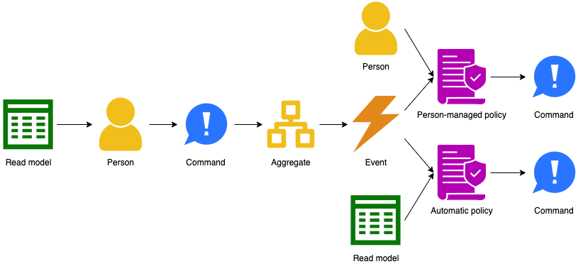
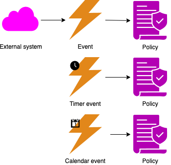
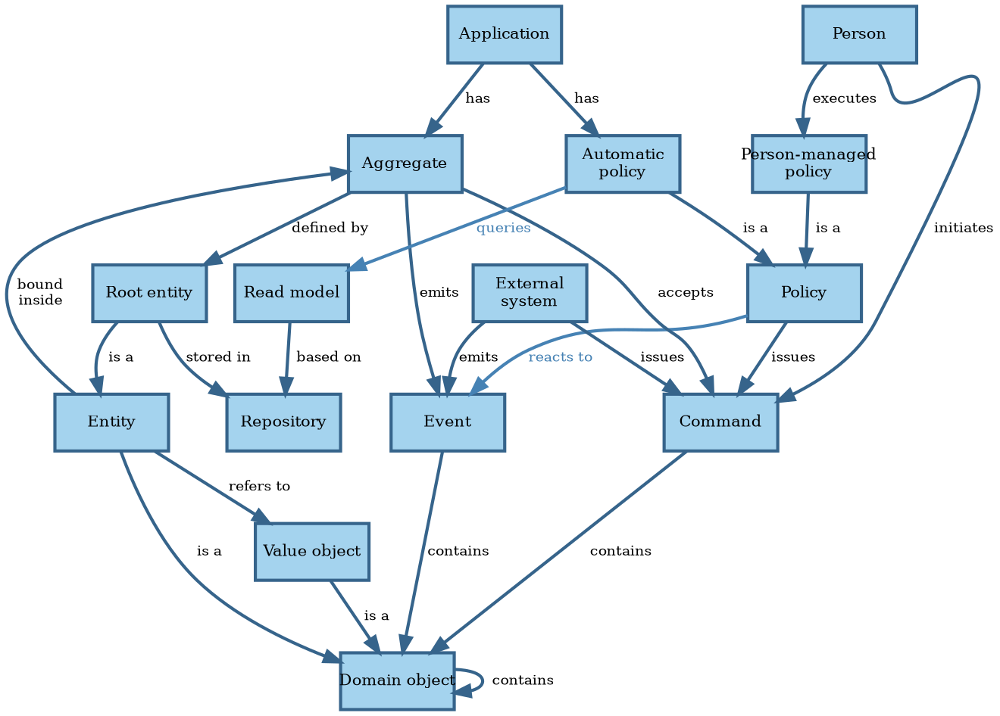

# Preliminary analysis

The books referenced by SWEBOK present generally accepted knowledge in the requirements engineering field.
However, we feel that some issues remain:

- There isn't always someone who can give us the requirements.
- Requirements elicitation takes a long time because the development team needs to learn the domain.
- Software has a certain shape that should affect how we express functional requirements.
- Guidance on specifying non-functional requirements is thin.
- The Agile requirements process is misunderstood and weak.

Let's explore these issues in more detail.


## Unknowable requirements

The literature assumes that it's clear what the system we're about to build should do.
This isn't true until we achieve product/market fit, which means startups need a different process.

The _Lean Startup_ movement assumes that until we achieve product/market fit, we can only find out what works by trying
things out @@Ries2011.
This would put requirements development in the _Complex_
[Cynefin domain](../introduction/software-engineering.md#the-cynefin-framework), rather than in the _Complicated_
realm of engineering.

The Build-Measure-Learn cycle in Lean Startup corresponds to the probe-sense-response approach suited for the
_Complicated_ domain.
This process moves the undertaking from _Complex_ to _Complicated_.
Once the company establishes product/market fit, its requirements process normalizes.

<!-- vale Google.FirstPerson = NO -->
The issue of unknown requirements raises its head outside the startup scene as well.
We can ask stakeholders what they need, but they're always constrained by their current situation and thinking.

There may be requirements out there that, when realized, would significantly enhance the value the product delivers,
but which nobody involved can conceive of.
Remember the quote attributed to Henry Ford:
"If I had asked people what they wanted, they would have said faster horses."
<!-- vale Google.FirstPerson = YES -->

In this book, we're trying to establish an _engineering_ discipline for software development, so we'll focus on the
_Complicated_ domain.
We therefore won't pursue the issue of unknowable requirements any further, trusting that Lean Startup solves that
problem.


## Learning the domain

Most engineering disciplines specialize around a domain.
Engineers trained in that field speak the same language as the people requesting them to build a system.
In contrast, software developers need to learn the language of the domain.

The requirements elicitation practices assume an analyst interviews various subject-matter experts (SMEs)
and then writes down requirements.
Different representations of the requirements help SMEs to validate them.

In this approach, it's the business analyst who integrates the perspectives from various stakeholders.
Once a sufficiently clear picture is emerging from those conversations, maybe a workshop brings all the stakeholders
together to validate there is a shared understanding.

This approach has some issues.

Subject-matter experts, by definition, are experts.
They've accumulated a lot of knowledge over a long period of time.
It's hard for them to think back to when they didn't have all that knowledge.
This makes it hard for them to know what to explain or not, and even what to mention at all.
And since the business analyst is new to the domain, they don't know what questions to ask.
The result is an iterative process that takes a lot of time.

Worse, it's uncommon for SMEs to be experts in the entire domain.
More often, multiple SMEs each have a clear picture of one part of the process and nobody of the whole.
This results in conflicting points of view, which need resolution before building software.
However, it takes a while before the analyst knows enough to ask the hard questions and bring conflicts into the open.

_Event storming_ is a technique that solves these issues @@Brandolini2013 @@Webber2017.
It's a workshop where the key stakeholders work together to build up a consistent picture of the entire process.
It uses a simple notation that, unlike _Business Process Model and Notation_ @@BPMN2013, is easy for
non-technical people to understand.
It lets the stakeholders and development team build up a _domain model_ in hours or days rather than weeks or months.

In event storming, the SMEs perform the integration of various perspectives rather than the analyst.
By giving them a standard notation, non-experts can follow what they're doing and force them to be precise.
It allows them to ask the hard questions and bring conflicts out for resolution.
Everybody's learning compresses while the domain model emerges as a natural byproduct.

The event storming notation consists of the following items:

- A <span style="color: #e2871a;">**domain event**</span> is anything that happens that's of interest to an SME.
- A <span style="color: #1d6eff;">**command**</span> triggers an event.
- An <span style="color: #efb600;">**aggregate**</span> accepts commands and emits events.
- A <span style="color: #b300b3;">**policy**</span> contains the decision on how to react to an event.
- A <span style="color: #007300;">**read model**</span> holds the information necessary to make a decision.
- A <span style="color: #efb600;">**person**</span> is a human being responsible for a given decision.
- An <span style="color: #ff00ff;">**external system**</span> is another system that interacts with the system under
  consideration.

In an event storming workshop, sticky notes of a particular color represent each of these concepts.
Workshop participants place the stickies on a wall in timeline order to visualize the entire business process.

A specific grammar governs event storming concepts @@Brandolini2022, in the sense that certain things
always come before or after others.
It's this grammar that allows people who aren't domain experts to ask intelligent questions, like what emits this event?

The main part of the grammar is when a user of the system issues a command based on some information:



Some alternatives flows exist as well.
An external system rather than a person may issue a command:


Events can also come from outside, either from an external system or from the passing of time:



With the big picture defined, we can flesh out the domain model further.
The domain model is a concept from _Domain-Driven Design_ (DDD) @@Evans2014.

```admonish info "Quote"
The interaction between team members changes as all members crunch the model together. The constant
refinement of the domain model forces the developers to learn the important principles of the business they are
assisting, rather than to produce functions mechanically. The domain experts often refine their own
understanding by being forced to distill what they know to essentials, and they come to understand the
conceptual rigor that software projects require.

--- @@Evans2014
```

The **domain model** is a set of concepts shared by everyone on the project, with terms and relationships
that reflect domain insight.
These terms and relationships provide semantics for a language tailored to the domain while being precise enough
for technical development.

This language is the **ubiquitous language**, because it's used everywhere: requirements, tests, code, etc.
Using the same language prevents many misunderstandings and bugs.
The basic terms in the ubiquitous language are the **domain objects**: entities and value objects.

An **entity** is anything that has continuity and an identity, like a customer.
When we need to bill the customer, we care whether we bill Adam Brooks or Charlie Davis.
An entity may refer to or contain other entities.

A **value object** is a concept without an identity, like an email address.
For value objects, we only care about their attributes.
Two email addresses with the same local name and internet domain are always the same, while two customers named
John Smith can be different.
A value object may contain other value objects, like when an address contains a zip code.
An entity may refer to value objects, like when an order line item contains a quantity.

An **aggregate** is a cluster of associated domain objects that we treat as a unit for data changes.
For instance, we can create an order with line items, but we can't create individual line items without an order.
The **root** of an aggregate is an entity, like order in the example.
The aggregate may contain other entities, like line items.
Anything outside the aggregate may only refer to the root entity.

A **repository** is where an application stores aggregates and later retrieves them.
Each aggregate type has its own repository.

The combination of event storming and DDD allows the development team to learn the domain faster and better than
traditional techniques.
The DDD concepts also map to code constructs in a natural way, eliminating translation issues.

DDD and event storming give us a new vocabulary to talk about what software _does_.
We need to reconcile that with our vocabulary of what software [is](../introduction/software.md#model-of-software).

In event storming terms, aggregates make up an application's state.
An application transitions between states when an aggregate accepts a command.
The output of an application is an emitted event.

Commands and events carry data.
In DDD terms, that data takes the form of domain objects.

Putting all that together, we get the following model for a software application:



## Requirements for software

Another potential issue with the generally accepted requirements engineering knowledge, is the advice to state
requirements in relation to a user's needs only.
The point here is to keep design out of requirements, and that's sound advice.

However, this approach also keeps out the fact that the requirements are for _software_ rather than for manual
procedures or for some other medium.
Software has a [particular shape](../introduction/software.md) and that should affect how we define requirements.

Requirements should have **acceptance criteria**, predefined conditions that the product must meet to be
acceptable in the operating environment.
Without acceptance criteria, there is no way of knowing whether the product meets the requirement.

At least some acceptance criteria take the form of acceptance tests.
An **acceptance test** verifies whether the system meets a requirement.
Some acceptance criteria can't have acceptance tests, because they're not about the system itself.
For instance, stakeholders may require that the system comes with documentation.

Some acceptance tests run automatically as part of the product's test suite; others are manual tests, like those
in User Acceptance Testing (UAT).

@@Adzic2009 argues that all acceptance tests, whether manual or automated, are best written using examples.
Examples elaborate requirements and can become tests that verify the requirements.
This template for specifying examples makes them easy to turn into tests:

```text
Given <some initial state>
When <some input arrives>
Then <expect some new state and/or output>
```

This approach maps nicely to states and transitions of a Turing Machine or other automaton @@Martin2008.
We therefore argue that at least all automated acceptance tests for functional requirements should take this form.
For requirements around quality attributes other than functionality, this format may be too restrictive.

The `Given/When/Then` form looks a lot like the template used by EARS @@Mavin2022.
The `Given` clause is a combination of the `While` and `When` clauses of EARS.
We prefer the `Given/When/Then` format, because it has more traction in the field and because it maps so nicely to
state machines.

Many requirements need more than one example to fully specify them.
The examples for a given requirement often deal with the same state and input.
In such cases, it makes sense to condense the examples using a table.
Tables make it easier to spot missing combinations.

```text
Given the order total is <total>
When the order is confirmed
Then the discount to subtract from it is <discount>

Examples:
| total   | discount |
| $99.99  | $0.00    |
| $100.00 | $1.00    |
| $250.00 | $5.00    |
```

If we look at acceptance criteria through the lens of event storming, we see two specializations of the generic
`Given/When/Then` format.

This first is for aggregates:

```text
Given <the aggregate is in some state>
When <the aggregate accepts a command>
Then <the aggregate has a new state and/or emits an event>
```

The second is for policies:

```text
Given <the policy's read model returns some information>
When <the policy reacts to an event>
Then <the policy issues a command>
```


## Specifying non-functional requirements

**Non-functional requirements** are requirements that target a quality attribute other than _functionality_.
These requirement don't deal so much with _what_ happens, but more with _how_: how fast, how easy, how secure, etc.
That makes it less natural to express such requirements using the `Given/When/Then` format that focuses on the _what_.

For instance, for the quality attribute _performance_, we may use the metrics of throughput and latency.
**Throughput** is the number of requests per second the system processes, while **latency** is the number of seconds it
takes to handle requests.

We usually don't care much about the latency of a single request being over 3 seconds.
If this happens only once over the lifetime of a system, then that's annoying but usually not a big deal.
Unless we're talking about a safety-critical system, of course.

The same holds for other non-functional requirements.
Consider usability, for instance.
We may require that 90% of the users can find the right next action within 5 seconds of the system presenting them
some information.
We don't care that one person one day was sleep-deprived and slow.

What we care about instead, is that some metric is below its threshold _on average_ (50th percentile, or p50).
Or in 95% of cases (p95), or some other statistical relationship.
Often we want several such relationships to hold at the same time, like p50 $\leq$ 3s **and** p95 $\leq$ 5s.

The statistical nature of such requirements means we can't test them with a single test, like we can for functional
requirements.
It also often means we must run the tests in production to get meaningful results.

You may force acceptance tests for non-functional requirements into the `Given/When/Then` format:

```text
Given there are 100 concurrent users
When users search for some order
Then they receive search results within 3 seconds on average
```

However, this results in tests that are quite vague.
What searches do the users perform?
Are these searches finding the same orders?
How many orders are there in the system?
What's the interval between searches?

We then risk such vagueness to spill over into the tests for functional requirements.
That would be a shame.

A better format is the following:

1. **Objective**:
  The non-functional requirement under consideration.
  Define the quality attribute (performance, security, usability, etc).
2. **Scenario**:
  Describe conditions under which to test the non-functional requirement.
  This may involve setting up certain environmental conditions or specifying user interactions.
  The scenario corresponds to the `Given` part of the `Given/When/Then` format.
3. **Criteria**:
  Outline the metrics to collect.
  Specify their thresholds or acceptable ranges using percentiles.
4. **Procedure**:
  Provide step-by-step instructions for conducting the test.
  This may involve specific actions, measurements, or observations.
  The procedure corresponds to the `When` part of `Given/When/Then`.
  Some people refer to this as the **fitness function** @@Ford2017.
5. **Expected results**:
  State the expected outcomes based on the defined criteria.
  Specify what success looks like and what would constitute a pass or fail for the acceptance test.
  The results correspond to the `Then` part of `Given/When/Then`.
6. **Constraints**:
  Specify any limitations associated with the test, such as specific environments, user roles, or
  other contextual factors.


## Requirements engineering in Agile methods

Agile processes remain misunderstood.
For instance, @@Wiegers2013 describes user stories as comparable to use cases.
They're not.

In Agile processes, a **user story** is "a promise for a conversation."
Agile processes are lean, and user stories are a good example of their Just-In-Time (JIT) nature.
We don't want to waste time elaborating on requirements until we're ready to implement them.
A user story is a _scheduling tool_.
We put user stories on the backlog until it's time to work on them.

To schedule work, we need to understand its costs and benefits, so that we can prioritize it against other work.
The product owner and development team discuss the work in just enough detail to get both.
Once the team is ready to work on the user story in an iteration, it completes the requirements engineering work and
implements the requirements.

The confusion around user stories comes at least in part from its name, which isn't accurate.
A user story is neither a story nor necessarily about a user.
We can see this when we consider the canonical form of a user story:

```text
As a <stakeholder>,
I want <some functionality>
In order to <get a benefit>.
```

The stakeholder may be a user, or it may be a non-user stakeholder, like a compliance officer, business sponsor, or
developer.
Here's an example of the latter that shows that user stories are about work rather than requirements:

```text
As a developer,
I want to upgrade Java to 21
In order to improve the code using new language features
```

A user story's one sentence isn't a story, as @@Sommerville2011 thinks.
This misunderstanding probably reflect the authors' lack of experience with Agile methods.
Part of that lack of experience stems from resistance to try out Agile methods.
This resistance, in turn, partly comes from a real or perceived lack of rigor.

Some of that criticism is fair.

Agile methods like eXtreme Programming @@Beck2000 have a strong oral culture around requirements.
This works fine when staff turnover is low, but breaks down when people leave frequently and others join.
The product owner is an especially critical role in that sense.
New joiners have to rely on the shared memory of the existing team to relearn the requirements.
This process is both slow and error-prone in the face of fading memories.
Having acceptance tests helps, but they can't capture all acceptance criteria.
And when they can, they still don't explain the rationale.

You also can't link to a conversation people had in the past, so [requirements tracing](digest/management.md)
becomes impossible in an oral culture.
That in turn makes it harder than necessary to perform an impact analysis of proposed changes.

It doesn't have to be this way, though.
We don't have to throw out the JIT baby with the oral requirements bath water.
We can evolve the requirements documentation just like we evolve the code.
Valuing working software over comprehensive documentation @@AgileManifesto doesn't mean we can't or shouldn't write
documentation at all.
Remember, `there is value in the items on the right` (documentation) when written to serve a need rather than for its
own sake.
