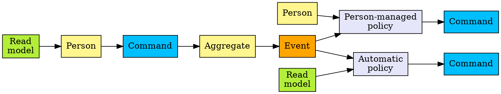
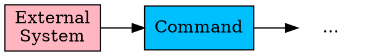
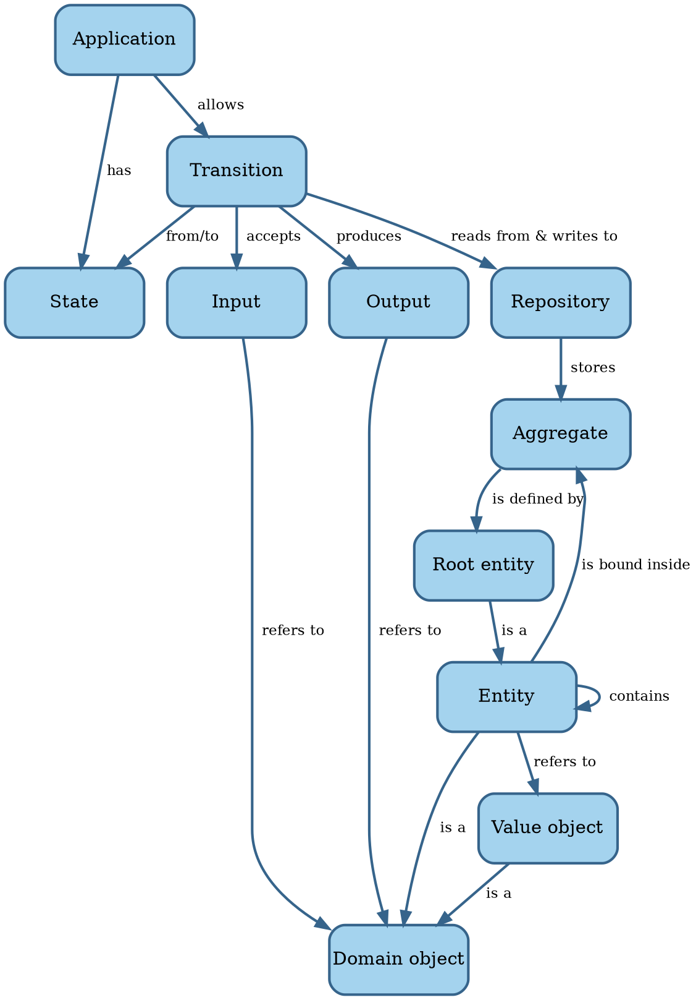

# Preliminary analysis

The books referenced by SWEBOK present generally accepted knowledge in the requirements engineering field.
However, we feel that some issues remain:

- There isn't always someone who can give us the requirements.
- Requirements elicitation takes a long time because the development team needs to learn the domain.
- Requirements in software development change more often than in traditional engineering disciplines.
- Software has a certain shape that should affect how we express requirements.

Let's explore these issues in more detail.


## Unknowable requirements

The literature assumes that it's clear what the system we're about to build should do.
This isn't true until we achieve product/market fit, which means startups need a different process.

The _Lean Startup_ movement assumes that until we achieve product/market fit, we can only find out what works by trying
things out @@Ries2011.
This would put requirements development in the _Complex_
[Cynefin domain](../introduction/software-engineering.md#the-cynefin-framework), rather than in the _Complicated_
realm of engineering.

The Build-Measure-Learn cycle in Lean Startup corresponds to the probe-sense-response approach suited for the
_Complicated_ domain.
This process moves the requirements gathering activity from _Complex_ to _Complicated_.
Once the company establishes product/market fit, its requirements process normalizes.

<!-- vale Google.FirstPerson = NO -->
The issue of unknown requirements raises its head outside the startup scene as well.
We can ask stakeholders what they need, but they're always constrained by their current situation and thinking.

There may be requirements out there that, when realized, would significantly enhance the value the product delivers,
but which nobody involved can conceive of.
Remember the quote attributed to Henry Ford:
"If I had asked people what they wanted, they would have said faster horses."
<!-- vale Google.FirstPerson = YES -->

We're not going to explore the issue of unknowable requirements any further.


## Learning the domain

Most engineering disciplines specialize around a domain.
Engineers trained in that field speak the same language as the people requesting them to build a system.
In contrast, software developers need to learn the language of the domain.

The requirements elicitation practices assume an analyst interviews various subject-matter experts (SMEs)
and then writes down requirements.
Different representations of the requirements help SMEs to validate them.

It's the business analyst who integrates the perspectives from various stakeholders.
Once a sufficiently clear picture is emerging from those conversations, maybe a workshop brings all the stakeholders
together to validate there is a shared understanding.

This approach has some issues.

Subject-matter experts, by definition, are experts.
They've accumulated a lot of knowledge over a long period of time.
It's hard for them to think back to when they didn't have all that knowledge.
This makes it hard for them to know what to explain or not, and even what to mention at all.
And since the business analyst is new to the domain, they don't know what questions to ask.
The result is an iterative process that takes a lot of time.

Worse, it's uncommon for SMEs to be experts in the entire domain.
More often, multiple SMEs each have a clear picture of one part of the process and nobody of the whole.
This results in conflicting points of view, which need resolution before building software.
However, the analyst doesn't know enough yet to bring conflicts into the open.

_Event storming_ is a technique that solves these issues @@Brandolini2013.
It's a workshop where the key stakeholders work together to build up a consistent picture of the entire process.
It uses a simple notation that, unlike something like UML, is easy for non-technical people to understand.
It lets the stakeholders and development team build up a _domain model_ in hours or days rather than weeks or months.

The domain model is a concept from _Domain-Driven Design_ (DDD) @@Evans2014.

```admonish info "Quote"
The interaction between team members changes as all members crunch the model together. The constant
refinement of the domain model forces the developers to learn the important principles of the business they are
assisting, rather than to produce functions mechanically. The domain experts often refine their own
understanding by being forced to distill what they know to essentials, and they come to understand the
conceptual rigor that software projects require.

--- @@Evans2014
```

The **domain model** is a set of concepts shared by everyone on the project, with terms and relationships
that reflect domain insight.
These terms and relationships provide semantics for a language tailored to the domain while being precise enough
for technical development.

This language is the **ubiquitous language**, because it's used everywhere: requirements, code, tests, etc.
The basic terms in the ubiquitous language are the **domain objects**: entities and value objects.

An **entity** is anything that has continuity and an identity, like a customer.
When we need to bill the customer, we care whether we bill Adam Brooks or Charlie Davis.

A **value object** is a concept without an identity, like an email address.
For value objects, we only care about their attributes.
Two email addresses with the same local name and internet domain are always the same, while two customers named
John Smith can be different.

An **aggregate** is a cluster of associated objects that we treat as a unit for data changes.
For instance, we can save an order including its line items, but we can't save individual line items.
The **root** of an aggregate is an entity, like order in the example.

A **repository** is where an application stores aggregates and later retrieves them.
Each aggregate type has its own repository.

Event storming enhances DDD with some extra concepts:

- A **domain event** is anything that happens that's of interest to an SME.
- A **command** triggers an event.
- An **aggregate** accepts commands and accomplishes events.
- A **policy** contains the decision how to react to an event.
- A **read model** holds the information necessary to make a decision.
- A **person** is a human being responsible for a given decision.
- An **external system** is another system that generates events of interest to the system under consideration.

In an event storming workshop, sticky notes of a particular color represent each of these concepts.
Workshop participants place the stickies on a wall in timeline order to visualize the entire business process.

A specific grammar governs event storming concepts @@Brandolini2022, in the sense that certain things
always come before or after others.
The usual case is that a user of the system issues a command based on some information:



Some alternatives exist as well.
An external system rather than a person may issue a command:



Events can also come from outside, either from an external system or from the passing of time:

```dot process
digraph event_storming {
  rankdir=LR;
  node[shape=rectangle, style=filled, fontcolor=black];

  ES [label="External\nSystem", fillcolor=lightpink];
  ES -> E;
  E [label="Event", fillcolor=orange];
  T [label=<&#x1F551;>, fillcolor=lightpink];
  T -> E;
  E -> rest;
  rest [shape=plaintext, label="...", style=normal];
}
```



The books that SWEBOK V3 posits as the body of knowledge for requirements don't mention DDD or event storming.
Neither does the V4 draft.

They do recommend to maintain a glossary, but that isn't the same as a full-fledged domain model.
And it certainly isn't a guarantee that the terms in the glossary find their way into the code and other artifacts.

@@BABOK2015 contains a section on learning (9.1.3), but doesn't give much advice on how to best do that.
It doesn't mention DDD or event storming, although it does list concept modelling as a technique in section 10.11.
The Agile Extension to the BABOK doesn't mention them either @@AgileBABOK2017.


## Changing requirements

Software requirements change more often and change more in magnitude than requirements in traditional engineering
fields.
As an example, let's look at scale requirements.
A civil engineer designs a bridge for a given load.
If that load turns out to be two orders of magnitude higher, then a new bridge is necessary.
Software systems are routinely expected to scale that much and more.

One reason for the large amount of changes in software is that they're _possible_.
Software as a medium is a lot more malleable than the materials that make up a bridge.

Another reason for frequent changes is stakeholders' difficulty in visualizing how a system is going to work
until it's in front of them.
Prototypes and mockups help with that, as @@Wiegers2013 mentions.
We think that event storming helps as well, especially for the big picture workings of the system.
And since there is no substitute for users working with a real system, iterative & incremental development is essential.

Whatever the reason, it's clear there is value in designs that are easy to change to allow for changes in requirements.
We'll come back to this topic in later chapters.


## Requirements for software

Another potential issue is the advice to state requirements in an abstract way, only referencing a user's needs.
The point here is to keep design out of requirements, and this is sound advice.

However, this approach also keeps out the fact that the requirements are for _software_ rather than for manual
procedures or for some other medium.
Software has a [particular shape](../introduction/software.md) and that should affect how we define requirements.

TODO: Requirement -> Acceptance criteria -> Acceptance tests -> BDD -> transitions


## A new model for software applications

DDD and event storming gives us a new vocabulary to talk about what software does.
We need to reconcile that with our vocabulary of [what software is](../introduction/software.md#model-of-software).


