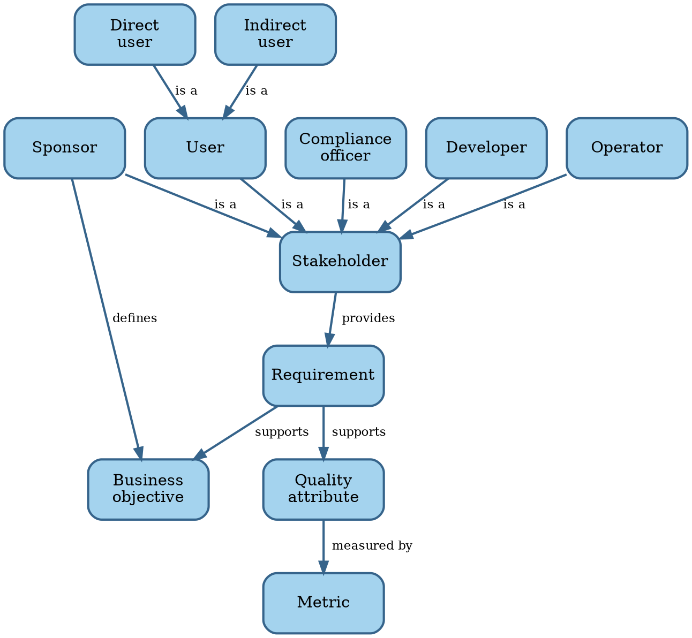

# Requirements concepts

```dot process
digraph requirements_concept_map {
  node [shape=rect, style="rounded,filled", fixedsize=true, width=1.5, height=0.75, fillcolor=lightskyblue2,
    color=steelblue4, penwidth=2];
  edge [fontsize=11, color=steelblue4, penwidth=2];

  Sponsor;
  DU [label="Direct\nuser"];
  IU [label="Indirect\nuser"];
  User;
  Compliance [label="Compliance\nofficer"];
  Illity [label="Quality\nattribute"];
  BO [label="Business\nobjective"];

  Sponsor -> Stakeholder [label="is a"];
  Sponsor -> BO [label=" defines"];
  DU -> User [label="is a"];
  IU -> User [label="is a"];
  User -> Stakeholder [label="is a"];
  Compliance -> Stakeholder [label=" is a"];
  Developer -> Stakeholder [label="is a"];
  Operator -> Stakeholder [label="is a"];
  Stakeholder -> Requirement [label="  provides"];
  Requirement -> Illity [label="  supports"];
  Requirement -> BO [label="  supports"];
  Illity -> Metric [label="  measured by"];
}
```
