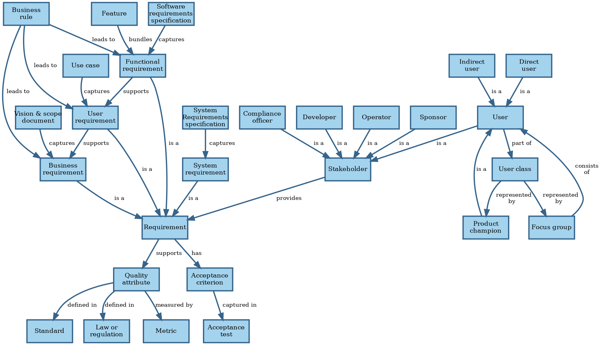

# Requirements concepts

```dot process
digraph requirements_concept_map {
  node [shape=rect, style="filled", fixedsize=true, width=1, height=0.5, fillcolor=lightskyblue2,
    color=steelblue4, penwidth=2, fontsize=10];
  edge [fontsize=9, color=steelblue4, penwidth=2];

  Sponsor;
  DU [label="Direct\nuser"];
  IU [label="Indirect\nuser"];
  User;
  Compliance [label="Compliance\nofficer"];
  Illity [label="Quality\nattribute"];

  Sponsor -> Stakeholder [label="  is a"];
  DU -> User [label="  is a"];
  IU -> User [label="  is a"];
  User -> Stakeholder [label="  is a"];
  User -> Class [label="  part of"];
  Class [label="User class"];
  Class -> Champion [label="  represented\nby"];
  Champion [label="Product\nchampion"];
  Champion -> User [label="is a"];
  Class -> Focus [label="  represented\nby"];
  Focus [label="Focus group"];
  Focus -> User [label="consists\nof"];
  Compliance -> Stakeholder [label="  is a"];
  Developer -> Stakeholder [label=" is a"];
  Operator -> Stakeholder [label="  is a"];
  Stakeholder -> Requirement [label="  provides"];
  Requirement -> Illity [label="  supports"];
  Illity -> Metric [label="measured by    "];
  Illity -> Standard [label=" defined in  "];
  Illity -> Law [label="defined in        "];
  Law [label="Law or\nregulation"];
  Requirement -> AC [label=" has"];
  AC [label="Acceptance\ncriterion"];
  AC -> AT [label="  captured in"];
  AT [label="Acceptance\ntest"];

  BR [label="Business\nrequirement"];
  BR -> Requirement [label=" is a"];
  Vision -> BR [label="  captures"];
  Vision [label="Vision & scope\ndocument"];
  UR [label="User\nrequirement"];
  UR -> Requirement [label="is a"];
  UR -> BR [label=" supports   "];
  UC -> UR [label=" captures"];
  UC [label="Use case"];
  FR [label="Functional\nrequirement"];
  FR -> Requirement [label="  is a"];
  FR -> UR [label=" supports  "];
  SRS -> FR [label="captures  "];
  SRS [label="Software\nrequirements\nspecification"];

  System -> Requirement [label="is a"];
  System [label="System\nrequirement"];
  SyRS -> System[label="  captures"];
  SyRS [label="System\nRequirements\nspecification"];

  Rule [label="Business\nrule"];
  Rule -> BR [label="  leads to"];
  Rule -> UR [label=" leads to"];
  Rule -> FR [label="leads to"];

  Feature -> FR [label="  bundles"];
}
```
