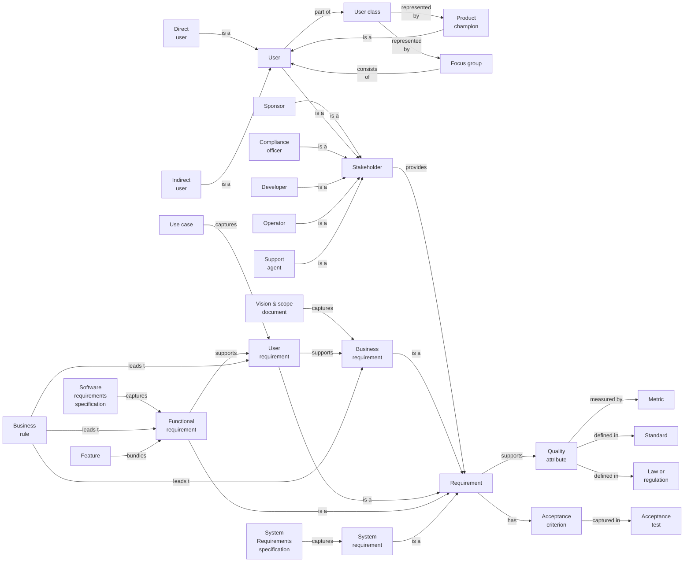

# Requirements concepts

```mermaid
flowchart LR
  Sponsor;
  DU[Direct\nuser]
  IU[Indirect\nuser]
  User;
  Compliance[Compliance\nofficer]
  Illity[Quality\nattribute]

  Sponsor --is a--> Stakeholder
  DU --is a--> User
  IU --is a--> User
  User --is a--> Stakeholder
  User --part of--> Class
  Class[User class]
  Class --represented\nby--> Champion
  Champion[Product\nchampion]
  Champion --is a--> User
  Class --represented\nby--> Focus
  Focus[Focus group]
  Focus --consists\nof--> User
  Compliance --is a--> Stakeholder
  Developer --is a--> Stakeholder
  Operator --is a--> Stakeholder
  Support --is a--> Stakeholder
  Support[Support\nagent]
  Stakeholder --provides--> Requirement
  Requirement --supports--> Illity
  Illity --measured by--> Metric
  Illity --defined in--> Standard
  Illity --defined in--> Law
  Law[Law or\nregulation]
  Requirement --has--> AC
  AC[Acceptance\ncriterion]
  AC --captured in--> AT
  AT[Acceptance\ntest]

  BR[Business\nrequirement]
  BR --is a--> Requirement
  Vision --captures--> BR
  Vision[Vision & scope\ndocument]
  UR[User\nrequirement]
  UR --is a--> Requirement
  UR --supports--> BR
  UC --captures--> UR
  UC[Use case]
  FR[Functional\nrequirement]
  FR --is a--> Requirement
  FR --supports--> UR
  SRS --captures--> FR
  SRS[Software\nrequirements\nspecification]

  System --is a--> Requirement
  System[System\nrequirement]
  SyRS --captures--> System
  SyRS[System\nRequirements\nspecification]

  Rule[Business\nrule]
  Rule --leads to--> BR
  Rule --leads to--> UR
  Rule --leads to--> FR

  Feature --bundles--> FR
```
