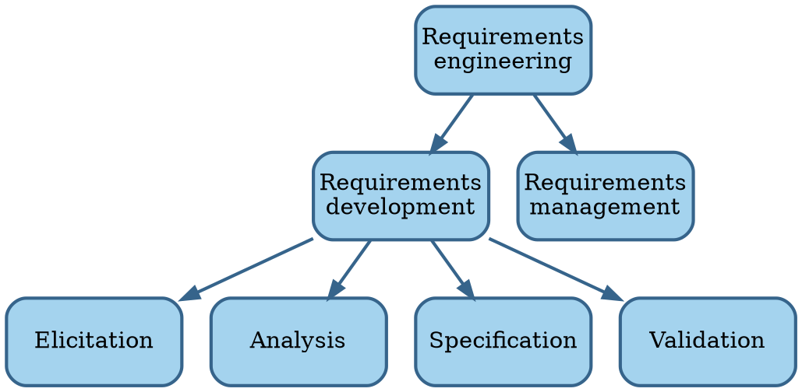

# Digest of requirements literature

```admonish tldr title="Definition"
**Requirements** are a specification of what should be implemented.
They are descriptions of how the system should behave, or of a system property or attribute.
They may be a constraint on the development of the system.

--- @@Sommerville1997
```

@@Wiegers2013 recognizes different kinds of requirements:

- **Business requirements** describe _why_ the organization is developing a system: the benefits they hope to achieve.
- **User requirements** describe goals or tasks the users must be able to perform with the product to realize the
  business requirements.
  Most systems support multiple user classes, as well as other stakeholders, like legal officers and developers.
  Direct users operate the system, while indirect users receive outputs from the system without touching it.
  Make sure all stakeholders have a voice.
- **Functional requirements** specify the behaviors the system must exhibit under specific conditions.
  They describe what the developers must implement to enable the user requirements.
- **Non-functional requirements** or **quality attributes** describe the product's characteristics in various
  dimensions that are important to stakeholders.
- **System requirements** describe the requirements for a system that consists of multiple subsystems.

```admonish tldr title="Definition"
A **stakeholder** is a person, group, or organization that is actively involved in a project, is affected by its process
or outcome, or can influence its process or outcome.
Stakeholders can be internal or external to the project team and to the developing organization.

--- @@Wiegers2013
```

**Requirements engineering** is the discipline that deals with requirements:



Requirements engineering is the realm of the **business analyst**.
This can be a job title or a role performed by people that also perform other roles.
The analyst serves as the principal interpreter through which requirements flow between the customer community and
the software development team @@Wiegers2013.
Business analysts have their own body of knowledge @@BABOK2015.

**Requirements development** aims to collect good enough requirements to allow the team to start design and
construction at an acceptable level of risk @@Wiegers2013.
Requirements development is an iterative process.


## Elicitation

**Elicitation** consists of activities involved with discovering requirements, such as interviews, workshops,
document analysis, prototyping, etc.
Elicitation is usually either usage-centric or product-centric.
The usage-centric approach emphasizes understanding and exploring user goals to derive functionality.
The product-centric approach focuses on defining features expected to lead to marketplace or business success.

```admonish tldr title="Definition"
A **feature** consists of one or more logically related system capabilities that provide value to a user and are
described by a set of functional requirements.

--- @@Wiegers2013
```

It's important for non-business people to speak the language of the business.
Customers sometimes don't articulate points that they believe are common knowledge.


## Analysis

**Analysis** involves reaching a richer and more precise understanding of each requirement and representing sets of
requirements in multiple ways.
An **analysis model** is a diagram that depicts requirements visually, which sometimes makes it easier to find flaws.


## Specification

**Specification** involves representing and storing the collected requirements knowledge in a persistent and
well-organized fashion.
We should record requirements in a shareable form, rather than using an oral tradition.
They should also be version-controlled.


## Validation

**Validation** confirms that you have the correct set of requirements information to enable developers to build
a solution that satisfies the business objectives.

Various studies suggest that errors introduced during requirements activities account for 40-50% of all defects found
in a software product.
The major consequence of requirements problems is rework.
Rework often consumes 30-50% of total development cost, and requirements errors make up 70-85% of that.

A major source of requirements issues is ambiguity, which leads to different expectations on the part of various
stakeholders.
To combat this:

- Have people who represent different perspectives inspect the requirements in a workshop.
- Write tests against the requirements.
- Build prototypes.

Prevent gold plating by tracing each bit of functionality back to requirements and business objectives.


## Requirements management

TODO
