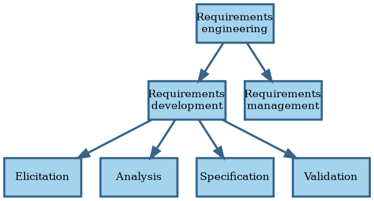
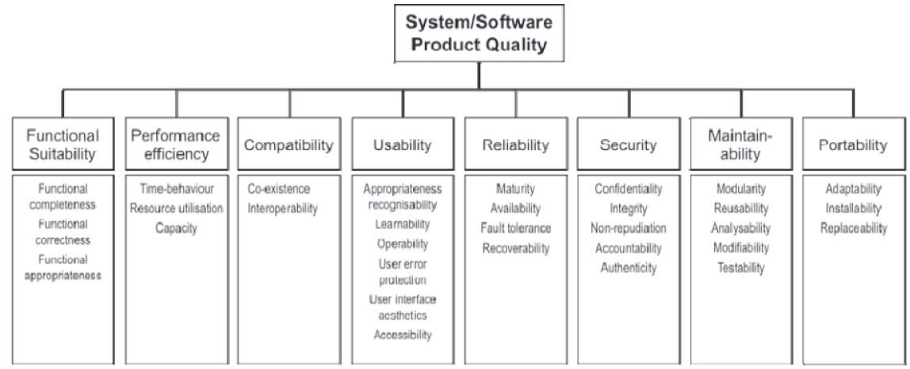

# Digest of requirements literature

In this section we review the generally accepted knowledge around requirements for software systems.


## Definitions

```admonish tldr title="Definition"
**Requirements** are a specification of what should be implemented.
They are descriptions of how the system should behave, or of a system property or attribute.
They may be a constraint on the development of the system.

--- @@Sommerville1997
```

@@Wiegers2013 recognizes different kinds of requirements:

- **Business requirements** describe _why_ the organization is developing a system; the benefits they hope to achieve
  in the form of a project vision, high-level business objectives, and success metrics.
- **System requirements** describe the requirements for a system that consists of multiple subsystems.
  An **external interface requirement** describes the connection between the system and other systems, hardware, or
  users.
  Some people use this term to refer to what we here label functional requirements.
- **User requirements** describe goals or tasks the users must be able to perform with the product to realize the
  business requirements.
- **Functional requirements** specify the behaviors the system must exhibit under specific conditions.
  They describe what the developers must implement to enable the user requirements.
- **Non-functional requirements** or **quality attributes** describe the product's characteristics in various
  dimensions that are important to stakeholders.

```admonish tldr title="Definition"
A **stakeholder** is a person, group, or organization that is actively involved in a project, is affected by its process
or outcome, or can influence its process or outcome.
Stakeholders can be internal or external to the project team and to the developing organization.

--- @@Wiegers2013
```

**Business rules** are policies, guidelines, standards, or regulations that define or constrain some aspect of the
business.
They aren't requirements themselves, but lead to requirements because they dictate properties that the system must
have to conform to the rules.

A **business process** describes a series of activities that transform inputs to outputs to achieve a specific
result.
Business rules influence business processes by establishing vocabulary, imposing restrictions, and governing how to
compute something.

A business rule falls into one of several categories: facts, constrains, action enablers, inferences, and computations.
**Facts** are statements that are true about the business at a specified time.
They describe associations between important business terms.
Don't go overboard with collecting facts; focus on the ones relevant to the scope of the product.

A **constraint** restricts the actions that the system or (some of) its users may perform.
It can be positive (something must happen or something must be true for something else to happen) or negative
(something must not happen).
Many constraints are about authorization, which you can capture using a roles and permissions matrix.

An **action enabler** is a rule that triggers some activity if specific conditions are true.
These conditions may be complex combinations of simpler conditions.
A decision table captures action enablers in a concise way using `if-then` statements.

An **inference** creates new facts from other facts.
`If-then` statements can capture inferences, where the `then` part specifies new knowledge rather than an action to take.

**Computations** transform existing data into new data using specific mathematical formulas or algorithms.
Many such rules come from outside the organization, like tax withholding formulas.
Capture computations in mathematical form or decision table.


## Requirements engineering

**Requirements engineering** is the discipline that deals with requirements:



Requirements engineering is the realm of the **business analyst**.
This can be a job title or a role performed by people that also perform other roles.
The analyst serves as the principal interpreter through which requirements flow between the customer community and
the software development team @@Wiegers2013.

For consumer software, the **product manager** plays the role of business analyst.
Both roles can also coexist, with the product manager focusing on the external market and user demands, and the BA
converting those into functional requirements.

In Agile projects, the **product owner** plays the role of business analyst, although sometimes both roles are
present.

Business analysts have their own body of knowledge @@BABOK2015, including an extension for Agile software
development @@AgileBABOK2017.

**Requirements development** aims to collect good enough requirements to allow the team to start design and
construction at an acceptable level of risk @@Wiegers2013.
Requirements development is an iterative process of progressive refinement of detail.


## Elicitation

Excellent software is the result of well-executed design based on excellent requirements.
Excellent requirements result from effective collaboration between developers and customers.
This requires that all parties know what they need to be successful and understand and respect what their
collaborators need.
The business analyst forges this collaborative partnership.

A partnership requires that partners speak the same language, so learn the language of the business.
Put together a glossary of terms, including synonyms, acronyms, and abbreviations.

A **data dictionary** stores more detail about terms in the glossary.
It's a shared repository that defines the meaning, composition, data type, length, format, and
allowed values for data elements used in the application.

In most cases, more than one category of user, or **user class**, exists.
Some people call user classes **stakeholder profiles** or **personas**.
User classes needn't represent humans; they can also be external systems.
Document user classes and their responsibilities, characteristics, numbers, and locations.

**Direct users** operate the product.
**Indirect users** receive output from the product without touching it themselves.

The analyst works with the business sponsor to select representatives of each user class, known as **product champions**.
Product champions gather requirements for all users in their class, so make sure they have the authority and trust
required to do that.
Ideally, product champions are actual users of the system.

If the product targets customers outside the organization developing the software, focus groups can take the place
of product champions.
A **focus group** is a representative group of users who convene to generate input and ideas for requirements.

The project's decision makers must resolve conflicts between user classes.
The primary stakeholders, also known as **favored user classes**, get priority.

Lack of adequate stakeholder involvement leads to an **expectation gap**, a gulf between what customers need and what
developers deliver.
To keep this gap to a minimum, arrange frequent contact points with product champions.
Don't limit this interaction to requirements, but involve users in as many activities as sensible.

**Elicitation** is the process of identifying the needs and constraints of the various stakeholders.
For any given project, you'll probably need to use more than one of the following elicitation techniques:

- Identify events.
  An **event list** identifies external events that trigger behavior in the system.
  Events originate from users, time, or external systems.
- Hold **interviews** with individual stakeholders.
  Come prepared with questions and use active listening @@Rogers1951.
  When replacing an existing system, a good question is what annoys the user the most about it.
  It also helps to come with a draft model that the user can critique.
  Assign someone not actively participating in the discussion to take notes.
- Hold **workshops** with multiple stakeholders.
  These are especially useful for resolving disagreements, so hold them after using other techniques that surface those
  disagreements.
  Workshops may take on a life of their own, so refer to the business requirements to enforce scope and focus on the
  right level of abstraction for the session's objectives.
  Smaller groups work faster than larger ones.
- **Observe** users do their work.
  Limit sessions to two hours and focus on high-risk tasks.
  Use silent observations when you can't interrupt users with questions.
- Distribute **questionnaires**.
  These are cheaper than alternatives when surveying large numbers of users.
  Their analysis can serve as input for other techniques that target smaller numbers of users.
- Analyze **existing systems**.
  Attempt to find the underlying need for offered features and assess whether the new system must address the same needs.
  Problem reports can give good ideas.
- Analyze **existing documents**.
  Examples are requirement specifications, business processes, user manuals, corporate and industry standards, and
  comparative reviews.
  Remember that documents may not be up-to-date.
- Analyze **interfaces** with external systems.
  This analysis gives technical requirements around data formats and data validation rules.
- **Reuse** requirements based on pre-existing business rules.

Different techniques work better for different user classes.

Elicitation is usually either usage-centric or product-centric.
The usage-centric approach emphasizes understanding and exploring user goals to derive functionality.
The product-centric approach focuses on defining features expected to lead to marketplace or business success.

```admonish tldr title="Definition"
A **feature** consists of one or more logically related system capabilities that provide value to a user and are
described by a set of functional requirements.

--- @@Wiegers2013
```

In usage-centric requirements elicitation, we capture user requirements in use cases.
A **use case** describes a sequence of interactions between a system and an actor that results in value for the actor.
An **actor** is person or external system that interacts with the system.

A use case consists of one or more scenarios.
The **main success scenario** describes the happy path of the interaction.
Secondary scenarios, or **alternative flows**, describe variations in interaction, including those for error
conditions.
Each scenario has a description, trigger, preconditions, interaction steps, and postconditions.
Exceptions describe anticipated error conditions and how the system should handle them.

Users may not be aware of all preconditions, so look to other sources as well.
Business rules may drive some preconditions, like what role the user must have to perform the scenario.
They may also define valid input values for or computations performed during the interaction steps.

Users know about those postconditions that relate to the value created for them, but those are usually not the only ones.
Developers and testers often need postconditions that aren't as visible to the user.

Activity or state diagrams can depict the interactions steps in a use case scenario.

The frequency of use gives a first estimation of concurrent usage and capacity requirements.

For products where the complexity lies outside user interactions, you may need other techniques besides use cases,
like event analysis.

Stakeholders must establish **acceptance criteria**, predefined conditions that the product must meet to be acceptable.
Without acceptance criteria, there is no way of knowing whether the product meets the requirement.
Boundary values are especially interesting.

**Disfavored user classes** are groups who aren't supposed to use the product for legal, security, or safety reasons.
Functional requirements for these user classes focus on making it hard for them to use the product.
Examples are authentication to keep people from using the system at all, and authorization to prevent them from
using specific features.
In this context, some people talk about **abuse cases** that the system should prevent instead of use cases that make
something possible.

Use cases capture user requirements.
They focus on the externally visible behavior of the system.
To complete development, we need more information.
The extra information takes the form of functional requirements that support the user requirements.

One example is about reporting.
A use case may show that the system compiles a report for a user class, but not the details of the report.
A **report specification** describes the purpose and contents of a report.
A **dashboard** uses multiple textual and/or graphical representations of data that provide a consolidated view
of a process.

Non-functional requirements are constraints or quality attributes.
**Quality attributes** define _how well_ the systems works.
Examples are how easy it's to use, how fast it executes, and how often it fails.
External quality attributes are important to users, while internal quality attributes are important to developers,
operators, and support staff.

@@ISO25010 defines eight quality characteristics, each of which consist of several quality attributes.
Note that the first characteristic is function suitability, which refers to functional requirements.
ISO recommends you select a subset of quality attributes that are important for your system.



Eliciting requirements for quality attributes is difficult.
When given a choice, stakeholders always opt for the fastest, most reliable, most secure, etc.
Ask them instead what defines _unacceptable_ performance, reliability, security, etc.

A **constraint** places restrictions on the design or implementation choices available to developers.
It's another kind of non-functional requirement, different from quality attributes.
Constraints can come from stakeholders (like compliance officers), external systems that the product must interact with,
or from other activities, like transition and maintenance.

It's easy to miss requirements:

- **Assumed requirements** are those that users expect without explicitly expressing them.
  Non-functional requirements are often assumed.
- **Implied requirements** are those that are necessary because of another requirement.
- Different user classes have different requirements, so make sure to involve representatives of all user classes.
- High-level requirements are often too vague.
  Decomposing them into more detail may bring to light other requirements, including implied ones.
- Another source of missed requirements stem from error conditions.
- A checklists of common functional areas may help to increase coverage.

Requirements may change as customers learn more and as the business evolves.
See [change management](#requirements-management) below.

Try to keep design out of the requirements as much as possible.
For instance, focus on user tasks rather than user interfaces.
Reject the solutions that stakeholders often offer.
Instead, describe the underlying needs that those solutions address.
In other words, understand the job the customer is hiring the software to do @@Christensen2016.
The _Five Whys_ technique may help to go from a proposed solution to the underlying need @@Ohno1988.


## Analysis

**Analysis** involves reaching a richer and more precise understanding of each requirement and representing sets of
requirements in multiple ways.
A **feature tree** organizes features in logical groups and hierarchies.

Model the environment.
A **context diagram** shows how the system fits in the ecosystem @@Brown2016.
An **ecosystem map** is similar, but also shows external systems that the product doesn't itself interact with.

Model the system.
An **analysis model** is a diagram that depicts requirements visually, which sometimes makes it easier to find flaws.
Analysis models blur the line between requirements and design, so be explicit about your intentions with a model.

The different analysis models each have their own strengths and weaknesses, so pick something based on your situation:

- A **Data Flow Diagram** (DFD) shows the processes of a system, the data stores, any external systems, and the flows
  of data between them.
  You can nest DFDs by expanding a process into its own DFD.
  A  level-0 DFD looks a lot like a context diagram.
- A **data model** depicts the system's data relationships.
  It provides a high-level view of the data, while the data dictionary gives the details.
  An **Entity Relationship Diagram** (ERD) is a common format for a data model.
  In an ERD, rectangles represent **entities**, the physical items, people, or aggregation of data.
  Entities are also known as records or data structures.
  Entities have attributes, which the data dictionary describes.
  Diamond shapes in the ERD represent relationships between entities.
  Numbers show the cardinality of the relationships.
  Entities show up in data stores in a DFD.
  Their attributes appear in report specifications.
  A **CRUD matrix** correlates use cases with Create, Read, Update, and Delete actions on entities.
- A **swimlane diagram** shows the steps of a business process or the operations of a software system.
  They consist of several lanes that represent different systems or actors executing steps.
  Swimlane diagrams can show what happens inside a process of a DFD.
  They resemble UML activity diagrams.
- A **State Transition Diagram** (STD) shows state changes.
  We already saw this kind of model in the [introduction](../introduction/software.md#finite-automata).
  UML has a similar diagram known as a _state machine diagram_ @@UML.
  _Transition tables_ show the same information as STDs in matrix form.
- A **dialog map** shows navigation between screens of the system.
  It's basically a user interface modeled as an STD.
  Dialog maps should show detailed screen layouts, but focus on the essence of the interactions.
- A **decision table** lists the various values for all factors that influence the behavior of a system, along
  with the expected response.
  A **decision tree** shows the same information graphically.
- An **event-response table** (aka event table, or event list) list all events that may occur in the system, along
  with the expected response.
  An **event** is a change or activity in the environment that requires a response from the system.
  A **business event** comes from a human user, a **temporal event** from the passing of time, and a **signal event**
  from hardware or an external system.
  The expected response depends on the system's state.

Different systems have differing needs for formality.
Safety-critical, security-critical, and mission-critical elements of the system are good candidates for modeling.

**Prototypes** are partial or preliminary implementations that make concepts and possibilities more tangible.
Their main goal is to reduce risk, so only build them to address high-risk or high-impact issues.
A prototype is an experiment to validate the hypothesis that requirements are sufficiently defined and that
user interaction and architectural issues are sufficiently addressed.
Seen from that lens, it makes sense to build several prototypes.

Prototypes focus either on user experience (mock-up) or technical soundness of a proposed approach (proof of concept).

**Mock-ups**, also known as horizontal prototypes, imply behavior without implementing it.
They can be self-contained screens or a structure the user can navigate (dialog map).
They often address the look and feel of the user interface.
Mock-ups help stakeholders state requirements, because it's easier to critique than to conceive, especially
when it comes to completeness and errors.

A **proof of concept**, or vertical prototype, implements a slice of functionality from user interface through all the
technical layers.
Use it to test a proposed technical approach, or to optimize algorithms.
Where a mock-up focuses on usability, proof of concepts focus on more technical quality attributes.

You can build mock-ups and proof of concepts with different precision.

Paper and electronic sketches or diagrams are **low-fidelity prototypes** used to explore functionality and flow.
**High-fidelity prototypes** allow definition of a precise look and feel.
Low-fidelity prototypes are faster to develop and thus allow for faster iteration on ideas.
High-fidelity prototypes risk endless discussions about details, so remind everyone that we're just trying to get the
requirements right, not designing yet.

A **throwaway prototype** lives only as long as required to reduce risk.
You build it as fast as possible, without regards for sound engineering practices.
Stakeholders may pressure the team to grow a throwaway prototype into the final product, but this is seldom a good idea.
It would be expensive to get it up to quality standards.
Low-fidelity prototypes are less susceptible to this pressure than high-fidelity ones.
Address this potential pressure up front by setting specific expectations about the purpose of the prototype, or
what experiment you're running.
If you build a high-fidelity throwaway prototype, add in time delays to prevent stakeholders getting the wrong
impression about performance.

An **evolutionary prototype**, in contrast, is an increment on the path towards a final product.
It must therefore meet all applicable quality standards.
When planned well, the first couple of increments can reduce risk just like for throwaway prototypes, although they take
a bit more time to develop.

You'll learn more from observing users work with a prototype than from asking them about it.
Don't forget to include all relevant stakeholders when evaluating a prototype.


Customers set requirement priorities based on the contribution towards business objectives.
Priorities are especially important for non-functional requirements, since conflicts between quality attributes are a
fact of life.
You need to define which quality attributes are most important for the system, so that developers can make proper
trade-offs.
Priorities may be different for different parts of the system.

Make sure to cover all stakeholders when setting priorities.
It's easy to forget about support staff, for example.

Software has a cost, which developers estimate.
Customers should respect those estimates.
Some features may be expensive or even infeasible.
Sometimes changing features can make them attainable or cheaper.

Priorities and cost estimates together make it possible to deliver maximum value at the lowest cost at the right time.
Non-functional requirements that affect the architecture should receive high priority, because rearchitecting is
expensive.
Priorities may change over time.


## Specification

**Specification** involves representing and storing the collected requirements knowledge in a persistent and
well-organized fashion.
We should record requirements in a shareable form, rather than using an
[oral tradition](analysis.md#requirements-engineering-in-agile-methods).
They should also be version-controlled.

Use templates for consistency.

The **Vision & Scope document** contains the business requirements, scope, and business context.
Other names for this document are project charter, business case document, or Market Requirements Document (MRD).
Whatever the name, the business sponsor is the owner.

The **vision** provides a shared understanding of the desired outcome: what the project is about and should become.
It applies to the product as a whole and should change only when the company's business objectives do.

The **scope** defines what part of the vision the current project or iteration addresses.
At a high level, it's about what business objective to target.
At a lower level, it's about what features to include.
Vision and scope together allow evaluating proposed requirements for project fit.

The vision and scope document also establishes priorities.
Categorize the five dimensions (features, quality, schedule, cost, and staff) as either **constraint**, **driver**, or
**degree of freedom**.
Not all dimensions can be constraints or drivers; degrees of freedom allow responding to changes in requirements or
project realities.
For instance, many Agile methods treat schedule & quality as constraints, features & cost as drivers, and scope as
a degree of freedom.

Collect functional and non-functional requirements in a **Software Requirements Specification** (SRS).
This practice enables downstream activities, like validation and change management.
The SRS has different names in different contexts, like business requirements document, or functional specification.

The SRS refers to the Vision & Scope document.
It also describes the user classes and any design and construction constraints, like which programming language to use
or which standards to follow.
Documenting assumptions may prevent serious issues.
An **assumption** is a statement that's the team believes to be true in the absence of proof.

Writing requirements down may be tedious, but the cost of doing so is small compared to acquiring that knowledge.
Or relearning it in the future by new hires.

Learn just enough about requirements for prioritization, then flesh out more details when needed for design and
construction.
Label uncertain requirements as TBD and assign someone to resolve the issue.

Trace requirements back to their origin: business requirements, system requirement, or business rule.
Record the stakeholders requesting each requirement.

Assign a unique ID to each requirement.
The best format for such IDs is a text-based hierarchical tagging scheme.
This practice gives rise to IDs like `Product.Discount.Error`.

Present requirements in different ways to stakeholders to reveal more insights.
For instance, text vs diagram or use case vs acceptance test.

It's often useful to group requirements by features (or even a feature tree) or by user class.

You may want to include a logical data model in the SRS, including how to collect, verify, process, protect, and
destruct data.
Descriptions of reports are also valuable.

Don't forget to document non-functional requirements, like for usability (including localization and
internationalization), performance, and security.
Also include requirements around migrations from existing systems.

To prevent recurring discussions, record rejected requirements and the reasons for their rejection.

The SRS should contain a glossary.

Excellent requirements are:

- **Correct**.
  Requirements must accurately describe a capability that meets a stakeholder's need.
  Formalize correctness using acceptance criteria.
- **Complete**.
  Each requirement must contain all information necessary for validation and implementation.
  This includes what to do in case of errors.
- **Unambiguous**.
  Natural language is prone to ambiguity, but is necessary since stakeholders can't usually read formal specifications
  well enough to validate requirements.

  Ambiguity comes in two forms.
  The first is when one person can see more than one way to interpret a requirement.
  The harder type is where different people each see only one interpretation each, but those differ from each other.

  To reduce ambiguity, we often use semi-structured text to constrain the text a bit.
  Lists, tables, formulas, charts, and decision trees may be useful as well.
  Use terms consistently and as defined in the glossary.
  Synonyms are okay, as long as they're in the glossary as well.
  Try to avoid adverbs, since they introduce subjectivity.
- **Necessary**.
  Required functionality should provide stakeholders with business value in line with the business objectives for the
  product.
  This includes compliance with laws, regulations, and standards.
  Requirements must come from a source that has the authority to provide requirements.
- **Feasible**.
  It must be possible to implement the requirement in an economic fashion.
- **Prioritized**.
  Again, economics come into play, this time to make sure we can work on the most important things first.
- **Verifiable**.
  Write individually testable requirements, with a small number of related test cases each.
  The count of testable requirements is actually a metric for product size.
  Rephrase negative requirements into positives so that they're clearer and thus easier to verify.

It's best to use templates to specify requirements so that all these properties get addressed.
For _system requirements_, @@Wiegers2013 suggests the Easy Approach to Requirements Syntax (EARS, @@Mavin2022), which
offers this template:

```text
While <precondition(s)>
when <trigger>
the <system name>
shall <system response>.
```

The `while` and `when` parts are optional.
**Preconditions** define conditions that must be true for a requirement to become active.
The **trigger** defines a discrete event detected by the system that activates a requirement.
The **system name** must be explicit.
The **system response** defines what the system must do when the requirement becomes active.

For _user requirements_, @@Wiegers2013 suggests a template from @@Alexander2002 with this structure:

```text
The [user class]
shall be able to [do something]
[to some object]
[qualifying conditions, response time, or quality statement].
```

_Non-functional requirements_ should be SMART: **S**pecific, **M**easurable, **A**ttainable, **R**elevant, and
**T**ime-sensitive.
@@Wiegers2013 gives this example for availability:

```text
The system shall be at least 95 percent available on weekdays
between 6:00 AM and midnight Eastern Time,
and at least 99 percent available on weekdays
between 3:00 PM and 5:00 PM Eastern Time.
```

It's possible to define requirements more formally using specification languages like Planguage @@Gilb2005.

Many measurements of quality attributes are **lagging indicators**.
This means you can't tell whether the system achieved its goals until after it's been in operation for a while.

The SRS as a whole should have some desired properties as well:

- **Complete**.
  No requirement is missing.
- **Consistent**.
  Requirements don't contradict each other.
- **Modifiable**.
  Requirement collections should have a browsable history, especially after baselining.
- **Traceable**.
  Link requirements both backward to their origin and forward to derived requirements and later-stage artifacts,
  such as code and tests.

Keep business rules separate from requirements, since their scope is wider.
This allows reuse across products.
Document the origin and expected frequency of change for each business rule.
The business should own business rules, rather than the IT department.


## Validation

**Validation** confirms that you have the correct set of requirements to enable developers to build
a solution that satisfies the business objectives.

Various studies suggest that errors introduced during requirements activities account for 40-50% of all defects found
in a software product.
The major consequence of requirements problems is rework.
Rework often consumes 30-50% of total development cost, and requirements errors make up 70-85% of that.

A major source of requirements issues is ambiguity, which leads to different expectations on the part of various
stakeholders.
To combat this:

- Have people who represent different perspectives inspect the requirements in a workshop.
- Write tests against the requirements.
- Build prototypes.

Reject requirements that don't contribute to the stated business objectives.
Likewise, exclude business rules that don't need implementing in software.

Ensure that requirements have acceptance criteria and, if possible, acceptance tests.
Examples of acceptance criteria that unsuitable for capturing in acceptance tests:

- The number of open issues is under some maximum.
- Documentation is available.
- Users received training.

For stakeholders to validate requirements, they must understand them.
Formal methods and certain diagram styles are foreign to most users, so the best way to specify requirements is still
in text form.
Structured natural language is often better than free-form text.


## Requirements management

Everyone must agree on the requirements:

- The sponsor agrees that the requirements achieve the business objectives.
- Customers agree that the requirements address their needs.
- Developers agree that the requirements are possible and verifiable.

A **requirements baseline** is a set of reviewed and agreed upon requirements that serves as the basis for development.
The analyst should place the baseline under change and version control.
For effective change control, there needs to be a process for proposing, evaluating, and deciding on requirement changes.
Impact analysis helps to assess the cost of proposed changes, as does having a traceability matrix.

A **requirements traceability matrix** is a set of links between requirements and other artifacts, such as design and
code elements.
It also links functional requirements to higher-level user requirements, business requirements, and business rules.
Each requirement is one record in a Requirements Management (RM) system.
Requirements have attributes, like origin and status.

When possible, organize requirements into related sets and deliver those sets incrementally.
