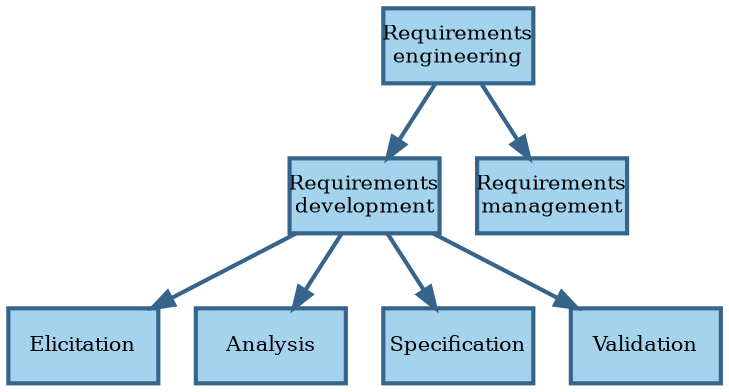

# Digest of requirements literature

In this section we review the generally accepted knowledge around requirements for software systems.


## Definitions

```admonish tldr title="Definition"
**Requirements** are a specification of what should be implemented.
They are descriptions of how the system should behave, or of a system property or attribute.
They may be a constraint on the development of the system.

--- @@Sommerville1997
```

@@Wiegers2013 recognizes different kinds of requirements:

- **Business requirements** describe _why_ the organization is developing a system; the benefits they hope to achieve
  in the form of a project vision, high-level business objectives, and success metrics.
- **System requirements** describe the requirements for a system that consists of multiple subsystems.
  An **external interface requirement** describes the connection between the system and other systems, hardware, or
  users.
- **User requirements** describe goals or tasks the users must be able to perform with the product to realize the
  business requirements.
  Most systems support multiple user classes, as well as other stakeholders, like legal officers and developers.
  Direct users operate the system, while indirect users receive outputs from the system without touching it.
  Make sure all stakeholders have a voice.
- **Functional requirements** specify the behaviors the system must exhibit under specific conditions.
  They describe what the developers must implement to enable the user requirements.
- **Non-functional requirements** or **quality attributes** describe the product's characteristics in various
  dimensions that are important to stakeholders.

```admonish tldr title="Definition"
A **stakeholder** is a person, group, or organization that is actively involved in a project, is affected by its process
or outcome, or can influence its process or outcome.
Stakeholders can be internal or external to the project team and to the developing organization.

--- @@Wiegers2013
```

**Business rules** are policies, guidelines, standards, or regulations that define or constrain some aspect of the
business.
They aren't requirements themselves, but lead to requirements.

**Requirements engineering** is the discipline that deals with requirements:



Requirements engineering is the realm of the **business analyst**.
This can be a job title or a role performed by people that also perform other roles.
The analyst serves as the principal interpreter through which requirements flow between the customer community and
the software development team @@Wiegers2013.

For consumer software, the **product manager** plays the role of business analyst.
Both roles can also coexist, with the product manager focusing on the external market and user demands, and the BA
converting those into functional requirements.

In Agile projects, the **product owner** plays the role of business analyst, although sometimes both roles are
present.

Business analysts have their own body of knowledge @@BABOK2015, including an extension for Agile software
development @@AgileBABOK2017.

**Requirements development** aims to collect good enough requirements to allow the team to start design and
construction at an acceptable level of risk @@Wiegers2013.
Requirements development is an iterative process of progressive refinement of detail.


## Elicitation

**Elicitation** consists of activities involved with discovering requirements, such as interviews, workshops,
document analysis, prototyping, etc.
Elicitation is usually either usage-centric or product-centric.
The usage-centric approach emphasizes understanding and exploring user goals to derive functionality.
The product-centric approach focuses on defining features expected to lead to marketplace or business success.

```admonish tldr title="Definition"
A **feature** consists of one or more logically related system capabilities that provide value to a user and are
described by a set of functional requirements.

--- @@Wiegers2013
```

Excellent software is the result of well-executed design based on excellent requirements.
Excellent requirements result from effective collaboration between developers and customers.
This requires that all parties know what they need to be successful and understand and respect what their
collaborators need.
The business analyst forges this collaborative partnership.

It's important for non-business people to speak the language of the business.
Put together a glossary of terms, including synonyms, acronyms, and abbreviations.
Conversely, it's useful to train stakeholders in the fundamentals of software development.

In most cases, more than one category of user, or **user class**, exists.
Some people call user classes **stakeholder profiles** or **personas**.
User classes needn't represent humans; they can also be external systems.
Document user classes and their responsibilities, characteristics, numbers, and locations.

The analyst works with the business sponsor to select representatives of each user class, known as **product champions**.
Product champions gather requirements for all users in their class, so make sure they have the authority and trust
required to do that.
Ideally, product champions are actual (intended) users of the system.

The project's decision makers must resolve conflicts between user classes, focusing on the primary stakeholders, also
known as **favored user classes**.

**Disfavored user classes** are groups who aren't supposed to use the product for legal, security, or safety reasons.
Functional requirements for these user classes focus on making it hard for them to use the product, like authentication
and authorization.
In this context, some people talk about **abuse cases** that the system should prevent instead of use cases to make
possible.

If the product targets consumers, **focus groups** can take the place of product champions.
It's then even more important to understand what job the consumer is trying to do that the software can help with
@@Christensen2016.

Lack of adequate customer involvement leads to an **expectation gap**, a gulf between what customers need and what
developers deliver.
To keep this gap to a minimum, arrange frequent contact points with product champions.
Don't limit this interaction to requirements, but involve users in as many activities as sensible.

**Direct users** operate the product.
**Indirect users** receive output from the product without touching it themselves.

The **vision and scope document** contains the business requirements, scope, and business context.
Other names for this document are project charter, business case document, or Market Requirements Document (MRD).
Whatever the name, the business sponsor is the owner.

The **vision** provides a shared understanding of the desired outcome: what the project is about and should become.
It applies to the product as a whole and should change only when the company's business objectives do.

The **scope** defines what part of the vision the current project or iteration addresses.
At a high level, it's about what business objective to target.
At a lower level, it's about what features to include.
Vision and scope together allow evaluating proposed requirements for project fit.

The vision and scope document also establishes priorities.
Categorize the five dimensions (features, quality, schedule, cost, and staff) as either **constraint**, **driver**, or
**degree of freedom**.
Not all dimensions can be constraints or drivers; degrees of freedom allow responding to changes in requirements or
project realities.
For instance, many Agile methods treat schedule & quality as constraints, features & cost as drivers, and scope as
a degree of freedom.

Techniques for requirements elicitation:

- Identify events.
- Hold interviews with individual stakeholders.
- Hold workshops with multiple stakeholders.
- Observe user do their work.
- Distribute questionnaires.
- Analyze existing documents.
- Analyze external interfaces.
- Examine problem reports.
- Reuse requirements based on business rules.

Present requirements in different ways to stakeholders to reveal more insights.
Text vs diagram, requirement vs acceptance test.

Customers must establish **acceptance criteria**, predefined conditions that the product must meet   to be acceptable.
Without acceptance criteria, there is no way of knowing whether the product meets the requirement.

Requirements may change as customers learn more and as the business evolves.
See [change management](#requirements-management) below.


## Analysis

**Analysis** involves reaching a richer and more precise understanding of each requirement and representing sets of
requirements in multiple ways.

Model the environment.
A **context diagram** shows how the system fits in the ecosystem @@Brown2016.
An **ecosystem map** is similar, but also shows external systems that the product doesn't itself interact with.
An **event list** identifies external events that trigger behavior in the system.
Events originate from users, time, or external systems.

Model the system.
An **analysis model** is a diagram that depicts requirements visually, which sometimes makes it easier to find flaws.
Examples are DFDs, ERs, STDs, dialog maps, and decision trees.
A **feature tree** organizes features in logical groups and hierarchies.

Look for derived requirements that are a logical consequence of requests.
Customers sometimes don't articulate points that they believe are obvious, so look for implicit requirements as well.
Another source of missed requirements stem from error conditions.

**Prototypes** are partial or preliminary implementations that make concepts and possibilities more tangible.
They give users get more clarity on requirements, and developers more clarity on viability.

Software has a cost, which developers estimate.
Customers should respect those estimates.
Some features may be expensive or even infeasible.
Sometimes changing features can make them attainable or cheaper.

Customers set requirement priorities based on the contribution towards business objectives.
Combined with cost estimates, these make it possible to deliver maximum value at the lowest cost at the right time.
Non-functional requirements that affect the architecture should receive high priority, because rearchitecting is
expensive.
Priorities can change over time.


## Specification

**Specification** involves representing and storing the collected requirements knowledge in a persistent and
well-organized fashion.
We should record requirements in a shareable form, rather than using an oral tradition.
They should also be version-controlled.

Use templates for consistency.

Trace requirements back to their origin: use case, system requirement, or business rule.
Record the stakeholders requesting each requirement.
Assign a unique ID to each requirement.

Keep business rules separate from requirements, since their scope is wider.

To prevent recurring discussions, record rejected requirements and the reasons for their rejection.


## Validation

**Validation** confirms that you have the correct set of requirements to enable developers to build
a solution that satisfies the business objectives.

Various studies suggest that errors introduced during requirements activities account for 40-50% of all defects found
in a software product.
The major consequence of requirements problems is rework.
Rework often consumes 30-50% of total development cost, and requirements errors make up 70-85% of that.

A major source of requirements issues is ambiguity, which leads to different expectations on the part of various
stakeholders.
To combat this:

- Have people who represent different perspectives inspect the requirements in a workshop.
- Write tests against the requirements.
- Build prototypes.

Reject requirements that don't contribute to the stated business objectives.

Ensure that requirements have acceptance criteria and, if possible, acceptance tests.
Examples of acceptance criteria that aren't based on acceptance tests:

- The number of open issues is under some maximum.
- Training is in place.
- Documentation is available.


## Requirements management

Everyone must agree on the requirements:

- Customers agree that the requirements address their needs.
- Developers agree that the requirements are possible and verifiable.
- The sponsor agrees that the requirements achieve the business objectives.

A **requirements baseline** is a set of reviewed and agreed upon requirements that serves as the basis for development.
The analyst should place the baseline under change and version control.
For effective change control, there needs to be a process for proposing, evaluating, and deciding on requirement changes.
Impact analysis helps to assess the cost of proposed changes, as does having a traceability matrix.

A **requirements traceability matrix** is a set of links between requirements and other artifacts, such as design and code
elements.
It also links functional requirements to higher-level user and business requirements and other related requirements.

Each requirement is one record in a Requirements Management (RM) system.
Requirements have attributes, like origin and status.

When possible, organize requirements into related sets and deliver those sets incrementally.
