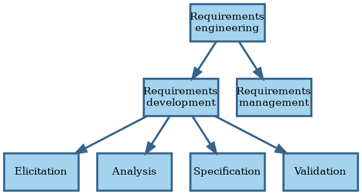

# Digest of requirements literature

In this section we review the generally accepted knowledge around requirements for software systems.


## Definitions

```admonish tldr title="Definition"
**Requirements** are a specification of what should be implemented.
They are descriptions of how the system should behave, or of a system property or attribute.
They may be a constraint on the development of the system.

--- @@Sommerville1997
```

@@Wiegers2013 recognizes different kinds of requirements:

- **Business requirements** describe _why_ the organization is developing a system; the benefits they hope to achieve
  in the form of a project vision, high-level business objectives, and success metrics.
- **System requirements** describe the requirements for a system that consists of multiple subsystems.
  An **external interface requirement** describes the connection between the system and other systems, hardware, or
  users.
  Some people use this term to refer to what we here label functional requirements.
- **User requirements** describe goals or tasks the users must be able to perform with the product to realize the
  business requirements.
- **Functional requirements** specify the behaviors the system must exhibit under specific conditions.
  They describe what the developers must implement to enable the user requirements.
- **Non-functional requirements** or **quality attributes** describe the product's characteristics in various
  dimensions that are important to stakeholders.

```admonish tldr title="Definition"
A **stakeholder** is a person, group, or organization that is actively involved in a project, is affected by its process
or outcome, or can influence its process or outcome.
Stakeholders can be internal or external to the project team and to the developing organization.

--- @@Wiegers2013
```

**Business rules** are policies, guidelines, standards, or regulations that define or constrain some aspect of the
business.
They aren't requirements themselves, but lead to requirements because they dictate properties that the system must
have to conform to the rules.

A **business process** describes a series of activities that transform inputs to outputs to achieve a specific
result.
Business rules influence business processes by establishing vocabulary, imposing restrictions, and governing how to
compute something.

A business rule falls into one of several categories: facts, constrains, action enablers, inferences, and computations.
**Facts** are statements that are true about the business at a specified time.
They describe associations between important business terms.
Don't go overboard with collecting facts; focus on the ones relevant to the scope of the product.

A **constraint** restricts the actions that the system or (some of) its users may perform.
It can be positive (something must happen or something must be true for something else to happen) or negative
(something must not happen).
Many constraints are about authorization, which you can capture using a roles and permissions matrix.

An **action enabler** is a rule that triggers some activity if specific conditions are true.
These conditions may be complex combinations of simpler conditions.
A decision table captures action enablers in a concise way using `if-then` statements.

An **inference** creates new facts from other facts.
`If-then` statements can capture inferences, where the `then` part specifies new knowledge rather than an action to take.

**Computations** transform existing data into new data using specific mathematical formulas or algorithms.
Many such rules come from outside the organization, like tax withholding formulas.
Capture computations in mathematical form or decision table.


## Requirements engineering

**Requirements engineering** is the discipline that deals with requirements:



Requirements engineering is the realm of the **business analyst**.
This can be a job title or a role performed by people that also perform other roles.
The analyst serves as the principal interpreter through which requirements flow between the customer community and
the software development team @@Wiegers2013.

For consumer software, the **product manager** plays the role of business analyst.
Both roles can also coexist, with the product manager focusing on the external market and user demands, and the BA
converting those into functional requirements.

In Agile projects, the **product owner** plays the role of business analyst, although sometimes both roles are
present.

Business analysts have their own body of knowledge @@BABOK2015, including an extension for Agile software
development @@AgileBABOK2017.

**Requirements development** aims to collect good enough requirements to allow the team to start design and
construction at an acceptable level of risk @@Wiegers2013.
Requirements development is an iterative process of progressive refinement of detail.

Requirements engineering is a process and, like any process, we can improve it over time.
Process improvement should be a continuous and evolutionary activity.
Change is only accepted when people have an incentive to change.
The biggest incentive is pain, so start by making problems visible by collecting metrics.
These metrics serve as the baseline to compare improvements to.
The Goal-Question-Metric (GQM) approach tells you which metrics to collect @@Basili1982.

Perform root-cause analysis to determine improvement hypotheses.
Pick one at a time and set clear goals for it.
Treat improvement efforts as a mini-project, including proper planning, staffing, and change management.
Make sure to revisit the goal to check whether the experiment worked using the metrics defined earlier.
Keep in mind that change usually leads to an initial productivity drop while people figure out the new way of working.
Also, most metrics are lagging indicators, so it make take a while before improvements become visible.

Use a change budget to limit the amount of change to a level that people can absorb.
