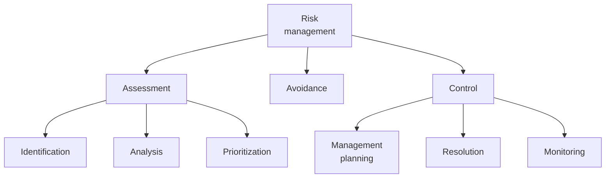

# Requirements management

Everyone must agree on the requirements:

- The sponsor agrees that the requirements achieve the business objectives.
- Customers agree that the requirements address their needs.
- Developers agree that the requirements are possible and verifiable.

A **requirements baseline** is a set of reviewed and agreed upon requirements that serves as the basis for development
of a product or increment.
When possible, organize requirements into related sets and deliver those sets incrementally.
Breaking delivery down like this helps in dealing with changes.

Changes in requirements are inevitable:

<!-- vale Google.FirstPerson = NO -->
- Stakeholders don't know precisely what they want at te beginning of the project.
- Stakeholders can sometimes articulate what they want precisely only after seeing something that doesn't quite match
  their vision ("I know it when I see it").
- Business needs may change during the course of the project.
- The legal and regulatory environment may change.
<!-- vale Google.FirstPerson = YES -->

Requirements typically grow 1-3% per month.
The analyst should place a baseline under change and version control to deal with these changes.

**Requirements management** includes all activities that maintain the integrity, accuracy, and currency of
requirements agreements throughout the project.
The business analyst sets up requirement storage mechanisms, defines attributes, coordinates status, and monitors
change.

Requirements have attributes, like origin, creation date, priority, and status.
Common statuses include proposed, drafted, approved, in progress, implemented, verified, and rejected.
Tracking the distribution of statuses throughout the project shows the progress the team is making.

**Requirements Management (RM) systems** help manage changes to requirements, track status, and trace requirements to
other artifacts.
RM tools range from generic issue trackers and wikis to specialized products.
Some RM systems are part of larger suites or connected to issue trackers.
The specialized tools generate some attributes and let you enter others.

**Version control** uniquely identifies different versions of requirements and requirement sets.
RM tools offer version control and more.

For effective change control, there needs to be a **change control process** for proposing, evaluating, and deciding on
requirement changes.
The process should include a "fast path" to ensure that low-risk, low-investment change requests don't get bogged down
in bureaucracy.
Capture the change control process in a **change control policy** before changes arrive.
The policy describes the lifecycle of a change request and the roles involved.

The **Change Control Board** (CCB) executes the policy by accepting or rejecting changes.
They assess change requests (see impact analysis below), make decisions, and see to implementation and verification of
approved changes.

Change requests share similarities with defect reports, and you can use the same tools to track them.
You should capture change request attributes, like requester, type, date received, status, etc.

A **requirements volatility chart** tracks the rate at which change requests arrive after a baseline.
It should trend towards zero as the project nears completion.
A sustained high rate implies a schedule risk.
The CCB then may need to renegotiate schedule, staff, budget, or quality to accommodate changes.
Tracking the origin of change requests is also illuminating.

**Impact analysis** is the process of assessing the consequences of a change.
A traceability matrix helps with impact analysis.
A **requirements traceability matrix** is a set of links between requirements and other artifacts, such as design and
code elements.
It also links functional requirements to higher-level user requirements, business requirements, business rules, and
system requirements.
For products in some fields, like aviation, regulations dictate that you can trace requirements forward to design and
code.

Quality attribute requirements often don't trace forward to code.
Some quality attribute requirements, like for security, trace forward to functional requirements, like authentication,
that in turn do trace forward to code.

For all but the smallest projects, manually maintaining traceability is impractical.
Commercial RM tools often offer traceability functionality.
You still have to manually add most links, but then the tool can assist with changes.

## Risk management

Requirements management relates to risk management.
A **risk** is a condition that may cause something bad to happen.
**Risk management** is the process of identifying, evaluating, and controlling risks before they harm your project:

Typical requirements risks include inadequate stakeholder involvement, misunderstanding of requirements,
incomplete requirements, infeasible requirements, and continually changing requirements.

Risk prioritization helps to focus on the risks with the highest exposure first.
**Risk exposure** is a function of likelihood (probability of bad thing happening) and impact (magnitude of bad thing
happening).

Risk resolution executes plans to deal with risks.
Some risks have such low exposure, that you can just **accept** them.
If not, you need to decide how to deal with the risk.
If you're lucky, you can **transfer** a risk to someone else.
Most of the time, however, you'll have to **mitigate** the risk, meaning you work to reduce its likelihood or impact.

You should document risks and track them over time to see if your plans are working.
Use the condition-consequence format for documenting risks.
One condition may result in several consequences.
Most of the time it suffices to record likelihood and impact using a low/medium/high scale.
These should change when a mitigation action completes, so reevaluate them then.

You should also collect ways of dealing with any risks that materialize.
