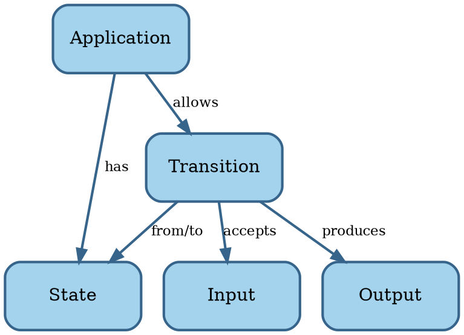

# Software

```admonish tldr title="Definition"
**Software** is a program for a computer.

--- @@MerriamWebsterSoftware
```

```admonish tldr title="Definition"
A **program** is a sequence of coded instructions that can be inserted into a computer.

--- @@MerriamWebsterProgram
```

We distinguish two types of software:

1. **System software**: operating systems, device drivers, and utilities.
2. **Application software**: productivity software, graphics software, databases, browsers, games, and the like.

System software is essential for the functioning of a general-purpose computer, managing hardware and providing a
platform on which application software runs.
System software provides value indirectly, through application software.

Most of what follows should be applicable to both categories.
In case of conflict, however, we'll focus on application software, because the majority of software falls into that
bucket.

In summary, software consists of instructions for a computer that tell it what to compute.
Let's look at the science of computing next.


## Computing

**Automata theory** is the study of abstract computing devices, named **machines** or **automata** @@Hopcroft2014.
The theory formally defines an automaton by a quintuple $ M = \lang \Sigma , \Gamma , Q , \delta , \lambda \rang $,
where:

- $ \Sigma $ is a set of symbols, called the **input alphabet** of the automaton.
  $ \Sigma $ can be finite or infinite.
- $ \Gamma $ is another set of symbols, called the **output alphabet** of the automaton.
- Q is a set of **states** the automaton can be in.
  Q can be finite or infinite.
  A state may also have memory (stack, queue, or tape).
- $ \delta $ is the **transition function** $ \delta : Q \times \Sigma \to Q $ mapping states to successor states.
  $ \delta $ may be deterministic or non-deterministic.
- $ \lambda $ is the **output function** $ \lambda : Q \times \Sigma \to \Gamma $ mapping states to outputs.

The different variations for $ \Sigma $, Q, and $ \delta $ lead to several classes of automata with different
capabilities.

Here's a concept map of software based on automata theory:



This basic model is admittedly not super useful yet.
We'll revise it later.

Now that we understand the basics of both software and engineering, let's put them together.
