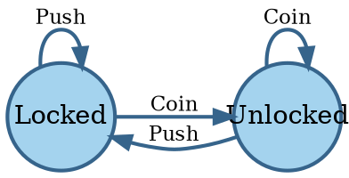
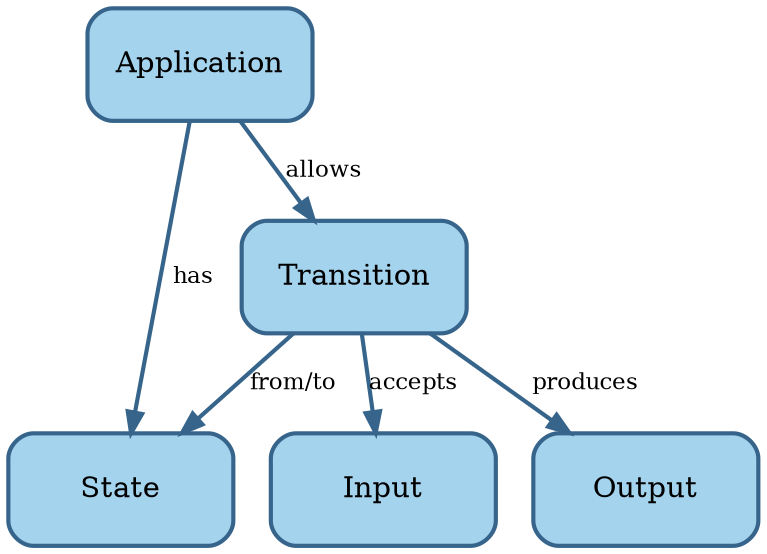

# Software

```admonish tldr title="Definition"
**Software** is a program for a computer.

--- @@MerriamWebsterSoftware
```

```admonish tldr title="Definition"
A **program** is a sequence of coded instructions that can be inserted into a computer.

--- @@MerriamWebsterProgram
```

We distinguish two types of software:

1. **System software**: operating systems, device drivers, and utilities.
2. **Application software**: productivity software, graphics software, databases, browsers, games, and the like.

System software is essential for the functioning of a general-purpose computer, managing hardware and providing a
platform on which application software runs.
System software provides value indirectly, through application software.

Most of what follows should be applicable to both categories.
In case of conflict, however, we'll focus on application software, because the majority of software falls into that
bucket.

In summary, software consists of instructions for a computer that tell it what to compute.
Let's look at the science of computing next.


## Computing

**Automata theory** is the study of abstract computing devices, named **machines** or **automata** @@Hopcroft2014.
The theory formally defines an automaton by a quintuple $ M = \lang \Sigma , \Gamma , Q , \delta , \lambda \rang $,
where:

- $ \Sigma $ is a set of symbols, called the **input alphabet** of the automaton.
  $ \Sigma $ can be finite or infinite.
- $ \Gamma $ is another set of symbols, called the **output alphabet** of the automaton.
- Q is a set of **states** the automaton can be in.
  Q can be finite or infinite.
  A state may also have memory (stack, queue, or tape).
- $ \delta $ is the **transition function** $ \delta : Q \times \Sigma \to Q $ mapping states to successor states.
  $ \delta $ may be deterministic or non-deterministic.
- $ \lambda $ is the **output function** $ \lambda : Q \times \Sigma \to \Gamma $ mapping states to outputs.

The different variations for $ \Sigma $, Q, and $ \delta $ lead to several classes of automata with different
capabilities.

Since software has to run on computers, which have finite resources, the classes of automata we're interested in
have finite $ \Sigma $ and Q.
Also, since we're focused on application software, it makes sense to assume a deterministic $ \delta $.
This combination is a **Finite State Machine** (FSM) known as a **Mealy machine** @@Mealy1955.

While we take both $ \Sigma $ and Q as finite, that doesn't mean they can't be big.
All but the most trivial software has many states in Q.
Likewise, a lot of software accepts a large number of inputs in $ \Sigma $.

Having a formal definition is great for doing science.
It allows for the development of scientific theories that inform us about the capabilities of Mealy machines.
For our purposes, however, we're not going to need the formal definition much.
The transition function $ \delta $ and output function $ \lambda $ are usually too complex to formally define as
mathematical functions.
Likewise, the states and inputs are often too large and implicit to enumerate.

We can use these concepts for parts of the software we're developing, however.
For instance, the Unified Modeling Language (UML) has a `StateMachines` package to specify behavior of a class
or operation using a state machine @@UML.

The most common representations of FSMs are state transition tables and state diagrams.
A **state transition table** is a matrix where the rows are inputs, the columns are states, and the cells contain
the new state and output.
A downside of state transition tables is that many cells may be empty.
In that case, a state diagram may be a better representation.

A **state diagram** is a directed graph where the nodes correspond to the states Q and the edges to transitions
defined by $ \delta $.
The edge labels are inputs from $ \Sigma $ and optionally may contain the output defined by $ \lambda $.

Here's an example state diagram for a turnstile:




We'll come back to Mealy machines in later chapters.
For now, we just want to define a concept map of software based on Mealy machines:



This basic model is admittedly not super useful yet.
We'll revise it later.

Now that we understand the basics of both software and engineering, let's put them together.
