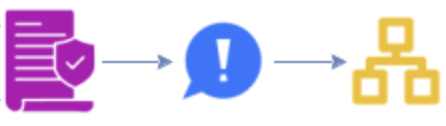

# Architecture & design

The process models captured in RESIN help split up the design work into manageable pieces.
Those pieces are the event storming elements, which fall into the following categories:

- **External**: _persons_ and _external systems_ fall outside the scope of the system and therefore don't need designing
  or architecting
- **Active**: _aggregates_, _policies_, and _read models_ are the elements that make decisions (whether/how to update
  data, whether to emit events, whether to issue commands)
- **Passive**: _events_ and _commands_ just carry data from one place to the next

We need to design the active and passive elements.
In the following, we're going to look at architecture first and then at design, but you can also do it the other
way around.
You can even interleave the activities.

## Architecture

A **module** is a compiled and packaged subdomain, like a jar file.
A **component** is an executable and deployable collection of modules, like a war file or executable fat jar
@@Richardson2023.

The purpose of modules is to provide internally cohesive units with minimal dependencies on other modules.
As stated above, a module is the technical equivalent of a subdomain.
That means we can determine modules by determining subdomains.

### Subdomains

We can leverage the power of the event storming grammar, which defines the valid patterns for event storm elements.
Let's look at the patterns between active elements:

If a policy issues a command that an aggregate accepts, then it depends on the aggregate.
It's the aggregate that defines the contract for the command, because the command is part of its API.
We call this **contract coupling**.

If an aggregate emits an event that a policy handles, then the policy also depends on the aggregate.
The logic is similar: the event is part of the aggregate's API, so it defines the contract.

This looks a lot like the previous situation, but it's a little different.
The read model depends on the agregate in this case too, but the coupling is actually a little stronger.
Both aggregates and read models have associated data models (see [below](#read-models)).
If a read model updates its data based on an aggregate's event, there is a good chance that these data models
at least overlap.
In fact, it's likely that the read model's data model derives from the aggregate's.
We call this **data coupling**, which is a bit stronger than contract coupling.

Here the policy uses data from a read model to make a decision on how to handle an event.
The policy therefore depends on the read model.
This coupling is much stronger than contract or data coupling, because the policy doesn't just depend on the
data from the read model.
That data must be available at the moment the policy handles an event.
We call this **availability coupling**.

Here one policy sends a command to an external system, and another policy handles the resulting event.
Together, the policies implement an Anti-Corruption Layer (ACL) @@Evans2004.
We therefore call this **ACL coupling**.
The policies share a lot of knowledge about the external system, so this is a strong form of coupling: between data
and availability coupling.

These five patterns give us a way to determine all dependencies between active event storm elements.
We can then visualize the dependencies in a Design Structure Matrix.

A **Design Structure Matrix** (DSM) is a network modeling tool that represents the elements comprising a system and
their interactions @@Eppinger2012.
As such, a DSM highlights the system's architecture.

Technically, a DSM is an NxN matrix, where the N rows and N columns each get the name of the system's elements.
The diagonal of the matrix represents the elements.
Off-diagonal elements represent the dependencies between the elements.
In a **binary DSM**, the off-diagonal elements are either 0 (no dependency) or 1 (dependency).
Dependencies are usually marked with `X`, whereas empty cells represent no dependency.
In a **numerical DSM**, the off-diagonal elements are numbers representing the strength of the dependency.
Many other variations exist, for instance, using different colors for the cells.

We can use the dependency table for active elements to create a numerical DSM if we assign numbers to the coupling
strengths:

- **Availability**: 10
- **ACL**: 8
- **Data**: 4
- **Contract**: 1

Note that there may be multiple dependencies between the same pair of elements.
In such cases, we take the maximum coupling strength to get a single number for the DSM cell.

Having our dependencies in a DSM means we can re-use DSM **clustering algorithms**.
The clusters found by those algorithms minimize the dependencies between the clusters and maximize the dependencies
within the clusters.
Since this is exactly what we want for our subdomains (and modules), we can find subdomains by looking at the DSM's
clusters.

We need one small refinement, however.
It's quite common to find two big clusters with a small one connecting the two.
The small cluster contains a policy that handles an event from the first cluster and issues a command to the second.
It depends on the preceding aggregate just as much as on the following (contract coupling), so the clustering
algorithm puts it into its own cluster.
Most of the time, we want to move the small cluster into one of the bigger two.
This is straightforward if one of the two bigger clusters depends on the other.
We then add the policy's cluster to the one that depends on the other.

The subdomains we get from this procedure contain the active elements of the system.
Let's look at the passive elements next.
Commands form the inbound API of an aggregate, so a command naturally belongs to the subdomain that contains the
aggregate that accepts it.

The picture for events is a bit more complicated.
There may be multiple aggregates emitting the same event, as well as multiple policies handling that event.
However, we shouldn't look at the individual emitters and handlers, but rather at their subdomains.
For instance, there may be two aggregates that emit the same event, but both are in the same subdomain.
This leaves us with the following combinations:
<!-- markdownlint-disable MD013 -->

| Emitters' subdomains \ Handlers' subdomains | Single                            | Multiple                                       |
|---------------------------------------------|-----------------------------------|------------------------------------------------|
| **Single**                                  | Place event in emitting subdomain | Place event in emitting subdomain              |
| **Multiple**                                | Place event in handling subdomain | Place event in a special "contracts" subdomain |

<!-- markdownlint-enable MD013 -->

### Components

Modules follow from the domains, which follow from the requirements.
This is the easy part, since it depends on the technical system alone.
Components, however, need developing and operating, which brings in the social part of the sociotechnical system.
As a result, determining component boundaries isn't as straightforward.

However, at a high level, we can play the same game as with subdomains / modules.
We build a DSM where the elements are the modules and run a clustering algorithm on it.
The problem is in finding the strengths of the dependencies between the modules.

_TODO_: Use Richardson's [dark matter/energy](https://microservices.io/tags/dark%20energy%20and%20dark%20matter) forces
to define dependency strength between modules.

_TODO_: How does residuality theory factor in to create an architecture exhibiting criticality?
Is this just the first step that defines the "naive architecture?"

## Design

We need to design the active and passive elements of the system.

### Events

Decide whether to use notification events or event-carried state transfer @@Fowler2017.
Design the event payload.
If an external system consumes the event, you'll want to document the payload in a formal schema @@AsyncAPI @@CloudEvents.
You also need to determine beforehand how to evolve the schema in the future, for instance using versions.

Clarify quality attribute requirements: is it acceptable to lose an event sometimes, or not?
If not, you'll need a message broker with appropriate durability guarantees.
Likewise, is it acceptable for an event to arrive at the system multiple times?
If so, the event handlers need to be idempotent.
If not, the message broker needs to support _exactly once_ delivery, which impacts latency.

Get a sense of how many events of a particular type the system must handle.
If this sounds like a lot, you may want to do some modeling to get a feel of whether it's feasible.
Queueing theory models, like M/M/s @@Kleinrock1974, may be useful to determine how many event handler instances
you'll need.
You may need to do some prototyping to determine how long it'll take to handle a single event before you can use
such models.

### Read models

Read models contain data, so we need to design their data models.
Use ER-diagrams or similar notation for this purpose.

If the read model helps a user to issue a command, then a user interface must expose the read model.
Design this interface and the interaction it's part of.

If the read model feeds into a policy, then it needs an API.
This API may be an informal one, where the policy accesses the read model's data directly via a Repository or Domain
Service.
This approach is appropriate when the read model is part of the same domain as the policy, as
discussed [below](#architecture).

Otherwise, design an internal API for accessing its data.
Since this is an internal API, it may not need to same level as scrutiny and documentation as an external API.

If the read model updates its data from events, then consider the quality attribute requirements listed [above](#events).

### Policies

Since policies handle events, consider the quality attribute requirements listed for [event handlers](#events).

### Commands

Both aggregates and external systems can accept commands.

A command for an external system depends on that system's API.
This API can take many forms, but the important part for the current discussion is that it's not something we need to
design.
The designers of the external system take care of that.

Commands accepted by aggregates come in two flavors.
If a person issues the command, then they need a user interface to do so.
Design this interface and the interaction it's part of.

If, however, an external system or policy issues the command, then it needs an API to do so.
Does the issuer need an immediate response (**synchronous**), can it wait for one (**asynchronous**),
or does it not care about one (**fire-and-forget**)?
For asynchronous and fire-and-forget scenarios, what delivery guarantees do we need?

Like with events, we need to design and document the schema for the payload of the API call.
This can take various forms @@OpenAPI @@AsyncAPI @@GraphQL.
We also need to design for throughput and latency requirements.

### Aggregates

Like read models, aggregates contain data, so we need to design their data models.

Since aggregates accept commands, we need to consider quality attribute requirements around delivery, throughput, and
latency.
See [events](#events) above for more information.
