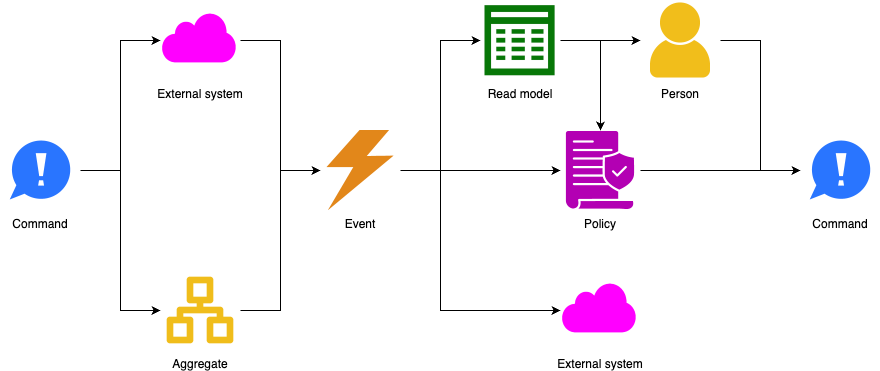

# Requirements

We should capture requirements with use cases and their scenarios @@Wiegers2013.
Scenarios are actually just process descriptions.

The standard notation to capture processes is Business Process Model and Notation (BPMN) @@BPMN2013.
However, this notation is complex: it has many symbols and nuances.
These complexities are necessary to fulfill a major goal of BPMN: execute processes based on the model alone.
As such, BPMN is more a tool for design and construction than for requirements gathering.
A major problem using BPMN for capturing requirements is that stakeholders have a hard time reading BPMN diagrams and
can therefore not validate the requirements.

Other notations exist for describing processes, like activity diagrams and sequence diagrams @@UML.
These notations are simpler, but rather generic, containing not much more than actors, their actions, and some data
flows.
This makes it hard to use them to capture requirements and then derive a design from those requirements.
It's left to the designer to take a giant intellectual leap.

Event storming @@Brandolini2013 can fill the gap between these two sets of notations.
The concepts of events, commands, persons, external systems, etc. are easy to explain in a workshop format,
especially when introduced gradually.
The grammar that governs the concepts helps with uncovering requirements by directing participants to answer the right
questions.
The concepts are also powerful enough to turn requirements into design in a structured manner, as we'll see.

The only downside of event storming is that it doesn't come with a formal notation like BPMN or UML.
It's easy to replace the colored stickies with similarly colored icons, however, and connect them with arrows:



We call this Rigorous Event Storming Icon Notation (RESIN) and argue that RESIN is well-suited for capturing
requirements and translating those into a design.

Note that we're not suggesting to use RESIN in an event storming workshop.
Stickies are more flexible and easier to manipulate.
RESIN is for capturing event storms in a more formal way, as input to the rest of the software development process.

## Requirements/Design process

You start off using RESIN in the same way as in the original event storming workshop:

1. Brainstorm the significant things that happen in the process.
   Place orange event symbols on a timeline flowing from left to right.
2. Ask what emits the events: external systems or the system under consideration.
   Place pink external system symbols for the former and red hotspot symbols for the latter.
3. Next focus on the hotspots, since these show the incomplete parts of the process model.
   If it's clear what specific part of the system emits a given event, replace the hotspot before it with a yellow
   aggregate symbol.
4. If it's not clear what specific part of the system emits a given event, ask what stimulus leads to the system
   emitting the event.
   This is either a user instructing the system to perform an action, or a policy.
   Place either yellow person and blue command symbols, or purple policy and blue command symbols to represent these
   scenarios.
5. If a user issues a command, ask what information they need for that.
   If the system is to provide that information, place a green read model symbol before the person.
6. Similarly, if a policy issues a command, it probably also needs a read model to feed it information.
7. For each policy, ask what event triggers it.
   Place an event symbol before it on the timeline.
8. For each read model, ask what events feed information into it, if any.
   Place event symbols before the read model as appropriate.
9. Repeat the above steps until no hotspots remain.

The result of the above process is a timeline that captures the process under consideration.
It's often hard to capture everything in a single timeline.
That's okay, you can use as many timelines as necessary to capture all scenarios of all use cases.

This process is a mix of requirements gathering and a bit of design, like determining the aggregates.
That last part is actually not trivial and deserves more attention.

## Determining aggregates

Before we can get into the weeds of how to determine the aggregates, we need a better definition of what exactly an
aggregate is.
The "big blue book" defines aggregate as:

```admonish tldr title="Definition"
An **Aggregate** is a cluster of domain objects that can be treated as a single unit for the purposes of data changes.
Each aggregate has a root and a boundary.
The boundary defines what's inside or outside the aggregate, and the root entity is the single entry point through
which all interactions with the aggregate must occur.

--- @@Evans2014
```

We can formalize this definition using precise mathematical language.

Let `E` be the set of all entities and `D` the set of all dependencies between them.
Then the domain model `M=(E,D)` is the directed graph of all entities and their interdependencies.

An aggregate `A` is a subgraph `A⊆M` with distinguished node `r∈V(A)∈E`, where:

- For every `e∈V(A)∈E`, there exists a directed path from `r` to `e` within `A`.
- For every edge `(e1,e2)∈E(A)∈D`, if `e1∈V(A)∈E` and `e2∉V(A),e2∈E`, then `e1=r`.

TODO: Algorithm for finding aggregates.

## Acceptance criteria

To complete the requirements gathering phase, add acceptance criteria:

- For every aggregate, describe how it updates its data from the commands it accepts and how it emits events in
  response.
- For every policy, describe how it turns the events it handles into the commands it issues in response.
- For every read model, describe how it updates its data from the events it handles.

Of course, the above description is a simplification.
In most cases, you'll need several workshops to flesh out the details.
You're also going to have to redo some work as you learn more.

We think the above process works best when performed at different levels of abstraction:

1. Do big picture event storming @@Brandolini2013 to find use cases.
   The goal here is to identify hotspots.
2. Hold more detailed event storming sessions to flesh out the details of a single use case or a small set of related
   use cases.
   The goal here is to resolve hotspots in one part of the system at a time.

By capturing requirements using event storming concepts, you're well positioned to start designing the system.
